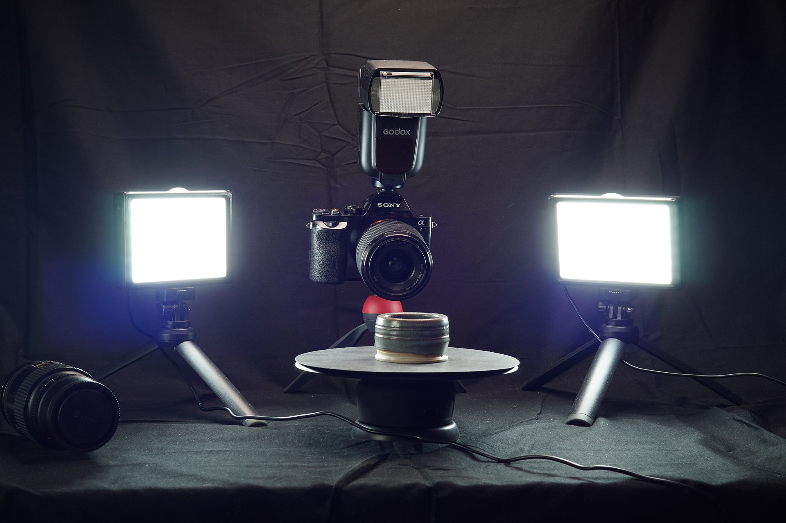

# captura 3D

>[!WARNING]
>
> O suporte para captura 3D foi removido a partir da versão 5.1 do Sampler.

## Iluminação

Se preferir saber mais sobre a configuração de iluminação para o Captura 3D em um tutorial em vídeo, você pode encontrá-la [aqui](https://youtu.be/7mgpmlq6xAc?si=_ubOyBsNFAPrPEmD "tutorial do lighting for Captura 3D video").

A fotogrametria requer iluminação uniforme e uniforme.

Isso nem sempre é possível: se você estiver contando com iluminação ao ar livre, poderá ter um sol brilhante sem nuvens, ou até mesmo estar chovendo. Mesmo em um dia nublado, você ainda obterá sombras e luz no objeto, o que pode causar problemas ao virar um objeto. Assumir o controle da iluminação pode eliminar esses problemas. E quando você estiver usando iluminação de estúdio controlada, não apenas conseguirá modelos melhores, mas também texturas melhores e mais uniformes.

## Tipos de luzes

Há muitas maneiras de obter até mesmo a iluminação. A melhor maneira provavelmente é usar um<b> flash de toque poderoso</b>. Esses flashes formam um anel ao redor da lente, e garantem que tudo o que a câmera vê seja iluminado uniformemente. Eles não são tão comuns quanto os flashes de montagem de cima padrão, e os modelos mais baratos podem ter desvantagens, como não conseguir montar filtros, sobre o que falaremos na próxima parte. Flash grandes e poderosos também são muito caros, mas alguns deles são tão fortes que você pode até usá-los à luz do dia, pois eles vão sobrecarregar a luz ambiente.

Em vez disso, podemos fazer isso com uma combinação de um <b>flash padrão</b> e algumas <b>luzes de vídeo contínuas</b> de baixo custo. Os flashes de montagem na parte superior padrão são mais baratos e fáceis de encontrar e ainda permitem filtros de lente. Luzes de vídeo simples também são baratas e facilitam o foco e a definição das configurações da câmera. Algumas marcas usam conectores de flash diferentes, então certifique-se de escolher o correto para a sua câmera.

Para luzes de vídeo, há muitas opções baratas. Você não deve ficar muito grande, mas você quer algo que produza uma quantidade decente de luz. Também é importante obter pelo menos duas luzes, pois você deseja iluminar seu objeto em dois lados. Um conjunto de luz LED barato com suportes pode fazer uma boa escolha aqui.

Você também pode pular o flash completamente se você obter 3 a 4 luzes, permitindo que você cubra mais ângulos. Isso depende da complexidade do objeto. Quanto mais buracos e fendas houver, mais luzes em ângulos diferentes serão necessárias para preenchê-las uniformemente.

A configuração ideal quase tenta imitar uma luz de toque: as luzes de flash de cima, as luzes de vídeo da esquerda e da direita, ao lado da lente, logo fora da vista.

Outra coisa que pode ajudar a obter uma iluminação uniforme é <b>adicionar difusores às suas luzes</b>. O difusor pode ser papel, folhas de plástico ou tampas, que vão sobre suas luzes. Elas espalham a luz de maneira mais uniforme, suavizando as sombras. A maioria dos conjuntos de armas de flash vem com algum tipo de difusor, geralmente as luzes de vídeo têm uma folha de difusão também. Caso contrário, você sempre poderá usar papel traçado, tesoura e fita adesiva. Não é uma ciência exata!

Você precisa <b>ajustar as configurações de exposição da sua câmera</b> para a quantidade de luz disponível para obter uma foto devidamente iluminada. Assim como as configurações de exposição estão equilibradas, você também pode equilibrar suas luzes. A baixa exposição pode exigir mais luz, e a luz geralmente é mais fácil de ajustar do que as configurações da câmera.

## Uso de uma combinação de luzes

Vale ressaltar que um flash é um flash curto e forte de luz, enquanto as luzes de vídeo emitem menos luz, mas o fazem sem parar. Um flash pode ser ajustado com muita precisão, mas como a câmera não consegue ver a luz do flash até que seja disparado, as configurações de foco e ajuste são um pouco complicadas: a tela não mostrará uma representação 100% correta da foto final, pois a câmera pode estar aumentando o ISO ou o tempo do obturador, como uma visualização para imitar a exposição da foto final.

Como um flash é acionado por um tempo tão curto, ele também não é afetado muito pelo tempo do obturador; mesmo que o obturador esteja aberto por 1 segundo, o flash só será acionado por alguns milissegundos.

Se você estiver usando uma combinação de iluminação de flash e luz de vídeo contínua, poderá <b>ajustar todas as configurações para equilibrar as luzes</b>. O flash provavelmente vai sobrecarregar facilmente as luzes de vídeo, para que você possa diminuir a intensidade. Você também pode aumentar o efeito da luz do vídeo, aumentando o tempo do obturador, pois eles continuarão adicionando luz quanto mais tempo um obturador estiver aberto.

Não há uma solução aqui que será necessária para experimentar exatamente o seu gabinete e equipamento. O objetivo final é simplesmente ter <b>iluminação uniforme e uniforme com um mínimo de sombras visíveis</b>. O sistema de fotogrametria automática terá um tempo mais fácil alinhando fotos, e suas texturas sairão mais uniformes e uniformes, como uma verdadeira textura de cor de base PBR.
