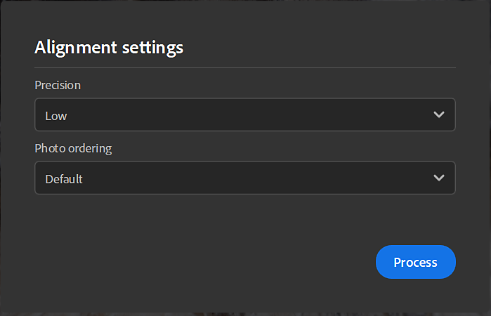

# Captura 3D

## Introdução

## O que é fotogrametria?

O Sampler está usando fotogrametria para transformar imagens em uma malha com o textura. A fotogrametria é a ciência que faz medições a partir de imagens. É usado para extrair informações de fotografias, para criar modelos e texturas 3D. O processo envolve tirar várias fotografias de um objeto de diferentes ângulos e, em seguida, processar as imagens para extrair informações sobre a forma e a localização de características nas imagens.

O objetivo é combinar recursos correspondentes entre as imagens para estabelecer as posições relativas da câmera para cada imagem. A partir dos recursos correspondentes, um modelo 3D do objeto é reconstruído. A etapa final é projetar as texturas no modelo 3D.

## Requisitos de hardware

A captura 3D está disponível no Windows e no MacOS Monterey ou Ventura.

Windows/Linux

Recomendamos:

* GPU com 8 Gb de VRAM
* 16 Gb de RAM. Idealmente, 32 Gb e 64 Gb.
* Mínimo de 10 Gb de espaço em disco

[Configuração do Linux](https://helpx.adobe.com/substance-3d/unlisted/documentation/sadoc/3d-capture-set-up-on-linux-255426606.html)

Mac

* Dispositivos Apple Silicon são altamente recomendados (M1 ou M2)
* GPU baseada em Intel e AMD com pelo menos 4 Gb de VRAM e suporte a Rastreamento de raios

## Iniciar uma nova Captura 3D

## Importar o conjunto de dados

## Preparação do Conjunto de Dados

Arraste e solte suas fotos ou clique para navegar pelo explorador do seu sistema operacional.

>[!NOTE]
>
> **Recomendações do conjunto de dados**
> 
> Recomendamos ter um conjunto de dados que contenha pelo menos <b>20 imagens</b> para que o captura 3D seja executado sem problemas.

Para usuários do iPhone, o formato .HEIC ainda não é compatível. Você pode usar o Lightroom para converter em .jpeg.

No MacOS, você pode usar [Ações rápidas](https://support.apple.com/en-gb/guide/mac-help/mchl97ff9142/mac) para converter imagens.

Para formatos de câmeras RAW, recomendamos usar o Lightroom para converter fotos em .jpeg.

>[!NOTE]
>
> **Limitações do conjunto de dados**
> 
> **Windows**: seu conjunto de dados deve ser menor que 6 GB de pixels (6 000 000 000 pixels) no total. Ele representa 500 fotos de pixels 12M

Depois que as fotos forem importadas, você pode clicar em uma foto para vê-la por completo.

Definição de fotogrupo:

Seu conjunto de dados pode ser dividido em vários fotogrupos. Os fotogrupos agrupam fotos por propriedades (tamanho do sensor, distância focal, rotação,...)

## Mascaramento

O uso de máscaras tem muitas vantagens. Ele permite que o processo de fotogrametria detecte características e reconstrua apenas áreas não mascaradas.

Isso permite também mover o objeto durante a captura, pois as máscaras ocultarão o plano de fundo em todas as fotos.

Para usar máscaras, selecione um fotogrupo e abra a guia **Máscara** à direita.

É possível importar máscaras respeitando uma convenção de nomenclatura:

* [image\_name].file\_extension
* [image\_name]\_mask.file\_extension

Você pode gerar máscaras automaticamente por fotos usando nossa tecnologia viabilizada por IA.

## Alinhamento

O alinhamento é processar todas as imagens para extrair e corresponder os recursos correspondentes para estabelecer as posições relativas da câmera para cada imagem.

## Configurações

Precisão

Há duas opções, baixo e alto.

* Baixo: recomendado para a maioria dos conjuntos de dados.
* Alto: aumente o número de pontos, aconselhado para corresponder mais fotos nos casos em que o objeto tem textura insuficiente ou as fotos são pequenas. Essa configuração torna o processamento mais lento. Recomendamos que você experimente a opção baixa primeiro.

Ordenação das fotos

Há duas opções: padrão e sequência.

Isso pode ser calculado usando diferentes algoritmos de correspondência de recursos:

* Padrão: a seleção é baseada em vários critérios, entre os quais a semelhança entre imagens.
* Sequência: use apenas imagens vizinhas dentro da distância especificada, recomendado para processar uma única sequência de fotos se o modo Padrão tiver falhado. A ordem de inserção de fotos deve corresponder à ordem de sequência.

## Posicionamento de nuvem de pontos e câmeras

O resultado da etapa de alinhamento é uma nuvem de pontos esparsos com todos os recursos detectados e a posição de todas as câmeras.

Se o contorno da imagem estiver verde, a imagem foi alinhada corretamente.

Se o contorno da imagem for laranja, a imagem não foi alinhada corretamente e nenhum recurso foi extraído dessa imagem.

Você pode clicar na imagem no painel esquerdo para quadro a nuvem de pontos na câmera associada.

Você pode clicar em uma câmera para enquadrar a nuvem de pontos nela.

## Reconstrução

A etapa de reconstrução gera um modelo 3D do objeto a partir dos recursos correspondentes conforme a projeção das texturas no modelo 3D.

## Configuração

Detalhes de geometria Essa opção especifica o nível de precisão nas fotos de entrada, o que resulta em mais ou menos detalhes no modelo 3D calculado.

## Região de interesse

Antes de gerar o modelo 3D, você pode definir a região para reconstruir em torno da nuvem de pontos com a caixa delimitadora.

É possível traduzir, dimensionar e girar a caixa nos três eixos.

Ao pressionar Shift durante o dimensionamento, você dimensionará a caixa a partir do centro.

<table>
<tr style="border: 0;">
<td style="border: 0;" valign="top">

</td>
<td style="border: 0;" valign="top">

</td>
</tr>
</table>

## Pós-processamento

O pós-processamento o ajuda a adaptar e otimizar sua malha e texturas às suas necessidades e como você deseja usá-las.

O resultado da reconstrução pode gerar uma malha com milhões de polígonos e texturas de até 16K. Isso geralmente não será otimizado para renderização, tempo real ou experiência de AR.

Será necessário pós-processar o resultado para reduzir o número de polígonos sem perder os detalhes.

A etapa de pós-processamento encadeia 4 etapas automaticamente:

* Decimação: reduza o número de polígonos definindo o número de faces que deseja
* Desembrulhar UV: define automaticamente as costuras, desembrulhar e empacotar UVs da malha dizimada
* Reprojeção: Reprojete a textura de cores da malha de fotogrametria na malha dizimada
* Fça bake: Fça bake os detalhes normais, de height e de AO da malha de fotogrametria para a malha dizimada. Isso garantirá a transferência de todos os detalhes da malha perdidos durante a dizimação para mapas de textura.

## Versão

Para iterar e testar facilmente diferentes opções de pós-processo, você pode criar várias versões e selecionar aquela que deseja adicionar ao seu projeto.

Para ajudá-lo, você pode visualizar a malha em modos diferentes.

Modo sólido

modo wireframe

Modo Grade UV

## Fluxo de trabalho não destrutivo

Depois que uma versão é adicionada ao projeto, uma pilha de camadas é criada com várias camadas.

A primeira camada é o resultado da reconstrução.

A segunda camada (se você fez algum pós-processo) é a camada de pós-processamento de malha com os valores definidos na janela captura 3D. Você ainda poderá editar os parâmetros nesta etapa se quiser usar outras configurações.

A terceira camada é uma camada de transformo de malha para dimensionar, traduzir e girar seu objeto 3D.

Nesta etapa, é possível adicionar filtros usados para aplicar em materiais para editar as texturas no objeto 3D.

## Exportar

Na janela de exportação, você pode definir o formato de malha e as configurações de material (as mesmas configurações quando você exporta um material).

## Tutorials

[Ir para Tutorials avançado](https://substance3d.adobe.com/tutorials/courses/Advanced-3D-Capture/youtube-f8iCtZ3Gmzs)

## Perguntas frequentes

**Quais são as melhores condições de captura para fotogrametria?**

Para que a fotogrametria produza resultados precisos, é importante seguir determinadas práticas recomendadas ao capturar imagens.

1. Iluminação: a fotogrametria funciona melhor quando as imagens são capturadas em boas condições de iluminação. Evite tirar imagens com pouca luz ou com iluminação de alto contraste, pois isso pode dificultar a extração precisa de recursos das imagens. As melhores condições de iluminação para fotogrametria são dias nublados ou áreas sombreadas.
1. Sobreposição: para garantir que haja informações suficientes nas imagens e extrair recursos com precisão, é importante capturar imagens com sobreposição significativa. Uma regra geral é ter pelo menos 60% de sobreposição entre imagens, horizontalmente e verticalmente.
1. Câmera: use câmera e lente de alta resolução, que oferecem boa qualidade de imagem e nitidez. Evite usar câmeras com lente olho-de-peixe ou lente grande angular, pois isso pode causar distorção geométrica que pode afetar os resultados finais.
1. Orientação: ao tirar fotos, tente manter o nível da câmera e perpendicular ao solo. As imagens angulares podem dificultar a extração precisa de recursos e podem levar a resultados distorcidos.
1. Calibragem da câmera : verifique se a câmera está calibrada antes de tirar fotos. Esse processo permite corrigir a distorção da lente e outros erros que podem afetar a precisão dos resultados finais.

**Como funciona para specular e objetos reflexivos?**

A fotogrametria pode ser desafiadora ao trabalhar com objetos altamente speculares ou reflexivos, pois os reflexos brilhantes podem dificultar a extração de recursos das imagens. Aqui estão algumas estratégias que podem ser usadas para superar esses desafios:

1. Iluminação: ao capturar imagens de objetos altamente reflexivos, tente evitar a luz solar direta e, em vez disso, capture imagens em condições de coberto ou sombreado. Isso pode ajudar a reduzir a intensidade dos reflexos e facilitar a extração de recursos das imagens.
1. Acabamento fosco: aplicar um acabamento fosco às superfícies reflexivas pode ajudar a reduzir a intensidade dos reflexos e facilitar a extração de recursos das imagens.
1. Capturar várias imagens: capturar várias imagens do mesmo objeto de ângulos diferentes pode ajudar a reduzir o impacto de reflexos e aumentar as chances de conseguir extrair recursos de pelo menos algumas das imagens.
1. Edição de imagens: no pós-processamento, determinados softwares de edição de imagens, como o Lightroom, podem ser usados para reduzir reflexos e aprimorar recursos das imagens, como aumentar o contraste ou corrigir cores.

Lembre-se de que os objetos reflexivos podem precisar de configurações e tratamentos mais elaborados, e talvez não seja possível obter resultados perfeitos em todos os casos. É uma boa ideia experimentar técnicas diferentes.

**Qual é a recomendação para fotogrametria entre um telefone celular e uma câmera DSLR?**

Tanto os telefones celulares como as câmaras DSLR podem ser usados para fotogrametria, mas têm diferentes forças e fraquezas. Aqui estão alguns pontos a serem considerados ao decidir que tipo de câmera usar:

1. Resolução: As câmeras DSLR normalmente têm uma resolução muito maior do que os telefones celulares, o que pode levar a resultados mais detalhados e precisos. No entanto, com os avanços recentes na câmera do telefone celular, algumas câmeras de telefone celular high-end têm resolução e qualidade de imagem comparáveis a algumas câmeras DSLR inferiores.
1. Calibração da câmera: a fotogrametria depende da calibração precisa da câmera, que normalmente é mais difícil de conseguir com câmeras de telefone celular do que com câmeras DSLR. Algumas câmeras de telefone celular têm parâmetros de calibração integrados que você pode usar, mas podem não ser tão precisos quanto uma calibração adequada de uma câmera DSLR.
1. Vida útil da bateria e armazenamento : As câmeras de telefone celular têm uma vida útil de bateria mais limitada em comparação com as câmeras DSLR. Portanto, você terá que planejar carregar o telefone ou carregar baterias extras enquanto trabalha. Além disso, você precisa ter certeza de que o telefone tem capacidade de armazenamento suficiente para lidar com arquivos de imagem grandes.
1. Custo: As câmeras DSLR são geralmente mais caras do que os telefones celulares, e também requerem acessórios adicionais, como tripés e unidades de flash externo.
1. Portabilidade: um telefone celular é mais portátil do que uma câmera DSLR, e é mais provável que você tenha seu telefone com você quando se deparar com um objeto ou cena interessante que você deseja capturar para fotogrametria.

Em resumo, isso realmente depende de suas necessidades específicas e das características do projeto. Para projetos de baixa resolução, um telefone celular pode ser suficiente. No entanto, se alta precisão e alta resolução forem necessárias, uma câmera DSLR pode ser uma escolha melhor. Além disso, se você estiver planejando tirar fotos regularmente ou para um projeto de longo prazo, investir em uma câmera DSLR pode ser uma solução mais econômica a longo prazo.

**Como devo calibrar minha câmera para limitar o desfoque em meu objeto?**

A calibração da câmera é uma etapa importante no processo de fotogrametria que ajuda a corrigir a distorção da lente e outros erros que podem afetar a precisão dos resultados finais. Aqui estão algumas etapas que você pode seguir para calibrar sua câmera e limitar o desfoque em seu objeto:

1. Usar um tripé: para manter a câmera estável e reduzir o desfoque, é importante usar um tripé ao capturar imagens para fotogrametria. Isso garantirá que a câmera esteja na mesma posição para cada tomada e ajudará a minimizar o movimento da câmera.
1. Usar um disparo remoto do obturador: para reduzir ainda mais o movimento da câmera, você pode usar um disparo remoto do obturador ou a função de temporizador automático na câmera para tirar as imagens. Isso ajudará a minimizar qualquer vibração da câmera causada ao pressionar o botão do obturador.
1. Ajuste a velocidade do obturador: para reduzir o desfoque causado pelo movimento da câmera, você deve usar uma velocidade do obturador rápida. Uma regra geral é usar uma velocidade do obturador que seja pelo menos tão rápida quanto o recíproco da distância focal da lente. Por exemplo, se estiver usando uma lente de 50 mm, você deve usar uma velocidade do obturador de pelo menos 1/50 de segundo.
1. Use um ISO alto: em condições de pouca luz, talvez seja necessário usar um ISO mais alto para manter uma velocidade rápida do obturador e reduzir o desfoque. Entretanto, lembre-se de que um ISO alto também pode aumentar o ruído na imagem, o que pode afetar a precisão dos resultados finais.
1. Usar um flash: Em algumas situações, o uso de um flash pode ajudar a reduzir o desfoque causado pela pouca luz. Lembre-se de que o flash também pode causar reflexos e outros problemas em alguns casos, portanto experimente com fotos que podem ser feitas ou não com flash para ver qual funciona melhor para seu aplicativo específico.

Lembre-se de que a calibração é um processo iterativo e pode exigir várias tentativas para obter bons resultados.

**Posso mover o objeto durante a captura para fotogrametria?**

Na maioria dos casos, não é recomendado mover o objeto durante a captura para fotogrametria. O processo de fotogrametria depende do objeto estar em uma posição fixa para cada imagem, já que o software usa as posições relativas de características nas imagens para reconstruir um modelo 3D do objeto.

Se o objeto for movido durante a captura, ele aparecerá em uma posição diferente em cada imagem, tornando difícil para o software corresponder os recursos correspondentes entre as imagens. Isso pode levar a imprecisões no modelo 3D final e também pode dificultar ou impossibilitar a etapa de correspondência de imagem.

Entretanto, há alguns casos em que mover o objeto pode ser benéfico. Por exemplo, no caso de objetos pequenos, onde é difícil tirar imagens com sobreposição significativa, é possível usar uma mesa giratória e girar o objeto para garantir que todos os recursos sejam capturados de vários ângulos.
