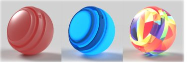
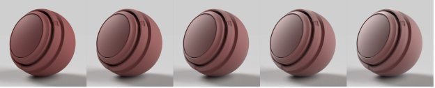
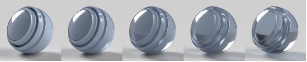
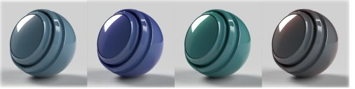
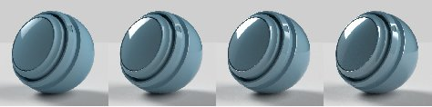

# Material Padrão da Adobe

>[!NOTE]
>
> O Substance 3D Sampler agora usa como padrão o modelo de material [OpenPBR](openpbr.md) em vez do Adobe Standard Material.

## Propriedades padrão do material

## Propriedades da superfície de base

**Cor de base**

A cor da superfície.

**Aspereza**

Quão suave ou fosca é a superfície.

**Metálico**

O grau de brilho metálico que a superfície tem.

**Opacidade**

A visibilidade da superfície.

**Oclusão de ambiente**

Sombras de cavidades e vincos que impedem a luz de atingir a superfície.

**Specular level**

A força dos reflexos de luz na superfície.

**Specular edge color**

A cor dos reflexos de luz. Afeta os ângulos de brilho de materiais metálicos.

**Normal**

Simula detalhes da superfície como saliências e rachaduras.

**Escala normal**

A força do efeito normal.

**Combinar normal e height**

Aplica a textura normal sobre a textura do height.

**Height**

Cria detalhes da superfície usando o deslocamento de relevo ou de geometria.

**Escala de Height**

A escala de height em unidades de cena. Aplica-se ao relevo e ao deslocamento.

**nível de Height**

O valor da textura de height que representa deslocamento zero.

**Nível de anisotropia**

A quantidade na qual os reflexos se estendem em uma direção ao longo da superfície.

**Ângulo de Anisotropia**

A rotação no sentido anti-horário do efeito anisotrópico.

**Intensidade de emissão**

A intensidade da luz emitida pela superfície.

**Cor de emissão**

A cor da luz emitida.

**Opacidade do brilho**

Simula o efeito de fibras ou fuzz microscópico na superfície.

**Cor do brilho**

A cor do efeito de brilho.

**Aspereza de brilho**

Suavidade do efeito de brilho.

## Propriedades internas

**Transparência**

A quantidade de luz capaz de transmitir através da superfície.

**Cor de absorção**

A luz da cor convergirá para à medida que for absorvida.

**Distância da Absorção**

Distância aproximada em unidades de cena em que a luz viajará antes de atingir a cor de absorção. Se definido como zero, o thickness não afetará a cor de absorção.

**Índice de refração**

A quantidade de luz se dobra à medida que passa pelo objeto.

**Dispersão**

A intensidade com que o espectro de cores se espalha quando refratado.

**Dispersão da subsuperfície**

As dispersões são iluminadas abaixo da superfície, em vez de passarem direto por ela.

**Dispersão de cores**

A cor abaixo da superfície em que a luz dispersa se tornará.

**Distância de dispersão**

A luz de distância aproximada deve se deslocar antes de atingir a dispersão total.

**Escala de distância dispersa**

Um multiplicador da distância da dispersão. Pode ser diferente para cada canal de cor.

**Turno vermelho**

Define a luz vermelha para viajar mais longe do que outras cores claras. Útil para pele.

**Dispersão de Rayleigh**

Define a luz laranja para viajar mais abaixo da superfície e a luz azul para viajar menos.

**thickness de volume**

O thickness da superfície em relação à caixa delimitadora do objeto. Usado para efeitos internos quando o thickness real não é conhecido.

**Escala do thickness de volume**

Multiplicador do thickness de volume.

## Propriedades do revestimento

**Opacidade do revestimento**

Simula uma camada na parte superior do material. Usado para criar revestimentos, vernizes e vernizes transparentes.

**Cor do revestimento**

A cor da pelagem.

**Aspereza do revestimento**

Quão lisa ou fosca é a superfície da pelagem.

**Índice de refração do revestimento**

A quantidade de luz se dobra à medida que passa pela pelagem.

**Nível especular do revestimento**

A força dos reflexos de luz na pelagem em ângulos de visão.

**Normal do revestimento**

Simule detalhes da superfície como saliências e rachaduras na superfície da pelagem.

**Escala de Normal do revestimento**

A intensidade do efeito normal do revestimento.
