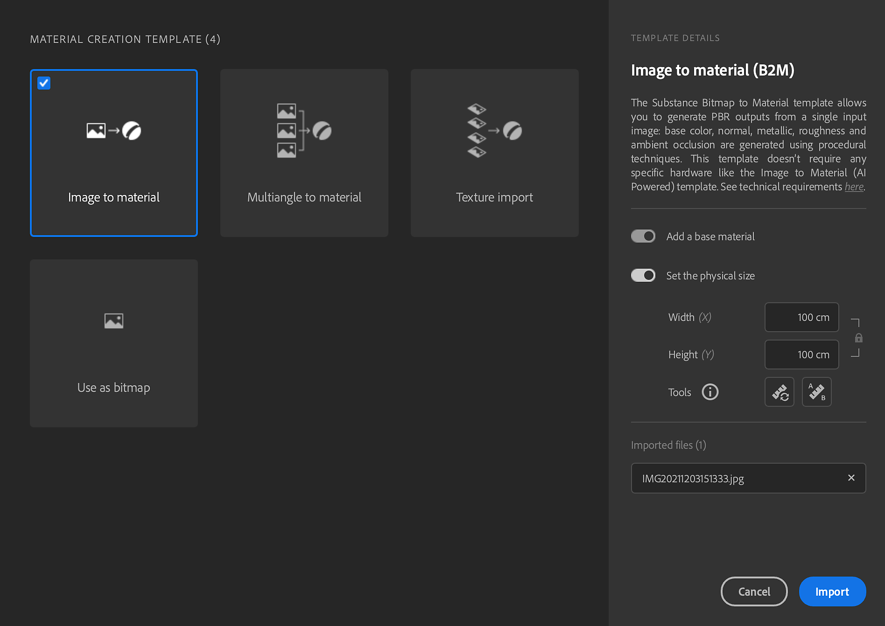

# Fluxo de trabalho de Tamanho físico completo

Combine o tamanho físico real de suas amostras e imagens digitalizadas em um contexto digital para criar visuais fisicamente precisos nos aplicativos.

## Importar digitalizações

1. Selecione o modelo de criação de material.
1. Marque a caixa de seleção tamanho físico.

   
1. Duas abordagens para definir o Tamanho físico:

   3-A. Clique em medida manual - A ferramenta Medida permite calibrar o tamanho físico entre 2 recursos da amostra.\
   Rastrear entre dois pontos -> enter

   

   3-B. Medida automática - a ferramenta Medida automática permite obter um tamanho físico estimado da amostra com base nos metadados da imagem (dpi). É mais rápido, mas funciona apenas com digitalizações, pois usa o dpi armazenado para calcular um tamanho inicial preciso.

   <b>Agora você pode processar as digitalizações</b>
1. Adicione um corte e ajuste-o para a amostra. É possível ver a tamanho físico exibida no canto inferior direito da Janela de visualização 2D atualizada.

   Exiba com proporção física na viewport 2D para ver com precisão os mapas em que você está trabalhando.\
   É possível definir a visualização 2D para se ajustar ao tamanho físico de modo que os DPIs da proporção da tela correspondam à escala do material. Em outras palavras, você pode colocar a amostra real ao lado da tela para verificar as dimensões.

   
1. Adicione uma Equalização para remover os gradientes.
1. Adicionar divisão em blocos gráficos para corrigir a divisão em blocos parece
1. Se necessário, a transformação de distorção é útil para realinhar apenas partes do mapa.

   <b>Pronto para exportar</b>
1. Exportar como

   Selecione o formato Sbsar. O Sampler colocará Tamanho físico nele como metadados. Ele permitirá que outros aplicativos leiam e usem essas informações também.\
   Você também pode exportar imagens; isso respeitará a proporção da tamanho físico.

   Se você precisar usar o tamanho físico a qualquer momento, use o *Painel de Tamanhos físicos*.

   Ao exportar como imagens, agora é possível forçar o tamanho das imagens a respeitar a proporção do tamanho físico.

## Tutorial em vídeo

Você também pode encontrar tutoriais em vídeo para ajudar você a aproveitar esse recurso:
