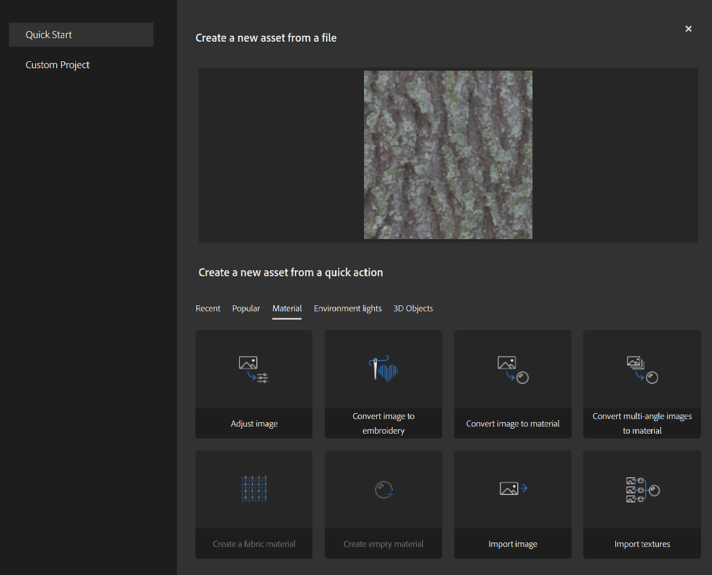

# Ações rápidas

Ações rápidas é um sistema que permite criar um ativo ou adicionar muitas camadas na pilha em poucos cliques. Use Ações rápidas para criar um ativo, criar um projeto ou adicionar as camadas necessárias à pilha existente.

Você pode encontrar Ações rápidas em vários lugares no Sampler:

* [A tela inicial](../interface/the-home-screen.md)
* [Criar nova janela](../getting-started/project-management.md)
* [Painel de ação rápida](../interface/panels/quick-actions-panel.md)

| Nome da ação rápida | Descrição | Camadas |
| --- | --- | --- |
| Converter imagem para material | Crie um material com todos os canais necessários a partir de uma única imagem. | Inserir imagem para equalizar IA de material |
| Converter imagens com diversos ângulos em materiais | Criar um material mesclando fotos de uma superfície tirada de diferentes ângulos de luz | Multiângulo para material de entrada Equalizar |
| Importar texturas | Crie um material a partir de mapas de textura. | Entrada |
| Importar imagem | Crie um material vazio e adicione uma única imagem como uma camada. | Entrada |
| Converter imagem para bordado | Aplique um filtro processual para fazer com que uma imagem ganhe um visual de retalho bordado. | Bordado de entrada |
| Criar um material de tecido | Crie um material de tecido com um filtro processual. | Tecido |
| Ajustar a imagem | Escolha filtros para ajustar e preparar uma imagem para uso em um material. | Substituição da cor de brilho lado a lado de corte de entrada/matiz de contraste/saturação |
| Criar um material vazio | Crie um material sem canais. | Nenhuma |

## Como usar a ação rápida

<b>Da tela inicial</b>

Clique em uma ação rápida

ou arraste e solte uma imagem em uma ação rápida.

ou arraste e solte uma imagem em uma ação rápida.

<b>De Criar novo</b>

Escolha qualquer ação rápida ou importe arquivos e veja quais ações rápidas você pode usar com sua entrada

<b>No Painel de Ação Rápida</b>

Clique em uma ação Rápida para adicioná-la à pilha ou criar um novo ativo dependendo do tipo de ação Rápida:

* <b>Aplicar:</b> aplica a ação rápida na pilha ativa.
* <b>Instalação :</b> abre a janela de instalação para pré-organizar a ação Rápida antes de adicioná-la à pilha.
* <b>Criar novo Ativo:</b> crie um novo ativo usando a ação rápida selecionada.
* <b>Criar novo Projeto : </b>Criar um novo projeto a partir da ação rápida selecionada.
