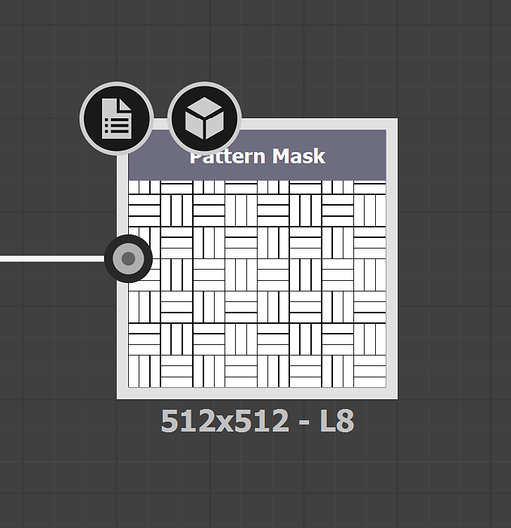

# Geradores de textura

Os geradores de textura fornecem controle aprimorado sobre a criação de materiais usando as opções <b>ruídos paramétricos, padrões </b>e<b> grunhidos</b>. As imagens geradas podem ser usadas em mapas de máscaras ou canais.

<table>
<tr style="border: 0;">
<td style="border: 0;" valign="top">

</td>
<td style="border: 0;" valign="top">

Geradores de Textura são um tipo de ativo no Substance 3D Sampler. Eles podem ser filtrados no painel Ativos com o ícone Textura geradores.

</td>
</tr>
</table>

## Como usar geradores de Textura

### Mapas de canal

Arraste e solte um gerador de textura na visualização 3D, ou a pilha de camadas e selecione um canal para usá-lo.

Um filtro de Preenchimento será criado na pilha com o Gerador de Textura na entrada direita. Você pode acessar as propriedades do Gerador de Textura no painel de propriedades.

#### Filtros

Alguns filtros, como <b>Assoalho</b>, usam geradores de textura padrão para máscaras de padrão. Outras pessoas trabalham com uma imagem ou um Gerador de Textura como o filtro <b>Padrão</b>.\
Nos filtros, você pode usar geradores de textura em qualquer propriedade de imagem, por exemplo, <b>máscaras personalizadas</b>.

Os filtros podem sugerir que os geradores trabalhem com eles, que são exibidos no novo seletor de ativos quando você clica em uma propriedade de imagem.

#### Tutorial

Você encontrará todos os tutoriais do Substance 3D Sampler em nossa [página de aprendizado](https://creativecloud.adobe.com/cc/learn/app/substance-3d-sampler).

[Design têxtil com os geradores de Textura da Sampler](https://creativecloud.adobe.com/cc/learn/substance-3d-sampler/web/fabric-texture-generator?locale=en)

[Material em fibra de carbono em minutos com a Substance 3D Sampler](https://creativecloud.adobe.com/cc/learn/substance-3d-sampler/web/create-carbon-fiber-material?locale=en)

[Material de tecido xadrez em minutos com o Substance 3D Sampler](https://creativecloud.adobe.com/cc/learn/substance-3d-sampler/web/create-plaid-fabric-material?locale=en)

## Como criar geradores de Textura personalizados

Você pode importar os Geradores de Textura criados com o Adobe Substance 3D Designer por meio do botão *Importar* nas ações de Pilha de camadas. Eles devem ser criados de uma maneira específica no Designer para funcionar corretamente quando importados no Sampler.

### Tipo

Escolha “gerador de Textura” como gráfico<b> tipo</b>.

#### Saídas

O nó de saída dos filtros do filtro deve ter o <b>identificador</b> ou o <b>uso </b>definido:

* A saída principal do Gerador de Textura não deve ter nenhum uso. Em seguida, ele pode ser reconhecido como a saída principal pelo 3D Sampler.

<table>
<tr style="border: 0;">
<td style="border: 0;" valign="top">

</td>
<td style="border: 0;" valign="top">

</td>
</tr>
</table>

* A(s) <b>saída(s) secundária(s)</b> do Gerador de Textura precisa(m) de <b>uso</b> para ser(em) usada(s).\
  O nome do Grupo seria a saída principal <b>Identificador</b>.

>[!NOTE]
>
> Se você criar seus próprios Filtros e Geradores de Textura para trabalharem juntos, recomendamos usar <b>usos personalizados</b> de acordo com os <b>Identificadores de saída</b>.

<table>
<tr style="border: 0;">
<td style="border: 0;" valign="top">

</td>
<td style="border: 0;" valign="top">

</td>
</tr>
</table>

>[!IMPORTANT]
>
> Se você quiser que seu gerador de Textura personalizado esteja em uma lista de ativos sugeridos de filtro, você precisa adicionar os seguintes dados de usuário em seu gráfico de Substance:
> 
> alchemist::sugestedfilters=[FilterName,FilterName2];

>[!NOTE]
>
> Os dados do usuário podem ser usados com [filtros personalizados](../filters/custom-filters.md).

#### Formato

Exportar filtro como arquivo de Substance (.sbsar)

>[!NOTE]
>
> É possível expor parâmetros de filtro para controlar o filtro diretamente no Sampler. Veja instruções [aqui](https://experienceleague.adobe.com/en/docs/substance-3d-designer/using/substance-graphs/manage-parameters/exposing-a-parameter)
