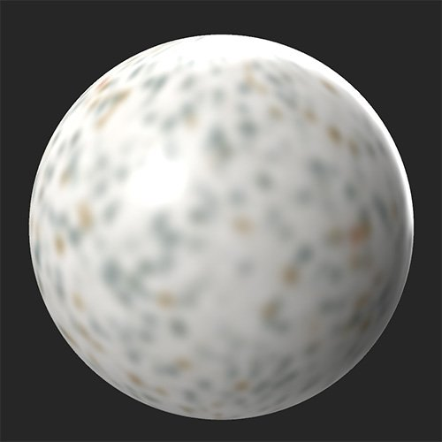

# Desfoque

<table>
<tr style="border: 0;">
<td width="41.60%" style="border: 0;" valign="top">

**Entrada:** Ajustes

</td>
<td width="58.30%" style="border: 0;" valign="top">

## Descrição

Desfoque todo o material ou selecione canais específicos para desfocar.

Nas imagens abaixo, o **filtro de Desfoque** foi aplicado ao canal de cor de base.

<table>
<tr style="border: 0;">
<td style="border: 0;" valign="top">

</td>
<td style="border: 0;" valign="top">

</td>
</tr>
</table>

</td>
</tr>
</table>

## Parâmetros

**Parâmetros básicos**

* **Intensidade**: 0-1\
  Ajustar a quantidade de desfoque aplicada a todos os canais

**Personalizado por Canais**

Ajuste a quantidade de desfoque para cada canal independentemente usando esses controles. Primeiro, ative o desfoque específico do canal e um controle deslizante aparecerá para controlar a quantidade de desfoque aplicada a esse canal.

>[!NOTE]
>
> O desfoque específico do canal substitui o desfoque **Parâmetros básicos > Intensidade** para o material completo. Portanto, se você definir a intensidade do desfoque do material como 1, mas ativar um canal e definir sua intensidade de desfoque como 0, o canal não será desfocado, enquanto todos os outros canais serão desfocados.

* ***Canal*** **- Intensidade de desfoque personalizada**: alternar\
  Habilita o valor de desfoque específico do canal.
* ***Canal*** ***-*** **Intensidade de desfoque**: 0-1\
  Ajuste o desfoque para o canal especificado.
