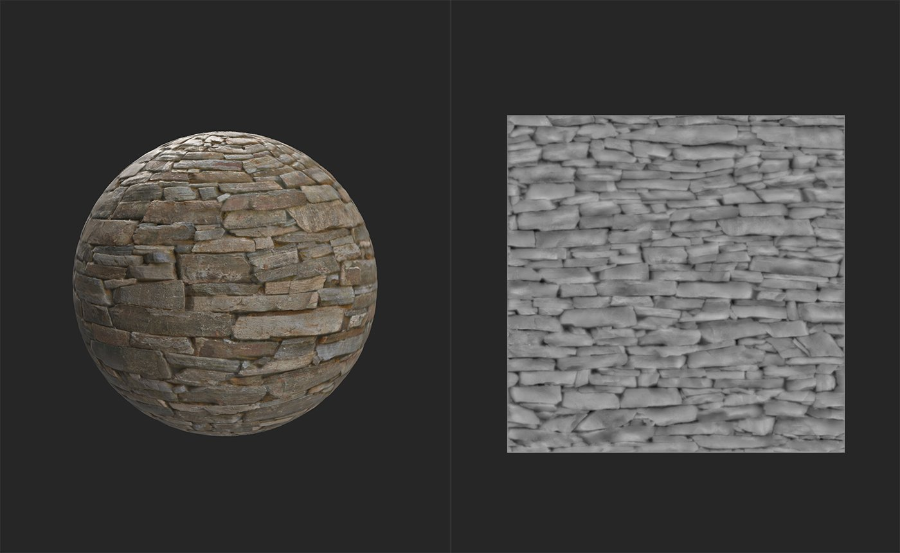

# Equalizar

<table>
<tr style="border: 0;">
<td width="41.60%" style="border: 0;" valign="top">

**Entrada:** Ajustes

</td>
<td width="58.30%" style="border: 0;" valign="top">

## Descrição

O filtro Equalizar ajusta o contraste local com base em um intervalo de distância. O objetivo do filtro Equalizar é reduzir grandes diferenças em cada canal. Como resultado, geralmente é útil como parte do fluxo de trabalho de Imagem para material (B2M) - o filtro de Imagem para material (viabilizado por IA) inclui uma passagem de Equalização no filtro para melhorar os resultados.

As imagens abaixo mostram o **filtro Equalizar** em ação.

Antes de adicionar o **filtro de equalização**, há uma variação significativa no mapa de heights e na cor base deste material.

Depois que o **filtro Equalizar** for adicionado, os canais do mapa de altura e de cor de base serão mais uniformes sem perder os detalhes.

</td>
</tr>
</table>

## Tutorial sobre o filtro equalizado

## Parâmetros

<b>Parâmetros básicos</b>

* <b>Entrada lado a lado</b>: alternar\
  Quando ativado, trate o material como se estivesse lado a lado repetidamente, de modo que as bordas próximas alteradas serão influenciadas pelos valores de cor na borda oposta.
* <b>Raio</b>: 0-1\
  Espalhe o efeito Equalizar sobre uma área mais ampla.
* <b>Sangramento de cor</b>: 0-1\
  Controle as cores que sangram na área ao redor.
* <b>Detalhes locais</b>: 0-1\
  Ajuste como o filtro Equalizar tenta preservar os detalhes locais.

<b>*Canal*</b>

Os controles de cada canal funcionam da mesma maneira.

* <b>Substituir Parâmetros Comuns</b>: alternar\
  Ative esta opção para personalizar o efeito Equalizar para este canal. Quando ativado, controles adicionais são exibidos:
  * <b>Entrada lado a lado</b>: alternar\
    Quando ativado, trate o material como se estivesse lado a lado repetidamente, de modo que as bordas próximas alteradas serão influenciadas pelos valores de cor na borda oposta.
  * <b>Raio</b>: 0-1\
    Espalhe o efeito de equalização sobre uma área mais ampla.
  * <b>Manter Diferenças Locais</b>: alternar\
    Ative para fazer o efeito de equalização funcionar em uma resolução mais alta para manter os detalhes
* <b>Modo de Destino</b>:\
  Selecione como distorcer o efeito Equalizar. Por padrão, a Equalização tenta mover as cores em direção à cor média do canal. Use Parâmetro para, em vez disso, criar uma tendência em direção a uma cor ou valor escolhido. Com a opção Parâmetro selecionada, um controle adicional será exibido:
  * <b>Destino</b>: seleção de cor\
    Selecione uma cor ou valor para agir como destino para o algoritmo de equalização.
* <b>Variação de cor personalizada</b>: controles deslizantes de HSL\
  Ajuste a Matiz, a Croma (Saturação) e a Luminosidade (Luminância) do resultado depois que o algoritmo de equalização tiver sido executado para o canal especificado.

<b>Máscara</b>

* <b>Máscara personalizada</b>: alternar\
  Ativar ou desativar o uso de uma máscara personalizada para este filtro
* <b>Máscara personalizada</b>: imagem/pincel\
  Selecione uma imagem para usar como máscara ou use o pincel para tinta uma máscara personalizada diretamente na Visualização 2D
* <b>Inversão de máscara personalizada</b>: alternar
