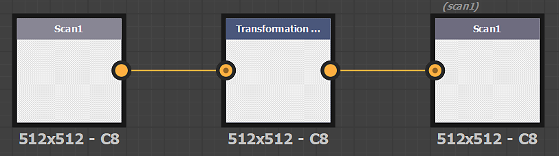

# Filtros personalizados

## Filtros Personalizados do Substance

É possível importar filtros criados com o Adobe Substance 3D Designer por meio do botão *Importar* nas ações da Pilha de Camadas.

### Criar um filtro de Substance

Os filtros devem ser criados de uma maneira específica no Designer para funcionar corretamente depois de importados para o Sampler.

Os nós de entrada e saída do filtro devem ter um identificador ou uso definido.

>[!NOTE]
>
> É possível usar o **uso** ou o **identificador** (o uso tem a prioridade).

#### Formato

Exporte o filtro como um arquivo de Substance Archive (.SBSAR)

>[!NOTE]
>
> É possível expor parâmetros de filtro para controlar o filtro diretamente no Sampler. Veja instruções [aqui](https://experienceleague.adobe.com/pt-br/docs/substance-3d-designer/using/substance-graphs/manage-parameters/exposing-a-parameter)

#### Criar um filtro para modificar imagens

| Nome das imagens | Uso |
| --- | --- |
| *Verificação1* | **verificação1** |
| *Verificação2* | **digitalização2** |
| *...* | **...** |

#### Criar um filtro para modificar canais

| Nome do canal | Uso |
| --- | --- |
| *Cor base* | **basecolor** |
| *Difusa* | **difuso** |
| *Specular* | **specular** |
| *Specular level* | **nível especulativo** |
| *Metálico* | **metálico** |
| *Aspereza* | **aspereza** |
| *Textura reluzente* | **textura reluzente** |
| *Normal* | **normal** |
| *Height* | **height** |
| *Oclusão de ambiente* | **ambientOcclusion** |
| *Opacidade* | **opacidade** |

>[!IMPORTANT]
>
> Ao criar um filtro personalizado para o Sampler, você precisa adicionar os seguintes dados de usuário ao seu gráfico de Substance:
>
> alchemist::type=filter;

>[!IMPORTANT]
>
> Se, no seu pacote, você tiver um gráfico para processar imagens (scan1 a scanX) e um gráfico para processar materiais (canais PBR), o Sampler poderá escolher o gráfico correto dependendo de onde o filtro estiver inserido na pilha de camadas.
>
> No gráfico de “imagem”, adicione os seguintes dados de usuário:
>
> * alchemist::type=filter;alchemist::variation::type=multi
>
> No gráfico de “material”, adicione os seguintes dados do usuário:
>
> * alchemist::type=filter;alchemist::variation::type=material

### Parâmetros específicos

Parâmetros específicos são gerenciados globalmente pelo aplicativo. É uma maneira de usar os parâmetros globais do aplicativo, do projeto e da pilha de camadas nos filtros personalizados.

#### Formato padrão

Controle do formato normal sobre o aplicativo. Definir como DirectX no Sampler

**Identificador de parâmetro**: normalformat, normal_format, $normalformat, $normal_format

#### Contagem de entradas

Quando você deseja modificar imagens (scan1 para scanX), use o número de imagens na pilha de camadas usando o parâmetro **Contagem de Imagens**.

* **Identificador de parâmetro**: input_count
* **Tipo de parâmetro**: integer1

#### Entrada de material

Se você deseja exibir um slot de material na pilha de camadas, como o atlas scatter ou o respingo:

* Adicionar um novo conjunto de nós de entrada (Cor base, Normal ... )
* Todos os nós de entrada do fundo (material inferior na pilha de camadas) devem estar no Grupo **Material1**
* Todos os nós de entrada do primeiro material que você deseja adicionar na parte superior devem estar no Grupo **Material2** e etc. se você quiser vários slots de material.
* Adicione um parâmetro de entrada de material:
  * **Identificador de parâmetro**: material_input
  * **Tipo de parâmetro**: integer1

#### Tipo de Fluxo de Trabalho

Se quiser exibir/ocultar alguns parâmetros com base no workflow do seu projeto (PBR Metálico/Aspereza ou PBR Specular/Brilho), você poderá usar o parâmetro Tipo de Workflow

**Identificador de parâmetro**: workflow_type

**Tipo de parâmetro**: inteiro1, lista suspensa

opções:

* 0: PBR metálico/aspereza
* 1: Specular/textura reluzente de PBR

{width="300px"}
