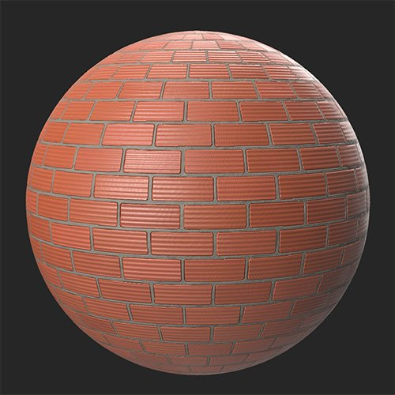

# Brickwall

<table>
<tr style="border: 0;">
<td width="41.60%" style="border: 0;" valign="top">

Geradores de **Entrada:**

</td>
<td width="58.30%" style="border: 0;" valign="top">

DescriçãoO filtro Brickwall gera um padrão de tijolo com base nas camadas abaixo dela. Isso é útil para criar paredes de tijolos (como o nome sugere), mas também pisos, ou em qualquer outro lugar onde os tijolos são usados.

Nas imagens abaixo, um material de argila é convertido em uma parede de tijolos com o **filtro de parede de tijolos.**

<table>
<tr style="border: 0;">
<td style="border: 0;" valign="top">

{width="200px"}

</td>
<td style="border: 0;" valign="top">

{width="200px"}

</td>
</tr>
</table>

</td>
</tr>
</table>

## Parâmetros

**Predefinições**

Selecione entre várias predefinições para emular rapidamente um estilo específico.

**Parâmetros Básicos**

* **Distribuição aleatória**: número aleatório\
  O valor aleatório usado para determinar outros valores aleatórios neste filtro.\
  Clique no número para obter um novo valor aleatório. Quando um valor aleatório for selecionado, clique no nome do parâmetro para redefinir o valor como 0.
* **Ligação de tijolo**:\
  Mesclar tijolos com base no estilo selecionado
* **Tipo de tijolo**:\
  Selecionar o estilo do tijolo
* **Bloco**: 1-25\
  Alterar a quantidade de divisão em blocos gráficos nos eixos X e Y.
* **Deslocamento**: 0-1\
  Modifique o deslocamento de cada linha de tijolos da linha anterior.
* **Usar Cor Personalizada**: alternar\
  Mesclar tijolos com base no estilo selecionado

**Mix**

* **Modo de mistura**:\
  Altere como os tijolos são organizados. Usar um **Modo de mistura** cria um segundo conjunto de tijolos que pode ser controlado independentemente do conjunto base.\
  Com o **Modo de mistura** definido como **Nenhum**, nenhum outro parâmetro aparecerá nesta seção.
* **Tipo de tijolo 2**:\
  Selecione o estilo do segundo conjunto de tijolos.
* **Deslocamento de Height**: 0-1\
  Deslocar o height do segundo conjunto de tijolos

**Cimento**

* **Cor de cimento**: seletor de cores\
  Alterar a cor do cimento entre tijolos.
* **Aspereza do cimento**: 0-1\
  Altere a aspereza do cimento entre os tijolos.
* **Interstício de cimento**: 0-1\
  Altere a largura do cimento entre os tijolos. Altera o tamanho do tijolo.
* **Nível de cimento**: 0-1\
  Alterar o height do cimento
* **Distúrbio Do Cimento**: 0-1\
  Ajuste a planura do cimento. Em valores altos, o cimento pode subir acima dos tijolos.

**Idade**

* **Desordem de tijolos**: 0-1\
  Ajuste aleatoriamente a rotação de cada tijolo em 3 dimensões.
* **Quebra de tijolo**: 0-1\
  Adicionar rachaduras em tijolos
* **Borda de Tijolo**: 0-1\
  Danificar e quebrar as bordas dos tijolos
* **Tijolo Desbloqueado**: 0-1\
  Remover tijolos aleatoriamente
* **Variação de cor de tijolo**: 0-1\
  Varie a cor dos tijolos para deixar a parede menos uniforme
* **Sujeira de tijolo**: 0-1\
  Adicionar dirt aos tijolos

**Parâmetros Avançados**

* **Intensidade de mistura do Height**: 0-1\
  Ajuste a mesclagem do height do material de base. Um valor de 0 ignora o height do material de base e só usa os parâmetros do filtro de Parede de tijolo para gerar informações do height. Um valor de 1 usa o material de base para gerar informações sobre o height.
* **Intensidade Normal**: 0-1\
  Ajuste a intensidade dos normais gerados pelo filtro de Parede de tijolo. Um valor 0 significa efetivamente que não há normais.
* **Intensidade de Oclusão do ambiente**: 0-1\
  Ajuste a força do AO. Um valor de 0 significa efetivamente que não há Oclusão ambiente.

Guia de Uso

O filtro de Parede de tijolo quebra o material subjacente em tijolos individuais que depois é reorganizado. Por esse motivo, o filtro Brickwall funciona melhor com superfícies duras como rochas ou metais - em outras palavras, os materiais mais adequados para serem tijolos no mundo real.

O filtro Parede de tijolo é útil para criar uma material de base que você pode então sobrepor outros efeitos, como musgo, neve ou dirt.
