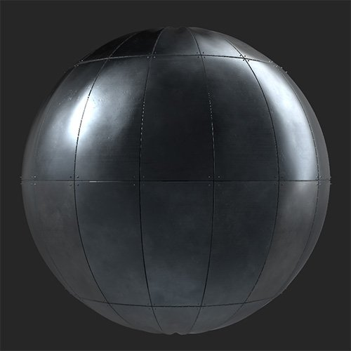

# Painel

<table>
<tr style="border: 0;">
<td width="41.60%" style="border: 0;" valign="top">

Geradores de **Entrada:**

</td>
<td width="58.30%" style="border: 0;" valign="top">

## Descrição

Converta seu material em painéis. O filtro Painéis é particularmente adequado para materiais metálicos.

*Um material metálico contínuo convertido em painéis.*

{width="200px"}

{width="200px"}

</td>
</tr>
</table>

## Parâmetros

**Predefinições**

Use predefinições para modificar rapidamente parâmetros e criar um efeito específico.

**Parâmetros básicos**

* **Distribuição aleatória**:\
  A distribuição aleatória determina os valores aleatórios de outros parâmetros que usam a aleatoriedade neste filtro.
* **Valor X**: 0-20\
  Alterar o número de painéis no eixo X
* **Valor Y**: 0-20\
  Alterar o número de painéis no eixo Y
* **Tipo de costura**:\
  Selecionar diferentes estilos de emendas entre os painéis
* **Usar fixadores**:\
  Adicione fixadores entre os painéis. Quando ativada, a seção Fixadores aparecerá na lista de parâmetros.

**Painéis**

* **Valor de Deslocamento**: 0-1\
  Desloque cada linha de painéis da linha anterior em uma porcentagem do tamanho do painel.
* **Deslocamento Aleatório**: 0-1\
  Adicionar um valor aleatório ao deslocamento de cada linha
* **Deslocamento vertical**: alternar\
  Alternar entre deslocamento horizontal e deslocamento vertical.
* **Tensão Protuberante**: -1 a 1\
  Modifique as normais de cada painel para que pareça que o painel está se destacando para dentro ou para fora devido à pressão.
* **Rugas**: 0-1\
  Adicionar sutis amassadas e rugas aos painéis
* **Variação de cor**: 0-1\
  Variar aleatoriamente a cor entre os painéis individuais
* **Variação de Reflexo**: 0-1\
  Variar aleatoriamente a aspereza de painéis individuais

**Faixas**

A seleção de parâmetros nesta seção depende de qual valor você escolheu em **Parâmetros básicos > Tipo de costura**.

* ***Lacuna***
  * **Largura da emenda**: 0-1\
    Modificar a largura entre os painéis
  * **Variação de Espaço**: 0-1\
    Desloque os painéis em uma pequena quantidade para que os espaços entre os painéis variem em largura
  * **Arredondamento dos Cantos do Espaço**: 0-1\
    Arredondar as bordas dos painéis
  * **Chanfro de espaço**: 0-1\
    Chanfrar as bordas dos painéis
* ***Solda***
  * **Largura da emenda**: 0-1\
    Modificar a largura entre os painéis
  * **Qualidade Da Solda**: 0-1\
    Ajustar a uniformidade da solda
  * **Descoloração De Solda**: 0-1\
    Modifique a intensidade de descoloração da solda em comparação à cor dos painéis.
  * **Substituir material de solda**: alternar\
    Habilite para personalizar o material usado para criar a solda. Os seguintes parâmetros adicionais serão exibidos se isso estiver ativado:
    * **Cor do material de solda**: seleção de cor\
      Selecione a cor da solda. Isso ainda será afetado pela **Descoloração de solda**.
    * **Aspereza do material de solda**: 0-1\
      Ajustar a aspereza da linha de solda entre os painéis
* ***Sobreposição***
  * **Largura da emenda**: 0-1\
    Modificar a largura entre os painéis
* ***Linha Permanente***
  * **Largura da emenda**: 0-1\
    Modificar a largura entre os painéis

**Prendedores**

* **Tipo de fixador**:\
  Selecione o estilo de fixador a ser usado entre os painéis
* **Quantidade de prendedores**: 3-10\
  Altere o número de prendedores a serem usados ao longo da borda entre dois painéis.
* **Tamanho do Prendedor**: 0-1\
  Modifique o tamanho dos fixadores
* **Variação do fixador**: 0-1\
  Deslocar a posição dos fixadores
* **Substituir material de fixação**: alternar\
  Modifique o material usado para fixadores separadamente do material de base. Quando ativado, os seguintes parâmetros são exibidos:
  * **Cor do material de fixação**: seleção de cor\
    Selecione a cor do material de prendedor
  * **Aspereza do material de fixação**: 0-1\
    Modifique a aspereza do material de fixação

**Avançado**

* **Normal** **Intensidade**: 0-3\
  Ajuste a intensidade normal geral do material
* **Intervalo de Heights de emendas**: 0-1\
  Modificar a altura das emendas personalizadas acima dos painéis
* **Intervalo de Height do Prendedor**: 0-1\
  Modifique o height dos fixadores
* **Profundidade DE Height DO AO**: 0-1\
  Alterar a intensidade do AO
* **Raio do AO**: 0-1\
  Modificar o raio do AO
