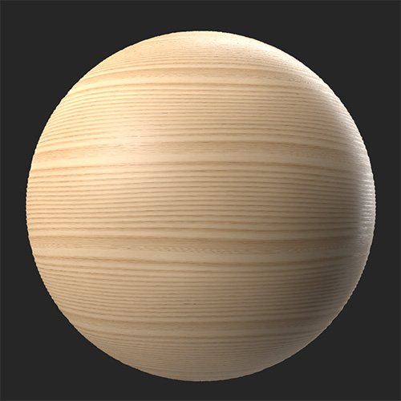

# Assoalho

<table>
<tr style="border: 0;">
<td width="41.60%" style="border: 0;" valign="top">

Geradores de **Entrada:**

</td>
<td width="58.30%" style="border: 0;" valign="top">

## Descrição

Converta seu material em um piso de parquet.

*Um material de madeira convertido em um padrão de parquet com o **Filtro de assoalho**.*

<table>
<tr style="border: 0;">
<td style="border: 0;" valign="top">

{width="200px"}

</td>
<td style="border: 0;" valign="top">

{width="200px"}

</td>
</tr>
</table>

</td>
</tr>
</table>

## Parâmetros

**Predefinições**

Use predefinições para alterar rapidamente os parâmetros para ver diferentes estilos de piso de parquet.

**Parâmetros básicos**

* **Distribuição aleatória**:\
  A distribuição aleatória determina os valores aleatórios de outros parâmetros que usam a aleatoriedade neste filtro.
* **Tipo de Padrão**:\
  Selecione o padrão de parquet
* **Valor X**: 1-30\
  Alterar o número de plantas no eixo X
* **Valor Y**: 1-30\
  Alterar o número de pranchas no eixo Y
* **Distância da emenda**: 0-1\
  Modificar a distância do chanfro ao redor das costuras das pranchas
* **Variação de Plataformas**: 0-1\
  Variar automaticamente a cor e a aspereza de cada prancha

**Avançado**

* **Deslocamento de Padrão em Inglês**: 0-1 (Este parâmetro só estará disponível se **Parâmetros básicos > Tipo de Padrão** estiver definido como **Inglês**)\
  Alterar o deslocamento de cada linha de pranchas da linha anterior
* **Intensidade da emenda**: 0-1\
  Ajuste os normais das emendas entre as pranchas para torná-las mais ou menos perceptíveis
* **Curva de chanfro de costura**: 0-1\
  Modificar a largura do chanfro entre as pranchas
* **Intervalo de Height de costura**: 0-1\
  Ajustar o height das emendas
* **Variação de Rotação Normal de Plataformas**: 0-1\
  Variar o ângulo de cada prancha por uma quantidade aleatória
* **Variação de aspereza de pranchas**: 0-1\
  Varie aleatoriamente a aspereza de cada prancha.
