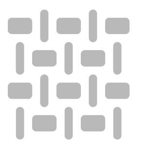

# Padrão

<table>
<tr style="border: 0;">
<td width="41.60%" style="border: 0;" valign="top">

Geradores de **Entrada:**

</td>
<td width="58.30%" style="border: 0;" valign="top">

## Descrição

Adicione um padrão ao seu material usando uma das opções disponíveis ou use uma imagem ou pincel para personalizar seu próprio padrão.

*Um exemplo do **Filtro de padrão**aplicado ao jeans.*

<table>
<tr style="border: 0;">
<td style="border: 0;" valign="top">

{width="200px"}

</td>
<td style="border: 0;" valign="top">

{width="200px"}

</td>
</tr>
</table>

</td>
</tr>
</table>

## Parâmetros

<b>Parâmetros básicos</b>

* <b>Propagação Aleatória</b>: 0-1\
  A distribuição aleatória determina os valores aleatórios de outros parâmetros que usam a aleatoriedade neste filtro.
* <b>Padrão </b>: seletor de imagens e/ou tinta\
  Selecione um padrão no gerador de textura ou importe um
* <b>Seleção de modo de cores </b>: apenas material ou cor\
  O modo <b>Material</b> influencia todos os *canais PBR* e o modo <b>Somente cor</b> somente influencia a *BaseColor* do material.
* <b>Quantidade de cores </b>: 1-10\
  Selecionar a intensidade de cor ativa no padrão
* <b>matiz</b>: 0-1\
  Ajuste o matiz de cor do padrão
* <b>Cor da máscara</b> : alternar\
  Mascarar a cor selecionada, depende da <b>Intensidade de cor</b>
* <b>Substituir cor: </b> alternar\
  Substituir a cor selecionada, depende da <b>Intensidade de cor</b>
* <b>Aspereza</b>: 0-1\
  Definir a aspereza da cor selecionada, depende da <b>Quantidade de cores</b>
* <b>Metálico</b>: 0-1\
  Definir a aspereza da cor selecionada, depende da <b>Quantidade de cores</b>
* <b>Modo Relevo</b>: alternar\
  Selecione a direção do Relevo da cor selecionada, depende da <b> Quantidade de cor</b>
* <b>Intensidade de Relevo: </b>0-1<b>\
  </b>Ajuste a intensidade do entalhe da cor selecionada, depende da<b> Intensidade da cor</b>
* <b>Distância do Relevo: </b>0-1\
  Esticar e suavizar a zona de entalhe da cor selecionada, depende da <b> Quantidade de cor</b>
* <b>Granulação do Relevo: </b>0-1\
  Adicionar granulação na cor selecionada, depende da <b>Quantidade de cores</b>
