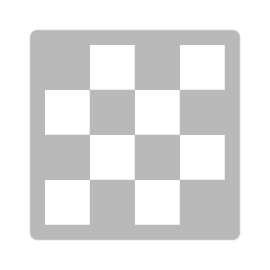

# Atlas Creator

<table>
<tr style="border: 0;">
<td width="41.60%" style="border: 0;" valign="top">

Ferramentas de **Entrada:**

</td>
<td width="58.30%" style="border: 0;" valign="top">

## Descrição

O **Criador de Atlas** **filtro** permite converter materiais e imagens em um atlas. Você pode usar outros filtros, como **Atlas scatter** e **Atlas splitter**, para usar elementos atlas dentro dos materiais.

As imagens abaixo mostram um atlas de folhas de selva antes e depois de serem processadas pelo **Criador de Atlas**.

Na imagem acima, uma imagem do atlas foi importada e convertida em um material, mas ainda não é um material do atlas porque o mapa de opacidade não considera elementos individuais.

Depois de executar o **Criador de Atlas**, um mapa de opacidade é gerado e a área entre os elementos do atlas é preenchida no canal de cor base.

</td>
</tr>
</table>

Parâmetros

**Parâmetros básicos**

* **Remover Formas Pequenas**: 0-1

  Use isso para ajustar o tamanho mínimo dos objetos no atlas. Isso é útil para remover artefatos.
* **Opacidade - Influência de crominância**: 0-2

  Ajuste as bordas dos elementos do atlas com base em valores de cor.
* **Adicionar opacidade**: imagem/pincel

  Importe um arquivo para usar como máscara ou use o pincel para pintar áreas que devem ser opacas diretamente na **exibição 2D**.

Guia de Uso

## Preparar uma imagem de atlas

Antes de usar o **filtro Criador de Atlas**, é uma boa ideia garantir que a imagem do atlas esteja preparada corretamente.

O **Criador de Atlas** funciona com base na cor da imagem e não considera a transparência. Isso significa que a melhor maneira de preparar sua imagem do atlas é garantir que o espaço entre os elementos seja um preto ou branco consistente, facilitando para o **Criador de Atlas** gerar a máscara de opacidade.

## Gerar um material de atlas a partir de uma imagem

O **Criador de Atlas** foi projetado para converter uma imagem de atlas em um atlas de material.

1. Importe a imagem de origem para a pilha de camadas.
1. Se for solicitado a selecionar um modelo de criação de material, selecione Imagem para material. Caso contrário, com a imagem na pilha de camadas, adicione um **filtro de Imagem para material (com IA)** acima da imagem.
1. Aguarde o filtro **Imagem para Material** para converter a imagem de origem em um material. Ajuste os parâmetros até ficar satisfeito com o resultado.
1. Adicione o **filtro Criador do Atlas** ao topo da pilha de camadas.
1. Ajuste os parâmetros do **Criador de Atlas** até ficar satisfeito com os resultados.

1. Adicione a imagem à pilha de camadas. Se for solicitado selecionar um modelo de criação de material, selecione **Usar como bitmap**.
1. Com a camada da imagem selecionada, no **painel Propriedades**, altere o **Uso de Saída** para **Cor Base**.
1. Adicione o **Criador de Atlas** ao topo da pilha de camadas.
1. Ajuste os parâmetros do **Criador de Atlas** até ficar satisfeito com os resultados - exiba o canal de opacidade na **exibição 2D** para ver os resultados do filtro com mais clareza.
1. Use o **painel Exportar** para exportar os canais gerados.
