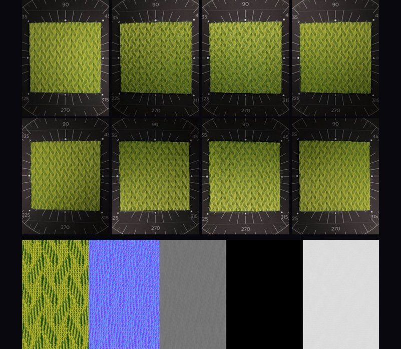

# Multiângulo para material

O modelo **Multiângulo para material** cria um material de 2 a 8 imagens de entrada tiradas sob condições específicas de luz. Tais condições de luz podem ser alcançadas com um scanner de material.

>[!NOTE]
>
> Você pode encontrar mais informações sobre como criar seu próprio scanner de material [neste artigo](https://www.adobe.com/products/substance3d/magazine/your-smartphone-is-a-material-scanner-vol-ii.html).

## Exemplo

Veja um exemplo de um material criado a partir de 8 imagens de entrada:

* As oito primeiras imagens são imagens de varredura tiradas sob oito ângulos de luz.
* As imagens inferiores são as saídas do modelo (cor base, normal, height, metálico e aspereza).

{width="400px"}

## Configuração do Substance 3D Sampler

Há três itens a serem definidos e configurados para ter certeza de que os canais PBR serão extraídos corretamente:

* Ordem das imagens digitalizadas
* O primeiro ângulo de luz de entrada
* o próximo ângulo de luz de entrada

{width="450px"}

### Ordem das imagens digitalizadas

Ao importar imagens, verifique na Camada de importação de imagem se as 8 imagens são consecutivas.

Por exemplo, a primeira imagem em 0° deve ser **digitalização1** e a imagem em 45° deve ser **digitalização2** ... então a imagem em 315° deve ser **digitalização8**

{width="450px"}

### Ângulo da luz primeiro e próximo

Na camada Multiângulo para material:

* Defina O Primeiro Ângulo De Luz De Entrada. Se a sua **digitalização1** estiver em 180°, o primeiro ângulo de luz de entrada =0,5 ou se a sua **digitalização1** estiver em 0°, o primeiro ângulo de luz de entrada = 0
* Definir próximo ângulo de luz de entrada: define a direção da rotação da imagem. Se scan1 for 0°, scan2 45°... o valor será **sentido anti-horário**

{width="450px"}
