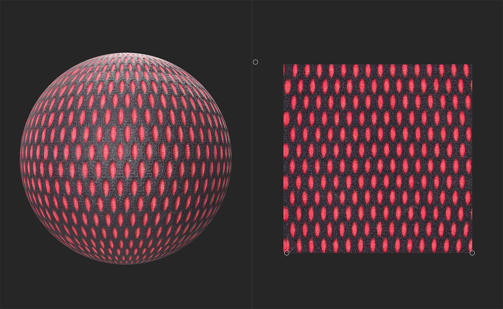

# Perspectiva Transformo

<table>
<tr style="border: 0;">
<td width="41.60%" style="border: 0;" valign="top">

Ferramentas de **Entrada:**

</td>
<td width="58.30%" style="border: 0;" valign="top">

## Descrição

Use a <b>ferramenta Transformar </b> para corrigir problemas de Perspectiva em uma imagem. O <b>Transformo de Perspectiva</b> também pode ser usado em materiais.

A imagem abaixo mostra um material de exemplo antes de ser corrigido pela <b>ferramenta Transformar Perspectiva</b>. Observe como as formas próximas à parte superior da Visualização 2D são alongadas verticalmente em comparação com as formas na parte inferior da Visualização 2D.

Com o <b>Transformo de Perspectiva</b>, as formas são consistentes e formam uma grade. É fácil usar filtros desse ponto, como <b>Divisão em blocos gráficos</b> ou <b>Torná-lo Lado a Lado</b> para convertê-lo em um material ladrilhável.

</td>
</tr>
</table>

## Guia de Uso

Com a camada Transformar Perspectiva selecionada, uma alça aparece em cada canto da textura na Visualização 2D. Mova-os individualmente no espaço 2D para corrigir a Perspectiva.

{width="300px"}

## Barra de ferramentas

Com a camada Perspectiva Transformo selecionada, uma barra de ferramentas aparece na parte superior da **Visualização 2D**. Use o **botão Redefinir posições** para redefinir as alças da camada de Transformo de Perspectiva para as posições padrão.
