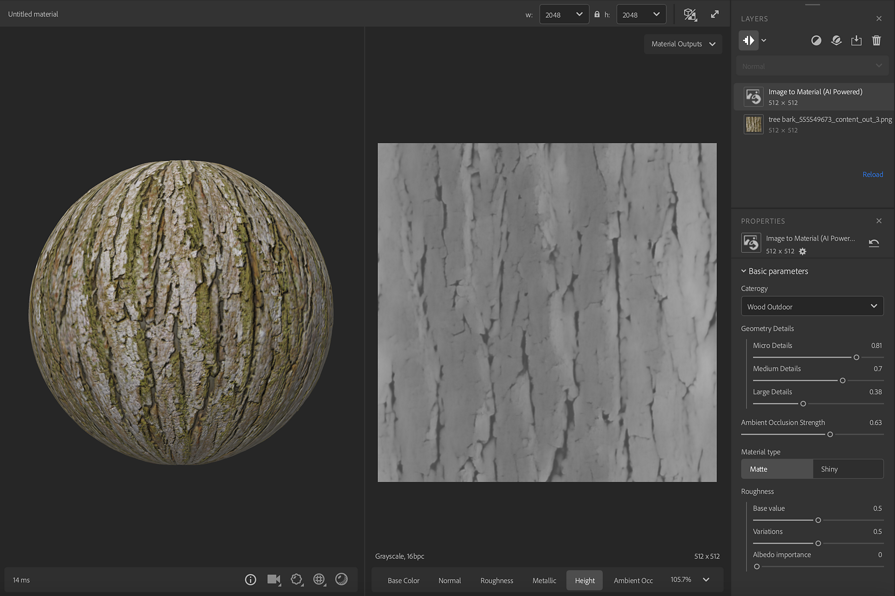

# Aumentar

<table>
<tr style="border: 0;">
<td style="border: 0;" valign="top">

Ferramentas de **Entrada:**

</td>
<td style="border: 0;" valign="top">

## Descrição

O filtro <b>Upscale </b> usa IA para aumentar a resolução de canais PBR (BaseColor, Roughness, Normal, Metallic, Height) das camadas abaixo dele.

<table>
<tr style="border: 0;">
<td style="border: 0;" valign="top">

</td>
<td style="border: 0;" valign="top">

</td>
</tr>
</table>

Neste exemplo, começamos com uma imagem de 1024x1024px, mas o resultado da saída é 4098x4098px. Os resultados que usam o filtro <b>Ampliação</b> são mais definidos.

</td>
<td style="border: 0;" valign="top">

>[!NOTE]
>
> **Filtro avançado**
> 
> O <b>Aumento</b> é um filtro avançado.\
> Para usá-lo na capacidade máxima e evitar resultados desfocados, recomendamos definir as camadas abaixo da <b>Ampliação</b> em Máximo de Entrada de Camada ou Mín. de Entrada de Camada.
> 
> Não há limites para quantos filtros de <b>Ampliação </b> podem ser usados, mas aumentar a resolução acima de 8k pode afetar significativamente o desempenho.

</td>
</tr>
</table>

## Parâmetros

<b>Parâmetros básicos</b>

* <b>Amostra para cima</b>: alternar grupo de botões\
  Escolha o fator de multiplicação para aumentar

## Como

Na imagem acima, uma imagem de baixa resolução é processada pela [Imagem para material (viabilizada por IA)](image-to-material.md).

O filtro <b>Ampliação</b> é adicionado para aumentar a amostra dos resultados. Ele halucina detalhes para alcançar uma resolução mais alta mantendo a qualidade do material. Você pode escolher nas propriedades aumentar a resolução em 2 ou em 4.
