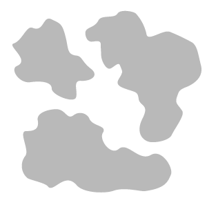

# Musgo

<table>
<tr style="border: 0;">
<td width="41.60%" style="border: 0;" valign="top">

**Dentro:** desgaste e acabamento

</td>
<td width="58.30%" style="border: 0;" valign="top">

## Descrição

Use o **filtro de musgo** para adicionar musgo e líquen ao seu material. O **Moss** usa o mapa de oclusão do seu material para crescer naturalmente em rachaduras e fendas.

As imagens abaixo mostram o material do dirt antes e depois da aplicação do **filtro de musgo**.

<table>
<tr style="border: 0;">
<td style="border: 0;" valign="top">

{width="200px"}

</td>
<td style="border: 0;" valign="top">

{width="200px"}

</td>
</tr>
</table>

</td>
</tr>
</table>

## Parâmetros

**Parâmetros básicos**

* **Distribuição aleatória**:\
  A semente aleatória na qual todos os outros parâmetros aleatórios deste filtro se baseiam.
* **Expansão Global Do Moss**: 0-1\
  Ajuste a cobertura do musgo em seu material.
* **Cor do musgo**: seleção de cores\
  Selecione a cor primária do musgo.
* **Cor de musgo secundária**: seleção de cor\
  Selecione a cor secundária do musgo.
* **Repartição de Moss**:\
  Selecione o método usado para aplicar o musgo. Por padrão, a **Oclusão** usa o mapa AO do seu material para aplicar o musgo, mas as outras opções terão efeitos diferentes. Se a **Máscara** **Personalizada** estiver selecionada, a **Máscara** **seção** será exibida.

**Máscara**

Esta seção só será exibida se a **Máscara Personalizada** for escolhida em **Parâmetros básicos > Repartição do Moss**.

* **Máscara Personalizada - Desfoque**: 0-1\
  Desfocar a máscara.
* **Máscara personalizada - Inverter**: alternar\
  Inverta a máscara.
* **Máscara personalizada**: imagem/pincel\
  Selecione uma imagem para usar como máscara ou use o pincel para pintar uma máscara personalizada diretamente na exibição 2D.

**Moss**

Os parâmetros disponíveis nesta seção dependem da opção selecionada em **Parâmetros básicos > Repartição do Moss**.

* **Oclusão**
  * **Propagação de Oclusão do Moss**: 0-1\
    Controle a propagação do musgo com base na oclusão.
  * **Máscara de Oclusão do Moss**: 0-1\
    Ajuste a quantidade de musgo usando o mapa de oclusão como máscara.
* **Geral**
  * **Propagação Geral do Moss**: 0-1\
    Ajuste a quantidade de musgo a aparecer.
* **Superior**
  * **Limite Superior do Moss**: 0-1\
    Controle o limite que determina se o musgo aparece ou não.
  * **Ângulo Superior do Musgo** Ajuste como o musgo se aplica ao material com base no mapa normal.
* **Todos**
  * **Tudo** inclui todos os parâmetros acima para **Oclusão**, **Geral** e **Superior**.

Os parâmetros a seguir estão disponíveis independentemente da opção selecionada em **Parâmetros básicos > Repartição do Moss**.

* **Flores de musgo Tamanho**: 0-1\
  Altere a granularidade do musgo.
* **Intensidade da Granulação do Musgo**: 0-1\
  Ajuste a visibilidade da granulação do musgo.
* **Tamanho dos Moss Clumps**: 0-1\
  Controle a tendência do musgo de se agrupar.
* **Nitidez de grupos de musgo**: 0-1\
  Ajuste a suavidade das bordas dos grumos.
* **Intensidade de Agrupamentos de Musgo**: 0-1\
  Controle a intensidade dos grupos de musgo.
* **Difusão do musgo**: 0-1\
  Ajuste como as bordas da máscara de musgo são difusas.
* **Intensidade de Relevo do Musgo**: 0-1\
  Mude o relevo do musgo.
* **Limite Superior do Moss**: 0-1

**Parâmetros Técnicos**

* **Intensidade Normal**: 0-1\
  Ajuste a força dos normais de musgo.
* **Intensidade de Oclusão ambiente** Controle a intensidade da oclusão ambiente do musgo.
