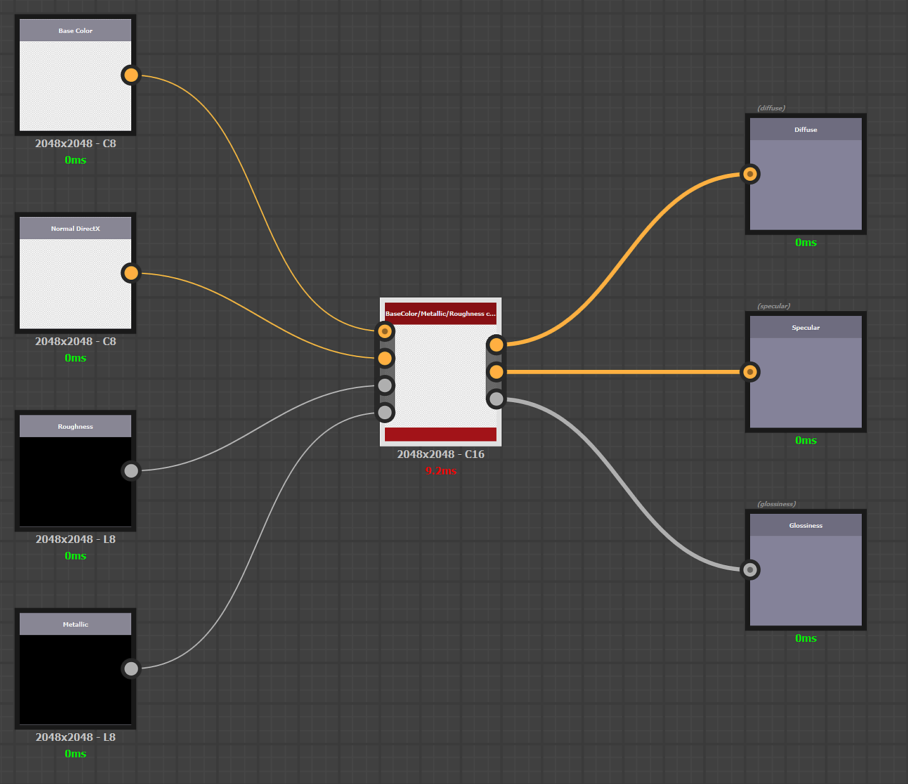

# Criar e editar predefinições personalizadas

Predefinições personalizadas podem ser criadas com o Substance 3D Designer.

A criação de predefinições personalizadas respeita as mesmas regras da criação de um filtro personalizado para o Sampler. A documentação está disponível [aqui](../../filters/custom-filters.md).

## Criação

## Criar o gráfico

Abra Substance Designer e crie um novo gráfico de Substance.

Abra as propriedades do gráfico e preencha as seguintes informações obrigatórias:

* Rótulo: insira o nome da predefinição personalizada que será usada na interface do Sampler
* Dados do Usuário: <b>alchemist::type=filter</b>

## Definição de entradas e saídas

### Entradas

As entradas representam os canais de material que você deseja transformar antes da exportação.

Crie um nó de Cor de entrada (ou tons de cinza) por canal de material e adicione um <b>uso</b> nos atributos de cada nó de entrada para garantir que a conexão seja feita entre o(s) material(is) e a predefinição personalizada.

Exemplo: definição da entrada de cor base

{width="600px"}

### Saídas

As saídas representam o resultado da exportação da textura.

Crie um nó de Saída por textura e adicione <b>uso</b> e um <b>rótulo</b> nos atributos de cada nó de saída. O <b>rótulo</b> será exibido na lista Canais na janela do Exportador e no nome do seu arquivo de textura.

Exemplo: definição da opacidade de cor da textura personalizada

{width="600px"}

#### Exemplo de embalagem de canal e conversão de canal

Embalagem de 3 canais em tons de cinza em uma textura:

{width="600px"}

Conversão do canal de PBR metálico/aspereza para PBR Specular/brilho:

{width="600px"}

## Importar

Para importar a nova predefinição:

1. Clique no botão <b>Gerenciar predefinições </b>à direita do menu suspenso <b>Predefinições</b>.
1. Use o botão <b>Importar predefinições</b> na parte inferior da <b>lista de predefinições</b>.

{width="400px"}
