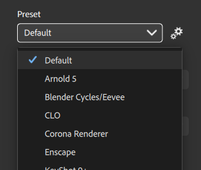

# Gerenciando predefinições

As predefinições permitem configurar rapidamente o arquivo exportado para um determinado aplicativo. Você também pode criar predefinições personalizadas para atender às suas necessidades se estiver usando um pipeline não coberto pelas predefinições padrão.

## Usar predefinições

As predefinições só estão disponíveis ao exportar para um arquivo de imagem. Ao exportar para SBS ou SBSAR, as predefinições não são necessárias.

Para acessar as predefinições:

1. Abra a janela <b>Exportar </b>:
   1. Use o <b>painel Exportar</b> na <b>barra Direita</b>.
   1. Usar <b> Arquivo > Exportar como...</b>
   1. Usar o atalho <b>Ctrl + E.</b>
1. No lado esquerdo da janela <b>Exportar </b>, selecione <b>Configurações de material</b>.
1. Selecione um formato de imagem (EXR, JPEG, PNG, TARGA, TIFF)
1. A lista Predefinição é exibida.

{width="400px"}

Use o menu suspenso Predefinições para selecionar uma predefinição ou use o botão <b>Gerenciar predefinições </b> ao lado do menu suspenso para gerenciar suas predefinições.

## Gerenciar predefinições

Use o menu suspenso Predefinições para selecionar uma predefinição ou use o botão <b>Gerenciar predefinições </b> ao lado do menu suspenso para gerenciar suas predefinições.

## Predefinições padrão

{width="400px"}

Você pode ativá-las/desativá-las para todas as predefinições padrão. Se uma predefinição padrão estiver desativada, ela não ficará visível na lista suspensa Predefinições.

Por padrão, todas as predefinições são ativadas.

## Predefinições personalizadas

Você pode ativar/desativar predefinições personalizadas. Se uma predefinição personalizada estiver desativada, ela não ficará visível na lista suspensa Predefinições.

Você também pode:

* <b>Renomear</b>: altere o nome da predefinição na interface.
* <b>Substituir</b>: altere o arquivo da predefinição para uma nova versão.
* <b>Excluir</b>: exclua a predefinição.
