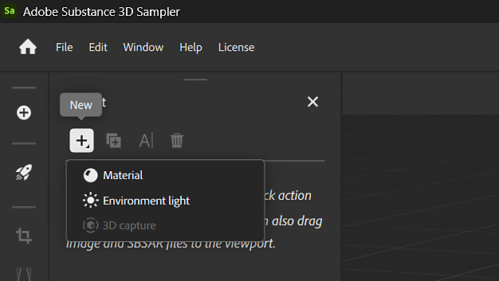

# Importar recursos

O Sampler pode usar recursos externos, como imagens e arquivos Substance, para modificar seu projeto. Use qualquer uma das seguintes opções para importar um arquivo para o seu projeto:

* Arraste e solte um arquivo do explorador de arquivos na janela do Sampler. Uma janela de importação é exibida com opções para alterar como a importação é tratada.

* Na <b>Barra esquerda</b>, use o botão <b>Obter conteúdo </b>e selecione <b>Importar na pilha de camadas</b> ou <b>Importar em seus ativos</b>. Ambas as opções abrirão um explorador de arquivos onde você pode navegar e selecionar os arquivos a serem importados.
  * <b>Importar na pilha de camadas</b> importa o arquivo para o projeto atual.
  * <b>Importar em seus ativos</b> importa o arquivo para que ele possa ser acessado de qualquer projeto.

* No painel <b>Camadas</b>, se nenhuma camada tiver sido criada, você poderá usar os links disponíveis para importar um arquivo para formar a base do material.

>[!NOTE]
>
> Os recursos são vinculados e não importados. Como consequência, se um arquivo de recurso for movido ou excluído, os materiais ou o conteúdo criado com esse recurso serão afetados. Como resultado, recomendamos usar uma pasta dedicada para os ativos do Sampler.
> 
> Por padrão, os ativos incluídos na Sampler são armazenados em C:\Program Files\Adobe\Adobe Substance 3D Sampler\Resources\assets

## Formatos de arquivo compatíveis

| Tipo | Descrição |
| --- | --- |
| <b>Bitmaps/Imagens</b> (JPEG, PNG etc.) | Você pode arrastar e soltar ou importar seus bitmaps no painel <b>Camadas </b>, ou para SBSAR ou parâmetros de filtro que permitem uma entrada de imagem. |
| <b>Pacotes de Substance</b> (SBSAR) | Você pode importar arquivos SBSAR para o painel <b>Ativos </b> ou para o painel <b>Camadas </b>. |
