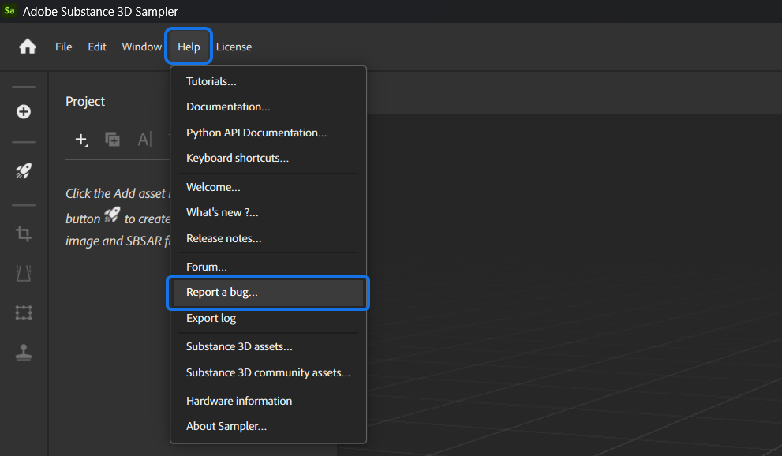
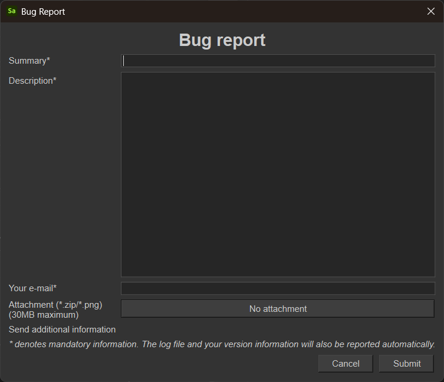

# Relatar um erro

Você pode relatar erros no Sampler.

Abra o menu <b>Ajuda </b>e selecione <b>Relatar um erro</b>g:

{width="700px"}

Preencha o seguinte formulário:

{width="400px"}

Em seguida, pressione Enviar. As informações inseridas serão compartilhadas diretamente com a equipe de desenvolvimento do Sampler.
