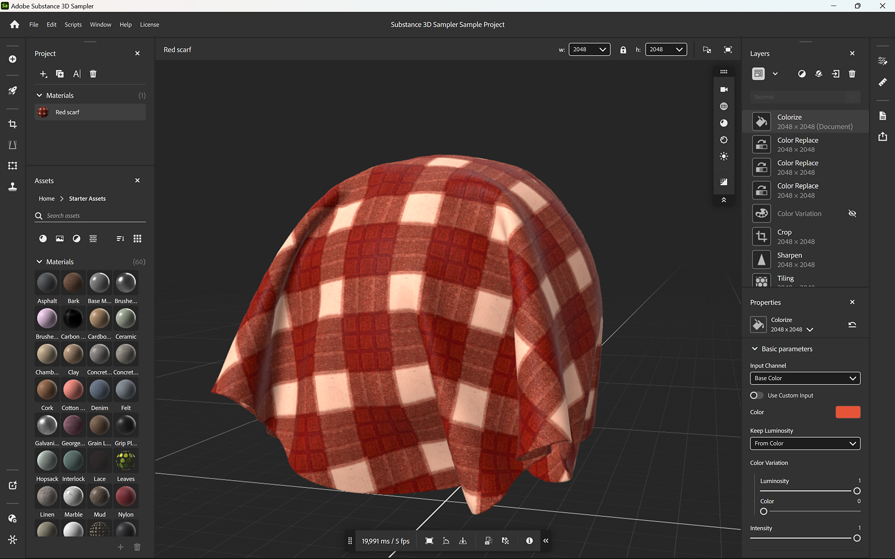

# Substance 3D Sampler

<table>
<tr style="border: 0;">
<td width="41.60%" style="border: 0;" valign="top">

O <b>Substance 3D Sampler </b>permite criar gêmeos digitais de seus ativos físicos.

Com este <b>software de digitalização completo</b> acessível, você pode capturar, processar e aumentar seus materiais, modelos e luzes com ferramentas poderosas.

Combine diferentes tecnologias e métodos de criação para criar materiais digitais precisos e exporte-os para usá-los em outros aplicativos Substance ou 3D de terceiros.

</td>
<td width="58.30%" style="border: 0;" valign="top">

</td>
</tr>
</table>

>[!NOTE]
>
> Se você estiver procurando a documentação da versão herdada **Substance Alchemist**, ela pode ser baixada como um [arquivo de PDF aqui](https://www.dropbox.com/s/sqvznduc12cuyuq/SubstanceAlchemist_June2021.pdf?dl=1). Esta documentação agora se concentra no Substance 3D Sampler.

<table>
<tr style="border: 0;">
<td style="border: 0;" valign="top">

## Introdução

* [Ativação e licenças](getting-started/activation-and-licenses.md) — ative e gerencie suas licenças para começar a usar o Sampler.
* [Requisitos do sistema](getting-started/system-requirements.md)
* [Atalhos](getting-started/shortcuts.md)
* [Importando Recursos](getting-started/importing-resources.md)
* [Ações rápidas](features-and-workflows/quick-actions.md)
* [HP Z Captis](pipeline-and-integrations/hp-z-captis-support/hp-z-captis-support.md)
* [Relatar um erro](getting-started/report-a-bug.md)
* [Gerenciamento de Projetos](getting-started/project-management.md) — use coleções para gerenciar seus ativos e materiais.
* [Exportar](getting-started/export/export.md)

</td>
<td style="border: 0;" valign="top">

### Interface

* [A tela inicial](interface/the-home-screen.md)
* [Janela de visualização 2D e 3D](interface/2d-and-3d-viewport.md)
* [Barras laterais](interface/sidebars.md)
* [Painéis](interface/panels/panels.md)
* [Ferramentas e widgets](interface/tools-and-widgets/tools-and-widgets.md)
* [Preferências](interface/preferences/preferences.md)

</td>
<td style="border: 0;" valign="top">

### Recursos e fluxos de trabalho

* [Imagem para material (viabilizado por IA)](filters/tools/image-to-material.md)
* [Fluxo de trabalho de Tamanho físico completo](features-and-workflows/end-to-end-physical-size-workflow.md)
* [Exportar ativos paramétricos](features-and-workflows/export-parametric-assets.md)
* [Scripts](scripting-and-development/scripting-and-development.md)
* [Ferramentas HDRI](filters/hdri-tools/hdri-tools.md)

</td>
</tr>
</table>

<table>
<tr style="border: 0;">
<td style="border: 0;" valign="top">

### Perguntas frequentes

* [Exportação do arquivo de registro](technical-support/exporting-the-log-file.md)
* [Configuração](technical-support/configuration/configuration.md)
* [Problemas técnicos](technical-support/technical-issues/technical-issues.md)

</td>
<td style="border: 0;" valign="top">

### Notas de versão

* [Todas as alterações](release-notes/all-changes.md)
* [Versão 5.0](release-notes/version-5-0-substance-3d-sampler.md)
* [Versão 4.4](release-notes/version-4-4-substance-3d-sampler.md)
* [Versão 4.3](release-notes/version-4-3-substance-3d-sampler.md)
* [Versão 4.2](release-notes/version-4-2.md)
* [Versão 4.1](release-notes/version-4-1.md)
* [Versão 4.0](release-notes/version-4-0.md)
* [Versão 3.4](release-notes/version-3-4.md)
* [Versão 3.3](release-notes/version-3-3.md)

</td>
</tr>
</table>

