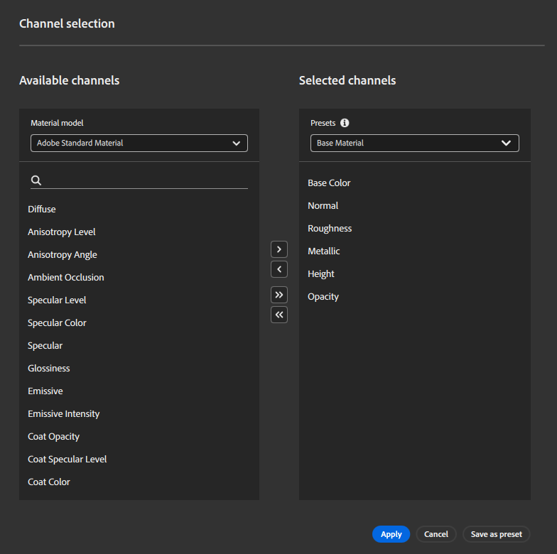

# Painel Configurações do canal

<table>
<tr style="border: 0;">
<td style="border: 0; width: 30%" valign="top">

O painel **Configurações do canal** controla a lista de canais computados para o material atual. Você pode gerenciar a visibilidade do canal, adicionar ou remover canais do material ou alterar a modelo de material que está sendo usada.

</td>
<td style="border: 0;" valign="top">

</td>
</tr>
</table>

## Modelo do material

Use esta lista suspensa para selecionar a estrutura do sombreador usada para renderizar o material. As opções no **painel de configurações do canal** serão alteradas com base no modelo de material selecionado.

Ao alterar o modelo de material, a pilha de camadas precisará ser recalculada para o novo modelo e canais diferentes serão disponibilizados. O Sampler tenta minimizar a perda de dados na conversão; no entanto, é possível que a alteração resulte em diferenças sutis de aparência com um novo modelo de material.

>[!NOTE]
>
> É possível alterar de Material padrão da Adobe (ASM) para OpenPBR, mas atualmente não é possível alterar de OpenPBR para ASM.

## Canais de materiais

<table>
<tr style="border: 0;">
<td style="border: 0; width: 30%" valign="top">

Esta seção exibe a lista de canais que são calculados por padrão com base no fluxo de trabalho.

Você pode usar o **botão Editar lista** para abrir a **Seleção de canal** e alterar quais canais são computados para o material.

</td>
<td style="border: 0;" valign="top">

{width="200px"}

</td>
</tr>
</table>

>[!NOTE]
>
> Alguns materiais do Substance Source não geram opacidade ou canais de oclusão ambiente, por exemplo. Mesmo que o canal de opacidade seja marcado como “é calculado”, se o arquivo de Substance não o produzir, o Sampler não o gerará.

### Seleção de canais

A janela Seleção de canal permite adicionar ou remover canais do material.

Para adicionar um canal ao material, selecione um canal disponível e use o botão **>**.
Para remover um canal do seu material, selecione o canal na **lista Canais selecionados** e use o botão **&lt;**.
Você pode adicionar todos os canais disponíveis ao seu material com o botão **;** ou remover todos os canais do seu material com o botão **≪**.

Você também pode usar predefinições para selecionar rapidamente uma lista de canais para o material. Por padrão, o Sampler inclui várias predefinições, mas você também pode criar suas próprias:

1. Adicione os canais desejados ao seu material.
1. Use o **botão Salvar como predefinição**.
1. Nomeie sua predefinição.

>[!NOTE]
>
>Salvar uma predefinição não a aplica ao material.

## Canais personalizados

Alterne os canais adicionais que não estão incluídos no fluxo de trabalho selecionado por padrão.

<table>
<tr style="border: 0;">
<td style="border: 0; width: 30%" valign="top">

Cada canal personalizado tem duas opções que você pode usar para controlá-lo:

1. Use o botão Visibilidade para mostrar ou ocultar o canal na Visualização 2D.
2. Use o **botão Automático** para alternar se o canal é calculado automaticamente.
   * Quando ativado, o canal será calculado se uma camada acima dele na pilha solicitar.
   * Quando desativado, o canal é sempre calculado.

</td>
<td style="border: 0;" valign="top">

{width="200px"}

</td>
</tr>
</table>

