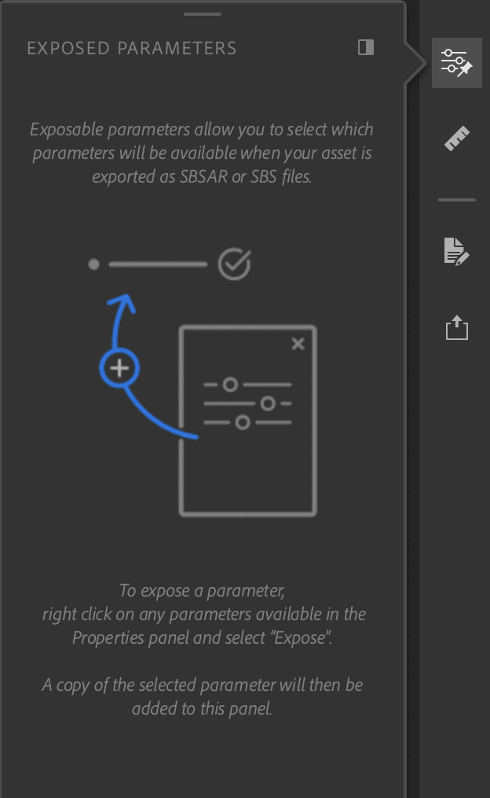

# Painel de parâmetros expostos

O **Painel de parâmetros expostos** contém os parâmetros expostos do painel **Propriedades.**

Os pontos coloridos servem para ajudar a visualizar a camada à qual o parâmetro está conectado. Pontos vazios indicam que o parâmetro é de uma camada de mesclagem.

Há algumas maneiras de interagir com os parâmetros expostos:

| Ações | Como |
| --- | --- |
| Deixar de expor um parâmetro | Clique com o botão direito do mouse em um parâmetro e selecione “Não expor”. |
| Editar o rótulo de um parâmetro | Clique com o botão direito do mouse em um parâmetro e selecione “Editar”, insira o novo rótulo. |

Você pode interagir com todos os parâmetros como faria normalmente com o **painel Propriedades**. As alterações serão refletidas na viewport 3D.
