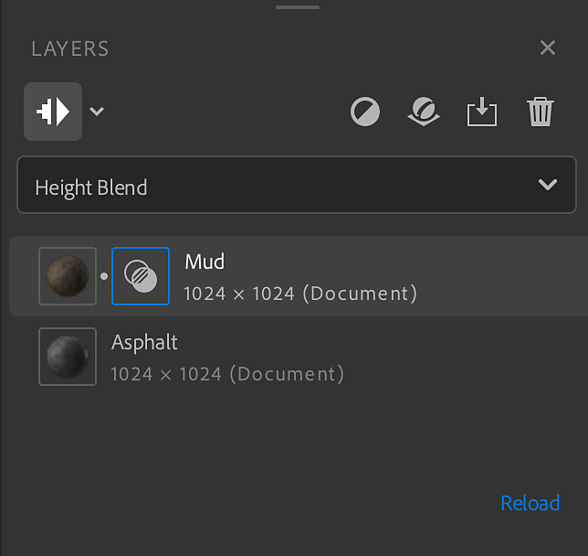
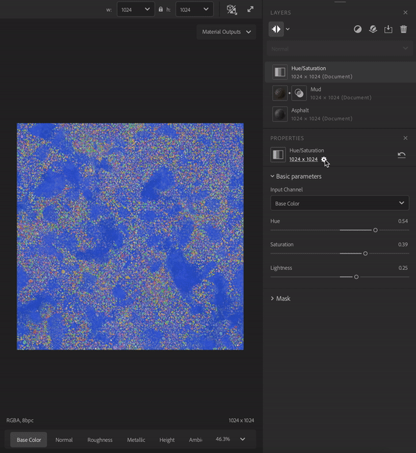

# Painel Camadas

<table>
<tr style="border: 0;">
<td style="border: 0; width: 70%" valign="top">

O **painel Camadas** contém a pilha de camadas e os atalhos para gerenciar as camadas. O **painel Camadas** funciona em conjunto com o **painel Propriedades** - selecione uma camada no **painel Camadas** para ver suas propriedades no **painel Propriedades**.

O **painel Camadas** consiste em três seções principais:

1. A seção de ferramentas contém botões que podem ser usados para
   1. Mostrar/ocultar resolução de camadas
   1. Alternar estratégia de resolução de camadas
   1. Adicionar uma camada
   1. Adicionar um material de base
   1. Importar um filtro personalizado
   1. Remover uma camada
1. O **seletor de modo de mesclagem** permite ajustar como uma camada se mescla com as camadas abaixo dela. O **seletor de modo de mesclagem** só está disponível quando uma camada de material é selecionada. Os filtros não usam modos de mesclagem.
1. A **pilha de camadas** contém todas as camadas que compõem o ativo.

</td>
<td style="border: 0;" valign="top">

</td>
</tr>
</table>

## A pilha de camadas

A pilha de camadas é a coleção de materiais, filtros e outros recursos que compõem o material atual. Assim como no Photoshop e no Substance 3D Painter, a pilha de camadas funciona da camada inferior primeiro até a camada superior por último. Isso significa que cada camada pode afetar as camadas abaixo dela.

Há algumas maneiras de gerenciar a pilha de camadas:

| Ações | Como |
| --- | --- |
| Adicionar uma camada | Arraste um ativo do **painel Ativos** para o visor para adicioná-lo ao topo da pilha de camadas. Arraste um ativo do **painel Ativos** para a pilha de camadas para adicioná-lo a um local específico na pilha de camadas. Use o botão **Adicionar uma camada** da seção de ferramentas para selecionar um filtro de uma lista. |
| Mover uma camada | Arraste uma camada na pilha de camadas para movê-la. Ao mover uma camada, uma barra aparecerá indicando onde a camada será colocada. |
| Excluir uma camada | Clique em uma camada para selecioná-la e pressione **Del** ou use o botão **Remover uma camada** na seção de ferramentas. |
| Alternar visibilidade | Passe o mouse sobre uma camada para ver a **opção Visibilidade** no lado direito da camada. Quando a visibilidade de uma camada é desativada, ela não é calculada. |
| Exibir propriedades da camada | Clique em uma camada para abrir a exibição de suas propriedades no **painel Propriedades**. |
| Mostrar/ocultar resolução | Clique no botão superior esquerdo do **painel Camadas**. |
| Alternar a resolução de todas as camadas | Clique na seta ao lado do botão “mostrar/ocultar resolução” e selecione a estratégia para todas as camadas na pilha. |
| Alternar uma resolução de camada | Clique em uma camada para abrir suas propriedades, clique na resolução no **painel Propriedades** e selecione a estratégia de resolução que a camada usará. |

## Tipos de camada

Há três tipos de camadas:

* Materiais
* Filtros
* Imagens

### Camadas de material

Uma camada de material contém informações em vários canais e pode ser mesclada com as camadas abaixo dela. As camadas de material aparecem de forma ligeiramente diferente, dependendo se estiverem na parte inferior da pilha ou não. Por exemplo, a imagem abaixo mostra um material de rocha arrastado para a pilha de camadas duas vezes. Observe que a camada inferior não tem nenhum ícone para controlar a mesclagem, enquanto a camada superior tem.

As regras gerais para camadas de material são:

* Uma camada de material sempre usa a resolução do documento.
* Uma camada de material na parte inferior da pilha não tem nada com que se misturar, portanto, o **seletor de modo de mesclagem** não está disponível.
* Uma camada de material que não está na parte inferior da pilha pode ser mesclada com as camadas abaixo dela, portanto, você pode usar o **Seletor de modo de mesclagem** para alterar o modo de mesclagem. Além disso, um **ícone de mesclagem** aparece ao lado do **ícone de camada**. Selecione o **ícone de mesclagem** para ajustar as configurações de mesclagem da camada com base no modo de mesclagem selecionado.

### Filtrar camadas

Os filtros executam operações nas camadas abaixo delas para criar efeitos específicos. Por exemplo, na imagem acima do **filtro de Matiz/Saturação**, você pode ajustar a matiz, a saturação e a luminosidade das camadas abaixo.

Alguns filtros podem usar uma ou mais camadas diferentes como entrada. Por exemplo:

* O **filtro de Atlas scatter** pode usar um material como entrada.
* O **filtro de Atlas scatter** dispersão instâncias do material do atlas de entrada com base nos parâmetros de **Atlas scatter**.

Arraste um material sobre um slot de entrada de camadas para usá-lo como entrada.

Uma camada de filtro usará a estratégia de resolução padrão definida nas preferências. É possível alterar a resolução que o filtro usará no painel de propriedades.

### Camadas de imagem

As camadas de imagem usam sua própria resolução e estão principalmente no fluxo de trabalho Imagem para material. Como as camadas de material, você pode criar uma camada de imagem arrastando uma imagem do **painel Ativos**.

Você pode arrastar uma imagem do navegador de arquivos do sistema para o Sampler. Se já houver camadas em sua pilha de camadas, a camada de imagem será adicionada ao topo da pilha. Se não houver camadas na pilha de camadas, uma caixa de diálogo aparecerá onde você pode escolher como processar a imagem:

* **A conversão de imagem em material** permite usar IA para converter uma imagem em material.
* O **Multiângulo para material** permite usar várias imagens com diferentes condições de iluminação para criar um material.
* A **importação de textura** permite usar imagens importadas como canais de textura para criar um material.
* **Usar como bitmap** importa a imagem como uma camada de bitmap simples.

Você também pode arrastar várias imagens selecionadas para a pilha de camadas de uma só vez para importá-las como uma única camada. Isso pode ser útil para filtros de várias imagens como **Mesclagem HDR** e **Multiângulo para material**. Selecione a camada com várias imagens para alterar os dados de canal de cada imagem.
