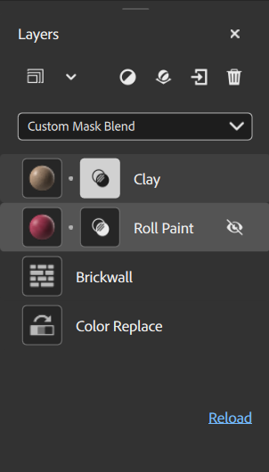

# Painel Propriedades

O **painel Propriedades** mostra os parâmetros e as propriedades das camadas selecionadas no **painel Camadas**. A melhor maneira de descobrir quais parâmetros fazem é brincar com eles e ver o impacto que eles têm em seu ativo.

Os parâmetros que aparecem no **painel Propriedades** dependem do que você selecionou no **painel Camadas**. Às vezes, uma camada pode ter mais de um conjunto de propriedades personalizáveis. Por exemplo, uma camada de material que não esteja na parte inferior da pilha terá propriedades de mesclagem. Cada ícone na pilha de camadas é um conjunto diferente de propriedades e parâmetros. Para uma camada de material com propriedades de material e propriedades de mesclagem, haverá dois ícones nessa camada.

<table>
<tr style="border: 0;">
<td style="border: 0; width: 30%" valign="top">

</td>
<td style="border: 0;" valign="top">

Nesta imagem do **painel Camadas**, cada ícone na pilha de camadas tem um conjunto diferente de parâmetros para controlar a aparência do material. Por exemplo, a camada Argila tem o ícone de material e o ícone de mesclagem, cada um com um conjunto separado de parâmetros. A Camada de tinta de rolagem também tem ícones de material e mesclagem, mas como está sendo passado o mouse, também tem uma alternância de visibilidade.

</td>
</tr>
</table>

## Aplicado a...

A seção **Aplicado a** do **painel Propriedades** permite controlar quais canais a camada atual afeta. Assim como ocorre com outras propriedades, as configurações de canal são diferentes com base na seleção da camada ou da mesclagem.

Por padrão, todos os canais são ativados para a maioria dos materiais e filtros. Alguns filtros, como Brilho ou Vibratilidade, afetam apenas um único canal. Quando os filtros afetam apenas um único canal, é possível ver o canal afetado ao lado do nome da camada.

