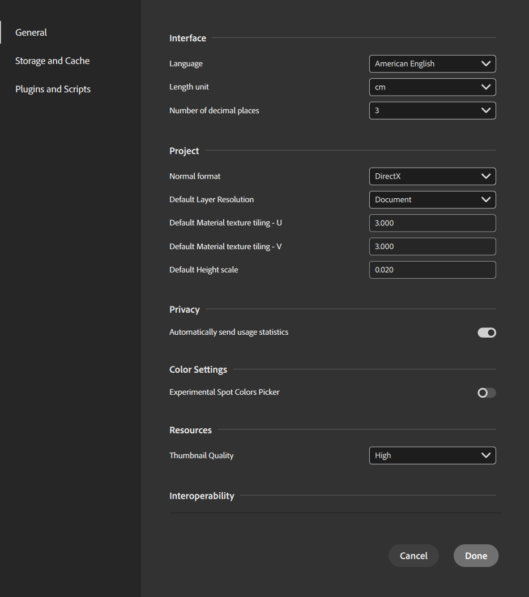

# Preferências

Use o **menu Preferências** para personalizar o Sampler de acordo com suas necessidades.

<table>
<tr style="border: 0;">
<td style="border: 0;" valign="top">

</td>
<td style="border: 0;" valign="top">

Use **Editar** > **Preferências** para acessar o menu Preferências.

As seguintes opções estão disponíveis:

</td>
</tr>
</table>

## Geral

* **Interface**
  * **Idioma**\
    No momento, o Sampler oferece suporte aos seguintes idiomas de interface.
    * Inglês americano
    * Francês
    * Alemão
    * Japonês
    * Chinês simplificado
    * Italiano
    * Espanhol
    * Português
* **Projeto**
  * **Formato normal**\
    Defina o formato normal usado no aplicativo.
  * **Resolução de camada padrão**\
    Defina a estratégia de resolução padrão usada no aplicativo.
  * **modelo de material padrão**
    Defina o modelo padrão a ser usado ao criar um material ou quando ações rápidas precisarem escolher uma modelo de material.
  * **Divisão em blocos gráficos de textura de Material Padrão - U**\
    Defina a divisão em blocos gráficos padrão da textura U.
  * **Divisão em blocos gráficos de textura de Material Padrão - V**\
    Defina a divisão em blocos gráficos da textura V padrão.
  * **Escala de Height padrão**\
    Defina a escala de height padrão para materiais.
* **Privacidade**
  * **Enviar automaticamente estatísticas de uso**
    Alternar se as estatísticas de uso anônimas devem ser enviadas para ajudar a melhorar o Sampler.
* **Configurações de cores**
  * **Seletor de cores de ponto experimental**\
    Ative ou desative o seletor de cores experimental sempre que um parâmetro de seleção de cores for exibido. O seletor de cores experimental permite escolher cores diretamente de uma coleção de amostras do PANTONE.
* **Recursos**
  * **Qualidade da Miniatura**\
    Ajuste a qualidade das miniaturas no painel Ativos. Diminuir a qualidade da miniatura pode melhorar os tempos de carregamento.
* **Interoperabilidade**
  * **Enviar para o formato do Designer**\
    Defina o formato que o aplicativo enviará ao Designer.
    * **SBS**
    * **SBSAR**
* **Aprendizado de Máquina**
  * **Redes neurais aceleradas por GPU**\
    Ative ou desative as Neural Networks aceleradas por GPU para melhorar o desempenho dos aplicativos.

### Armazenamento e cache

* **Cache**\
  Use estas configurações para atualizar os locais de cache.
  * Caminho para o cache de texturas renderizadas
  * Caminho do cache de miniaturas.
* **Captura de material**\
  Use esta configuração para atualizar o local do cache de captura de material.
  * Caminho do cache de captura de material.
  * Endereço IP da legenda\
    Conecte-se a um dispositivo Captis em sua rede local.
  * Use o dispositivo Captis como armazenamento USB para arquivos copiados.
* **Armazenamento em cache inserido em arquivos de projeto**\
  Alterar como o Sampler lida com o conteúdo armazenado em cache ao salvar arquivos.

### Plug-ins e script

* **Interface**
  * **Habilitar painel Log**\
    Habilite ou desabilite o painel de registro. O painel de log pode ser aberto na **[Barra lateral direita](../sidebars.md)** quando habilitado.
* **Gerenciar plug-ins**
  * Selecione o local dos plug-ins, importe novos plug-ins e ative ou desative plug-ins existentes.
* **Gerenciar scripts**
  * Selecione o local da pasta de scripts e importe os scripts.
