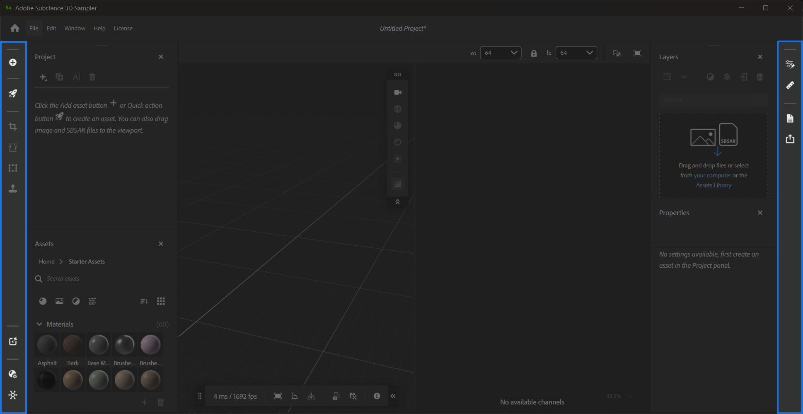

# Barras laterais

O Sampler tem duas barras laterais: a **Barra lateral esquerda** e a **Barra lateral direita**.

## Barra lateral esquerda

Na **Barra lateral esquerda**, você pode:

* **Adicionar e importar conteúdo**: importe imagens e selecione como elas devem ser integradas ao projeto.
* **Procure ativos 3D**: acesse milhares de materiais do Substance 3D Assets Creative Cloud Desktop.
* Acesse **Ações rápidas**: uma coleção de ações para atingir rapidamente determinadas metas. [Saiba mais sobre **Ações rápidas &#x200B;**](../features-and-workflows/quick-actions.md)**.**
* Adicione rapidamente filtros à pilha de camadas:
  * **Corte:** corte imagens e materiais usando alças no **Visualização 2D**.
  * **Transformação de perspectiva:** corrija erros de perspectiva com alças na exibição **2D.**
  * **Transformar:** redimensione imagens e materiais com alças no **Visualização 2D**
  * **Carimbo:** pinte áreas na **exibição 2D** para corrigir emendas ou outros problemas.
* Reabra os seguintes painéis quando eles forem fechados:
  * [O **painel Ações rápidas**.](panels/quick-actions-panel.md)
  * [O **painel Projeto**.](panels/project-panel.md)
  * [O **painel Ativos**.](panels/assets-panel.md)
  * [O **painel Configurações do canal**.](panels/channel-settings-panel.md)

Para obter mais informações sobre os filtros disponíveis na **Barra lateral esquerda**, consulte [Ferramentas e widgets](tools-and-widgets/tools-and-widgets.md).

## Barra lateral direita

A **Barra lateral direita** contém os seguintes painéis quando eles são fechados:

* [O **painel Camadas**.](panels/layers-panel.md)
* [O **painel Propriedades**.](panels/properties-panel.md)
* [O **Painel de parâmetros expostos**.](panels/exposed-parameters-panel.md)
* [O **painel Tamanho físico**.](panels/physical-size-panel.md)
* [O **painel Metadados**.](panels/metadata-panel.md)
* [O **painel Exportar**.](panels/share-panel.md)
