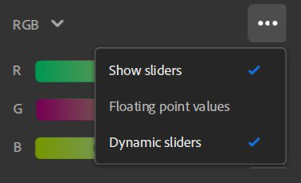
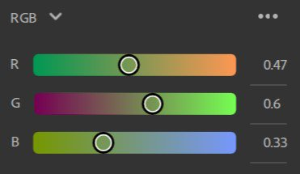
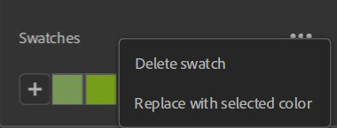

# Seletor de cores

O Seletor de cores aparece sempre que você precisa selecionar uma cor.

## Visão geral da interface

{width="300px"}

1. **Quadrado de cores**: ajuste a saturação e o brilho da cor com o matiz selecionado.
1. **Controle deslizante de MATIZ**: ajuste a matiz da sua cor.
1. **Atual/Anterior**: a cor da esquerda é a cor atual do seu seletor de cores. A cor certa é a cor que você tinha ao abrir o seletor de cores. Clique na cor certa para redefinir a cor atual ao seu valor original.
1. **Entrada hexadecimal**: você pode inserir diretamente o código de cor hexadecimal da cor desejada.
1. **Conta-gotas**: inicie o conta-gotas para escolher uma cor da tela. Uma bolha aparecerá ao lado do cursor para visualizar a cor que você escolherá.
1. **Controles deslizantes**: ajuste sua cor usando espaços de cores diferentes (RGB ou HSV).
1. **Amostras**: salve as cores para acessá-las rapidamente para uso futuro.

### Controles deslizantes

#### Espaço da cor

RGB (Vermelho, Verde, Azul) e HSV (Matiz, Saturação, Valor) são os dois espaços de cores disponíveis.

{width="200px"}

#### Opções de controle deslizante

{width="200px"}

**Mostrar controles deslizantes**

Essa opção permite ocultar os controles deslizantes para economizar espaço. Mesmo com os controles deslizantes ocultos, você ainda pode modificar as entradas de valor.

**Valores de ponto flutuante**

{width="200px"}

Alterne se serão usados valores de ponto flutuante ou inteiros para controles deslizantes. Os valores de ponto flutuante estão entre 0 e 1, enquanto os valores inteiros estão entre 0 e 255.

**Controles deslizantes dinâmicos**

Se marcada, o plano de fundo do controle deslizante é atualizado dinamicamente à medida que os valores são alterados. A imagem abaixo mostra a aparência do controle deslizante quando os controles deslizantes dinâmicos estão desativados.

{width="200px"}

### Amostras

As amostras são úteis quando você deseja salvar cores específicas para uso no aplicativo ou em vários projetos.

As amostras são globais para o Sampler e não específicas por projeto.

Clicar no botão “+” adicionará uma amostra com a cor atual como a primeira amostra da sua lista.

{width="200px"}

Observação: não é possível adicionar uma amostra com a mesma cor duas vezes. A amostra já salva será destacada quando você tentar adicioná-la novamente.

Uma dica de ferramenta com o valor da cor no código hexadecimal é exibida ao passar o mouse sobre uma amostra.

#### Opções de amostras

Excluir todas as opções.

{width="200px"}

Clique com o botão direito do mouse em uma amostra para excluí-la ou substituí-la pela cor atual.

{width="200px"}

Você também pode excluir uma amostra arrastando-a e soltando-a fora do seletor de cores.
