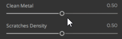

# Controles deslizantes

Há uma opção para animar de um a vários controles deslizantes. Pressione **Ctrl** ao passar o mouse sobre um controle deslizante, um ícone de **reprodução** aparecerá para iniciar a animação.

Você pode pausar a animação pressionando **Ctrl** quando passar o mouse sobre um controle deslizante animado, um ícone de **pausa** aparecerá para parar a animação desse controle deslizante.

Se quiser pausar todos os controles deslizantes, pressione **P**. Para reiniciar, pressione **P** novamente.

