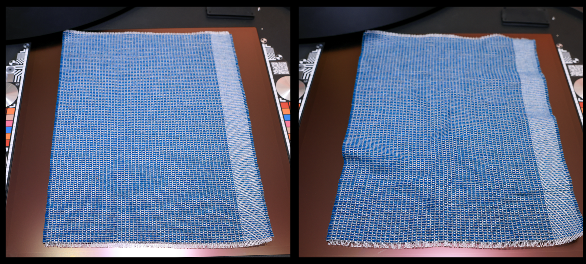

# Verificando práticas recomendadas

A qualidade de um material digitalizado é decidida muito antes de você pressionar o botão de varredura. Uma amostra limpa, plana e bem posicionada produz mapas limpos prontos para uso, enquanto uma captura apressada transporta todas as rugas, manchas de dust e fibras isoladas diretamente para os canais de PBR.

A regra geral é simples: **um minuto extra gasto na preparação do material antes que a verificação economize aproximadamente dez minutos de limpeza depois**. O tempo gasto passando um tecido, escovando o dust ou alinhando sua amostra é o tempo que você não gastará mais tarde desdeformando o material, removendo partículas ou removendo fibras soltas.

Esta página abrange duas áreas que fazem a maior diferença: **preparar a amostra física** e **posicioná-la corretamente** no dispositivo.

## Preparar a amostra física

Tudo o que estiver visível na amostra quando capturado é colocado nos mapas. Alguns minutos de preparação removem problemas na origem antes que eles se tornem um trabalho de edição.

**Limpar a amostra**

Faça uma limpeza rápida da amostra antes de colocá-la. Qualquer marca na superfície será interpretada como um detalhe material e reproduzida em todos os canais.

**Remover partículas estranhas e de dust**

Dust, cabelo, fios e outras partículas soltas são uma das fontes mais comuns de trabalho de pós-processamento. Pincele ou use ar comprimido para limpar a superfície, pois cada partícula deixada para trás deve ser pintada à mão mais tarde.

**Tecidos de ferro para remover rugas**

Para tecidos e outros materiais flexíveis, sempre passar a amostra plana antes de digitalizar. As dobras e rugas criam informações falsas de height e sombra que são difíceis de remover posteriormente e que quebram a legibilidade do material.

**Remover manchas de superfícies lisas**

Em materiais lisos e não porosos, limpe manchas, impressões digitais ou manchas. Elas aparecem claramente nos canais de cor base e aspereza.

**Conheça o thickness de exemplo**

Esteja ciente de quão grossa é sua amostra. Conhecer o thickness ajuda a posicioná-lo corretamente e a configurar a captura para que a superfície permaneça em foco em toda a área de digitalização.

## Coloque sua amostra corretamente

Uma boa posição mantém o material plano, nítido e centralizado, o que reduz a quantidade de corte, desdistorção e alinhamento que você tem de fazer posteriormente.

**Centralizar o material na área de digitalização**

Posicione a amostra no centro da área de digitalização. É aqui que o foco e a iluminação são mais uniformes e oferecem a superfície mais utilizável assim que o material é cortado. É por isso que é sempre ideal para digitalizar uma amostra de cada vez, para que possa ser colocado no centro da área de digitalização e dar-lhe os melhores resultados possíveis.

**Alinhe-o da forma mais reta possível**

Alinhe a amostra diretamente com a área de digitalização em vez de alinhá-la em ângulo. Uma amostra reta é muito mais fácil de ser ladrilhada e precisa de menos rotação e corte no Sampler.

**Manter a amostra plana**

Verifique se a amostra está completamente plana em relação à superfície de digitalização. Se necessário, use os ímãs fornecidos com o dispositivo HP Z Captis para manter materiais flexíveis ou ondulados no lugar. Uma amostra plana evita a deformação e o foco irregular, que, de outra forma, demorariam para ser corrigidos.

**Não sobrepor amostras**

Se você colocar várias amostras de uma vez, não deixe que elas toquem ou se sobreponham. Bordas sobrepostas criam limites ambíguos, difíceis de separar, e cortam bem depois.

## A recompensa no Sampler

Quando sua amostra estiver limpa, plana e centralizada, os mapas que chegam ao Sampler já estarão próximos de estar prontos para produção. Você gasta seu tempo refinando o material em vez de repará-lo: menos tempo desdeformando, menos tempo limpando dusts e fibras, e menos tempo removendo manchas e rugas de seus canais.

Depois que o material for importado, use os filtros do Sampler (Equalizar, Divisão em blocos gráficos automática, Corte de perspectiva, Divisão em blocos gráficos...) para os toques finais e exporte quando estiver satisfeito com o resultado.
