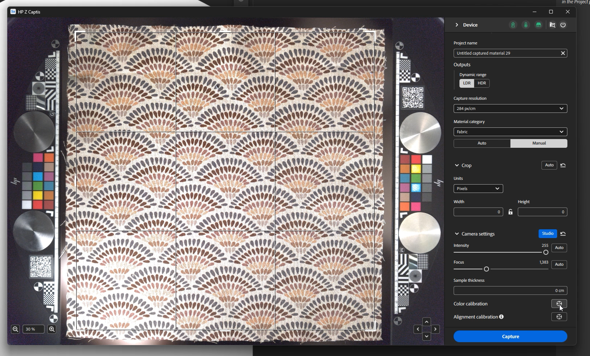

# Inicie o Sampler e ative o HP Z Captis

Depois que o Sampler for iniciado e se o dispositivo HP Z Captis tiver sido conectado ao computador, clique no ícone Captis/cone na barra esquerda.

Se você não vir o HP Z Captis sendo exibido na interface do usuário, consulte as Perguntas frequentes.

Depois de clicar no HP Z Captis, uma janela dedicada é aberta com 3 opções:

1. <b>Procurar conteúdo</b>: abrirá o explorador de arquivos para procurar no armazenamento local do dispositivo HP Z Captis.
1. <b>Iniciar verificação</b>: inicializará o dispositivo HP Z Captis e iniciará o fluxo de captura.
1. <b>Desligar</b>: desligará o dispositivo e fechará a janela.

## Fechando a janela do HP Z Captis

A qualquer momento, se você fechar a janela do HP Z Captis, será perguntado se deseja <b>continuar o processo</b> ou <b>abortar</b>.

Se você selecionar continuar, o dispositivo continuará com sua tarefa atual offline e pausará no final da etapa atual. Você pode reconectar o Sampler mais tarde para continuar com a próxima etapa da sessão de captura.

## Visualizar etapa

O Sampler inicializará a visualização do dispositivo HP Z Captis. É recomendável <b>não interagir </b> com o modo de exibição enquanto ele está sendo inicializado.

Nesta nova atualização, há dois modos: Automático e Manual.

### Configurações gerais

#### Modo automático

Agora você tem a possibilidade de iniciar a captura com um clique. A Sampler:

* definir um nome padrão,
* defina automaticamente a zona de região de interesse (ROI)/corte usando a luz de fundo,
* concentre-se no ROI completo e
* altere a configuração de intensidade para uma adaptada ao seu material.

Se tiver feito capturas anteriormente, a categoria de material, as saídas e a resolução de captura selecionadas serão as mesmas da captura anterior.

#### Modo manual

Você também pode optar por definir algumas das configurações manualmente:

*Nome do projeto*

É possível definir um nome de projeto da captura e definir que tipo de saídas deseja recuperar.

*Saídas*

* Por padrão, somente os canais PBR de material (cor base, normal, height e opacidade) serão salvos.\
  É possível escolher o tipo de saída entre LDR (intervalo dinâmico baixo) e HDR (intervalo dinâmico).

*Capturar resolução*

* 239 px/pol - 94 px/cm (visualização: qualidade inferior, digitalização mais rápida)
* px/in - 142 px/cm (Padrão: alta qualidade, fácil de gerenciar na maioria dos fluxos de trabalho - equivalente a 4k para captura de 30x30cm)
* 718 px/pol - 284 px/cm (Resolução total - equivalente a 8 k para captura de 30 x 30 cm)

Observação: somente canais PBR serão carregados no Sampler.\
As capturas de pasta padrão são salvas em podem ser modificadas nas preferências.

<b>Categoria de material</b>

Defina-o com o tipo de material que você está digitalizando para geração de mapa ajustado ao seu material específico.\
A categoria padrão selecionada é “Malha”. Isso ajudará a otimizar o resultado do canal de aspereza.

Se o que você está digitalizando contém vários tipos de materiais, selecione a categoria do maior.

<b>Cortar</b>

O corte pode ser feito automática ou manualmente.

O corte automático usará a luz de fundo para definir o contorno do material e colocar a Região de interesse (ROI) ao redor dele. Ele não é adaptado ao digitalizar várias amostras de material de uma vez ou quando o material é muito transparente.
Nesse caso, o ROI pode ser definido arrastando os cantos do widget de corte na visualização, ou configurando uma resolução ou tamanho físico definido.

<b>Configurações da câmera </b>

* Intensidade: ajuste a exposição da câmera.\
  Clicar em Automático usará o centro do ROI para definir a melhor intensidade para o material.

* Foco: ajusta o foco da câmera.\
  Clicar em Automático definirá o foco ideal usando o ROI completo.
  Este novo algoritmo de foco, onde o foco não está mais em um único ponto, permite um foco mais uniforme no material digitalizado, levando a digitalizações de maior qualidade que são mais fáceis de tornar ladrilhável.

Você pode definir os dois manualmente, se preferir.

<b>Outras configurações</b>

Outros tipos de configurações<b> só precisam ser modificados ocasionalmente</b>: a calibração de cor e alinhamento.

* Calibração de cores

Calibre a cor do mapa de cores de base graças às áreas técnicas do HP Z Captis. \
Isso fará com que o material final tenha exatamente a mesma cor da amostra adicionada na bandeja do HP Z Captis.\
As áreas técnicas com as amostras de cores são detectadas automaticamente e usadas para a calibração. Eles devem ser colocados em seu espaço específico em cada lado da amostra.

Isso só está disponível no modo Studio. Certifique-se de fazer o foco antes desta calibração de cor.

Esta calibração deve ser feita <b>a cada poucos meses</b>. Não é necessário fazê-lo para cada varredura ou cada vez que o dispositivo é usado.

* Calibração de alinhamento

Este alinhamento <b>precisa ser feito</b> na <b>primeira vez que você configura o dispositivo</b>, sempre que ele é movido fisicamente e, em seguida, a cada dois meses. Não é <b>necessário</b> executar este processo <b>para cada captura</b>.

Certifique-se de fazer o foco antes desta calibração de alinhamento.

Para fazer o alinhamento, <b>coloque algo com informações nítidas e claras, como um pedaço de papel com texto impresso, no centro do espaço de captura</b>, feche a gaveta e clique no botão de alinhamento. Uma vez que isto é feito, você pode certificar-se de que tudo está no lugar, com as áreas técnicas em seu lugar em cada lado do espaço de varredura, um material colocado no centro e, se necessário, mantido no lugar com os ímãs fornecidos com o dispositivo HP Z Captis, e você pode começar a digitalização de seus materiais.

Quando estiver tudo pronto: <b>inicie a verificação</b>.

## Etapas de captura, processamento e cópia

Assim que a digitalização for iniciada, a visualização exibirá as fotos tiradas durante o processo.

A parte de processamento é dividida em três partes:

* <b>Capturar</b>: tirando todas as fotos necessárias

* <b>Processamento</b>: processamento de fotos para gerar canais PBR (Cor base, normal, height, opacidade)

* <b>Copiando</b>: copiando os resultados do dispositivo HP Z Captis para o seu computador

Durante a captura e o processamento, é possível adicionar metadados (os mesmos metadados que você encontrará no painel Metadados Sampler).

Durante o processamento, você verá o resultado sendo construído lado a lado.

## Etapa de resumo

Nesta etapa, você pode revisar os resultados da varredura. Todos os canais criados são exibidos (no modo Explorer, nenhuma opacidade é criada, pois o anel do explorador não tem uma luz de fundo).

Você pode optar por enviar o material para a Sampler, adicioná-lo ao seu projeto e começar a processá-lo.
Também é possível iniciar diretamente uma nova captura sem adicioná-la ao projeto.
Em ambos os casos, você encontrará os mapas digitalizados na pasta equivalente no computador: C:\Users\username\Documents\Adobe\Adobe Substance 3D Sampler\Captis\Material

## Edição de material

Depois de sair da janela do HP Z Captis, os canais (cor base, normal, height, aspereza e opacidade, se relevante) serão adicionados como uma camada no painel Camadas.

Use filtros do Sampler (Equalizar, Corte de perspectiva, Divisão em blocos gráficos...) para processar e limpar seu material.

Depois de concluir, você pode:

* Salve seu projeto do Sampler: Arquivo > Salvar como ... (Ctrl + S)

* Exportar o material: Arquivo > Exportar ... (Ctrl + E)

