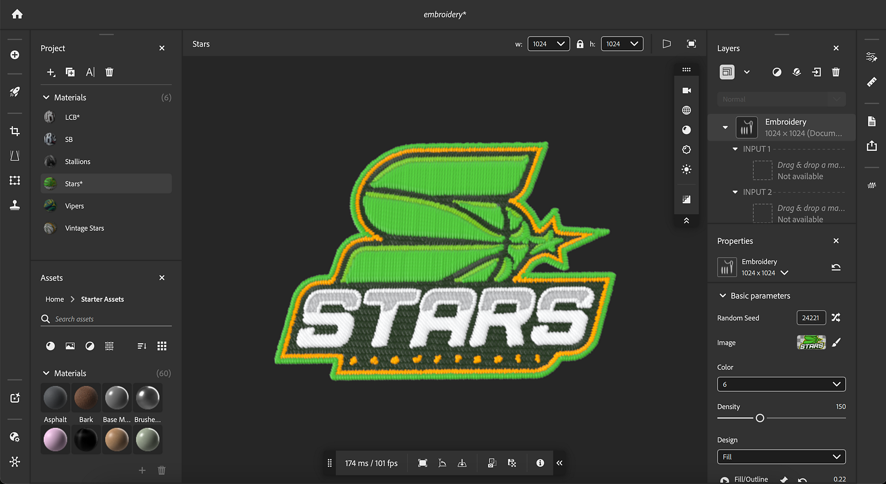

# Tajima Exportador plugin de arquivos de bordado

Com esta primeira prova de conceito, agora você pode transferir seus designs bordados digitalmente do Adobe Substance 3D diretamente para o software de bordado <b>Tajima DG17</b>, eliminando a necessidade da demorada digitalização manual.

Vamos ver passo a passo como usá-lo.

## Baixar

Baixe o plug-in Sampler Tajima aqui:

[Baixe o plug-in aqui](https://www.adobe.com/go/sampler-tajima-plugin)

## Instalação

*Da interface do usuário do Sampler:*

Vá para Preferências > Plug-ins e scripts > Adicionar um plug-in

Selecione a pasta de descompactação do download

*Do explorador de arquivos:*

Acesse Documentos > Adobe > Adobe Substance 3D Sampler > Plug-ins

Copie/cole aqui a pasta de descompactação do download

## Instalação

Abra seu projeto do Sampler (5.0.3 ou posterior) com um material de bordado.

Abra o plug-in Tajima e exporte para o local de sua escolha

<b>Software Tajima </b>

<b>1</b>- Iniciar o Assistente do Substance 3D

<b>2</b>- Selecione a <b>pasta de dados</b> apropriada (pasta de exportação do Sampler)

<b>3</b>- Escolher o gráfico de threads de bordado

<b>4</b>- Aplicar uma predefinição de estilo para obter as configurações de malha ideais

<b>5</b>- Edite as formas conforme necessário para obter os melhores resultados

<b>6</b>- Visualizar a planilha de design, completa com um código de barras digitalizável por máquina

