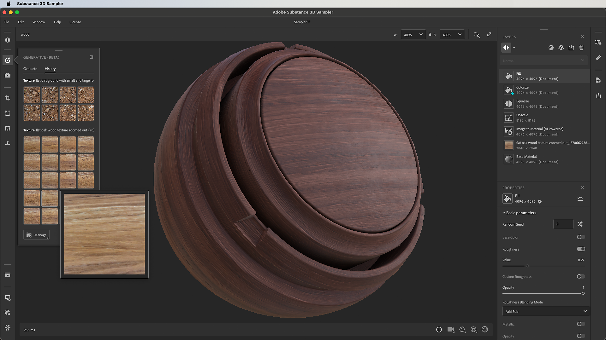

# Betas

Esta página contém logs de alterações para versões Beta do Sampler. Saiba como acessar a versão beta nas [Perguntas frequentes](../faq.md).

>[!NOTE]
>
>As versões beta do Sampler nem sempre estão disponíveis. Para saber quando as futuras betas serão lançadas, siga as redes sociais do Substance 3D.

## 4.4.0 Beta - Texto para Textura

Estamos apresentando o Texto para Textura com o Adobe Firefly, uma nova maneira para os artistas obterem imagens de textura usando apenas uma descrição. Esse novo recurso expande a caixa de ferramentas do artista além de importar fotografias personalizadas ou de banco de imagens, fornecendo uma maneira de gerar texturas diretamente no Sampler. Todas as imagens de Texto para Textura são quadradas e lado a lado com Perspectiva adequada, prontas para o fluxo de trabalho de criação de material.

<b>4.4.1 Fontes Beta</b>

*(Lançado Em: 9 De abril De 2024)*

<b>Corrigido:</b>

* [Aplicativo] Ícone de aplicativo incorreto na barra de tarefas do Windows
* Os painéis [Aplicativo] aparecem na frente dos pop-ups
* [Generative AI] Possíveis falhas ao receber resultados inesperados do serviço

<b>4.4.0 Fontes Beta</b>

*(Lançado Em 18 De março De 2024)*

<b>Adicionado:</b>

* [Firefly] Novo painel Gerativo (Beta)
* [Firefly] Gerar texturas lado a lado a partir de um prompt
* [Firefly] Gerar mais variações após a primeira geração
* [Firefly] Adicionar um resultado como uma camada ou na biblioteca Seus ativos
* [Firefly] Procurar histórico de solicitações anteriores
* [Firefly] As imagens geradas contêm manifesto com proveniência
