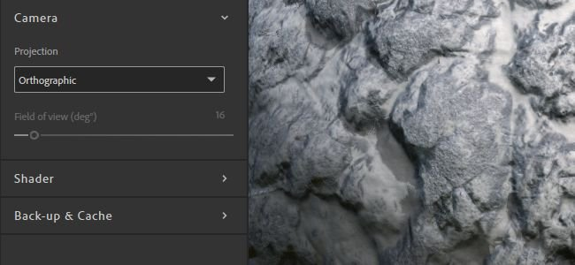

# Versão 2019.1

O **Substance Alchemist 2019.1 “Sesame”** permite compartilhar seus ativos com o novo gerenciamento de projetos. A pilha de camadas foi completamente reconstruída para melhorar o fluxo de trabalho. Controles e informações adicionais foram adicionados à viewport. Uma nova versão do nosso delighter melhora a qualidade e precisão dos seus materiais.

Data de lançamento: *4 de novembro de 2019*

>[!NOTE]
>
> **Observação:** o conteúdo produzido com a versão beta 0.8.1 ou anterior não é compatível com a versão 2019.1. No entanto, nada é perdido e esses dados ainda podem ser acessados iniciando a versão 0.8.1.

## Principais recursos

### Nova tela de boas-vindas

O Substance Alchemist agora tem uma tela de boas-vindas que permite que você passe rapidamente para o seu projeto mais recente, mas também crie novos projetos. A tela de boas-vindas também fornece alguns links para nossas plataformas existentes, como o [Substance Academy](https://academy.substance3d.com/).

### Gerenciamento de projetos

A versão 2019.1 apresenta a noção de projetos, que podem reunir coleções de materiais. Os projetos também podem ser exportados para serem compartilhados com outros computadores.

Para saber mais sobre projetos, consulte: [Gerenciamento de Projetos](../../getting-started/project-management.md).

### Novo Delighter

Melhoramos nosso delighter, usado para remover sombras de suas fotos. Ele agora preserva detalhes e as cores originais das várias superfícies, o que deve melhorar a precisão dos materiais gerados.

### Nova pilha de camadas

A pilha de camadas foi recriada do zero para expandir suas possibilidades e ações. As mudanças notáveis são:

* **Materiais e máscaras agora podem ser acessados diretamente por meio de seu ícone dedicado**\
  Ao adicionar um material na pilha de camadas, ele terá agora um novo ícone de máscara. Clicar neste segundo ícone exibirá os parâmetros de mesclagem do material.

  
* **O modo de mesclagem pode ser alterado diretamente na barra de ferramentas**\
  De agora em diante, quando uma camada de material é selecionada, seu modo de mesclagem pode ser alterado diretamente na barra de ferramentas Pilha de camadas, sem a necessidade de clicar na máscara.

  
* **Atribuir bitmap a entradas de Verificação específicas**\
  Ao importar o bitmap para criar materiais a partir da digitalização, é possível atribuir o uso correto por bitmap.

  

### Melhorias no visor

Alguns novos recursos foram adicionados ao visor, melhorando seu uso. Essas novas configurações podem ser acessadas no [painel Configurações do Visualizador](https://helpx.adobe.com/br/substance-3d/unlisted/documentation/sadoc/viewer-settings-188973164.html).

* **Modo de câmera**\
  O modo de projeção da câmera permite escolher entre Perspectiva e Ortográfica.

  
* **Campo de exibição da câmera**\
  Agora você pode alterar o campo de visualização (CDV) da câmera do visor. Ajustar esse valor pode ajudar a visualizar seus materiais de forma realista. O Campo de Exibição só pode ser controlado quando está no modo de projeção em Perspectiva.

  
* **Resolução e profundidade de bits por canal**\
  A visualização 2D agora exibe a resolução da textura e a profundidade de bits de cada canal.

  

## Notas de versão

### 2019.1.4 Sésamo

*(Lançado Em 30 De Janeiro De 2020)*

**Adicionado:**

* [Recursos] Prompt de confirmação ao limpar uma pasta de recursos

**Corrigido:**

* [Camadas] Mover camadas para duas ou mais camadas abaixo ou acima
* [Criar] Alocação de orçamento de VRAM suficiente para ter bons desempenhos

**Problemas Conhecidos:**

* Importar muitos recursos pode realmente tornar o Substance Alchemist mais lento
* Os filtros de Preenchimento sensível a conteúdo são lentos em alta resolução
* O uso de múltiplos delighters em um material não é recomendado
* O Delighter trava com drivers NVIDIA mais antigos (menos de 400.x)
* Coma ou ponto pode ser ignorado ao digitar um valor específico em um controle deslizante
* O filtro Normal para Height pode falhar no MacOS

### 2019.1.3 Sésamo

*(Lançado Em 28 De Janeiro De 2020)*

**Adicionado:**

* [Fluxo de trabalho] Suporte a vários fluxos de trabalho
* [Fluxo de trabalho] Suporte ao fluxo de trabalho de Textura reluzente de Specular PBR
* [Fluxo de trabalho] Novo painel Configurações do canal
* [Fluxo de trabalho] Seleção de fluxo de trabalho na criação do projeto
* [Configurações do canal] Ativar/desativar cálculo de canal específico
* [Configurações do canal] Exibe a lista de canais personalizados disponíveis no material atual
* [Configurações do canal] Cálculo automático de canais personalizados quando necessário
* [Configurações do canal] Cálculo de forçar/bloquear de canais personalizados
* [Camadas] Nova interface do espaço reservado de entrada de material nos filtros Atlas scatter e Respingo
* [Camadas] O parâmetro de entrada de imagem de um filtro pode ser alimentado por camadas inferiores
* [Camadas] Exibir uma notificação quando algumas camadas estiverem desatualizadas
* [Camadas] Possibilidade de atualizar para a versão mais recente das camadas desatualizadas por meio da notificação
* [Project] Novos campos de metadados na criação do projeto
* [Inspirar] As variações geradas são específicas de um projeto
* [2D View] Alternar entre as entradas e as saídas de camada e de material
* [Tela de boas-vindas] Opção Adicionar projeto de importação (.alch)
* [Preferências] Nova janela Preferências para definir o local do cache e as configurações de privacidade analítica
* [UI] Novos botões de interface
* [Desempenho] Melhoria geral do sistema de paralelização
* [Desempenho] Otimização do número de cálculos de material
* Atualização do Substance Engine [Engine]
* [Framework] Atualização para o Qt 5.13
* [MacOS] Melhorias globais no suporte ao macOS Catalina
* [Conteúdo] Filtro de ajuste - Intensidade normal e parâmetros invertidos

**Corrigido:**

* [Camadas] Parâmetro Desfazer entrada de imagem ao excluir a camada
* [Camadas] Corrigir uma falha ao adicionar uma camada de correção de clone
* [Camadas] Corrigir algumas falhas ao mesclar materiais de pilha de camadas em outros materiais de pilha de camadas
* [Exportar] A seleção de canais para exportação agora é respeitada
* [Recursos] Não falham ao navegar no painel Recursos
* [Recursos] Corrigir falha ao importar arquivos de Substance corrompidos
* [Recursos] Reduzir o número de falhas ao carregar pastas grandes
* [Miniatura] O cálculo da miniatura não congela a interface
* [Importação de imagem] Uniformização de tipo de imagem compatível com o aplicativo
* [Predefinição] Salva a descrição ao criar uma predefinição a partir de um SBSAR
* [Inspire] Corrigir o arrastar e soltar da imagem
* [Aplicativo] Corrigir falhas ao sair
* [Aplicativo] Corrigir falhas ao sair ao exportar materiais
* [UI] Correções e aprimoramentos
* [UI] Renomear ativo temporário para “material não salvo”
* [Content] Atualização global e limpeza de todos os filtros

**Problemas Conhecidos:**

* Importar muitos recursos pode realmente tornar o Substance Alchemist mais lento
* Os filtros de Preenchimento sensível a conteúdo são lentos em alta resolução
* O uso de múltiplos delighters em um material não é recomendado
* O Delighter trava com drivers NVIDIA mais antigos (menos de 400.x)
* Coma ou ponto pode ser ignorado ao digitar um valor específico em um controle deslizante
* O filtro Normal para Height pode falhar no MacOS

### 2019.1.2 Sésamo

*(Lançado Em 11 De dezembro De 2019)*

**Adicionado:**

* [Fluxo de trabalho] Suporte a vários fluxos de trabalho
* [Fluxo de trabalho] Suporte ao fluxo de trabalho de Textura reluzente de Specular PBR
* [Fluxo de trabalho] Novo painel Configurações do canal
* [Fluxo de trabalho] Seleção de fluxo de trabalho na criação do projeto
* [Configurações do canal] Ativar/desativar cálculo de canal específico
* [Configurações do canal] Exibe a lista de canais personalizados disponíveis no material atual
* [Configurações do canal] Cálculo automático de canais personalizados quando necessário
* [Configurações do canal] Cálculo de forçar/bloquear de canais personalizados
* [Camadas] Nova interface do espaço reservado de entrada de material nos filtros Atlas scatter e Respingo
* [Camadas] O parâmetro de entrada de imagem de um filtro pode ser alimentado por camadas inferiores
* [Camadas] Exibir uma notificação quando algumas camadas estiverem desatualizadas
* [Camadas] Possibilidade de atualizar para a versão mais recente das camadas desatualizadas por meio da notificação
* [Project] Novos campos de metadados na criação do projeto
* [Inspirar] As variações geradas são específicas de um projeto
* [2D View] Alternar entre as entradas e as saídas de camada e de material
* [Tela de boas-vindas] Opção Adicionar projeto de importação (.alch)
* [Preferências] Nova janela Preferências para definir o local do cache e as configurações de privacidade analítica
* [UI] Novos botões de interface
* [Desempenho] Melhoria geral do sistema de paralelização
* [Desempenho] Otimização do número de cálculos de material
* Atualização do Substance Engine [Engine]
* [Framework] Atualização para o Qt 5.13
* [MacOS] Melhorias globais no suporte ao macOS Catalina
* [Conteúdo] Filtro de ajuste - Intensidade normal e parâmetros invertidos

**Corrigido:**

* [Camadas] Parâmetro Desfazer entrada de imagem ao excluir a camada
* [Camadas] Corrigir uma falha ao adicionar uma camada de correção de clone
* [Camadas] Corrigir algumas falhas ao mesclar materiais de pilha de camadas em outros materiais de pilha de camadas
* [Exportar] A seleção de canais para exportação agora é respeitada
* [Recursos] Não falham ao navegar no painel Recursos
* [Recursos] Corrigir falha ao importar arquivos de Substance corrompidos
* [Recursos] Reduzir o número de falhas ao carregar pastas grandes
* [Miniatura] O cálculo da miniatura não congela a interface
* [Importação de imagem] Uniformização de tipo de imagem compatível com o aplicativo
* [Predefinição] Salva a descrição ao criar uma predefinição a partir de um SBSAR
* [Inspire] Corrigir o arrastar e soltar da imagem
* [Aplicativo] Corrigir falhas ao sair
* [Aplicativo] Corrigir falhas ao sair ao exportar materiais
* [UI] Correções e aprimoramentos
* [UI] Renomear ativo temporário para “material não salvo”
* [Content] Atualização global e limpeza de todos os filtros

**Problemas Conhecidos:**

* Importar muitos recursos pode realmente tornar o Substance Alchemist mais lento
* Os filtros de Preenchimento sensível a conteúdo são lentos em alta resolução
* O uso de múltiplos delighters em um material não é recomendado
* O Delighter trava com drivers NVIDIA mais antigos (menos de 400.x)
* Coma ou ponto pode ser ignorado ao digitar um valor específico em um controle deslizante
* O filtro Normal para Height pode falhar no MacOS

### 2019.1.1 Sésamo

*(Lançado Em 26 De novembro De 2019)*

**Adicionado:**

* [Mesclar] Novo modo de mesclagem de opacidade
* [Engine] Nova versão do Substance Engine

**Corrigido:**

* [Camadas] Corrigir falha ao excluir uma camada que ainda está sendo computada
* [Camadas] Corrigir falha ao remover a camada inferior
* [Camadas] Corrigir falha enquanto o nome do material contém caracteres especiais
* [Camadas] Parar de computar todos os filtros que usam um widget
* [Camadas] Evitar falhas ao usar os filtros Patch de clone e Preenchimento sensível ao conteúdo
* [Camadas] Corrigir falha ao arrastar e soltar um filtro em slots de entrada de respingos
* [Recursos] Corrigir falha ao vincular pastas locais ou importar recursos no Substance Alchemist
* [Coleção] Corrigir falha ao alternar rapidamente entre os materiais
* [UI] Corrigir falha enquanto o valor é nulo ou inválido na divisão em blocos gráficos, controles deslizantes de deslocamento no visor
* [Inspire] Corrigir falha ao acessar a guia Inspire
* [Inspire] Corrija a falha ao inspirar em um material de pilha de camadas recém-salvo
* [Desempenho] Computação de materiais de Substance e filtros pesados (Lado a lado) mais rápida
* [Ajuda] Corrigir arquivo de log de exportação
* [Conteúdo] O filtro Aleatório funciona em todos os canais
* [Conteúdo] O fluxo de trabalho multiangular leva em consideração todas as digitalizações
* [Content] Mesclagem de AO correta
* [Conteúdo] Mesclagem de curvatura correta
* Mesclagem correta da ID de cor [Conteúdo]
* [Content] Mesclagem de máscara personalizada Mesclagem correta
* [Conteúdo] Corrigir filtro de ajuste para modificação de aspereza
* [Conteúdo] Corrigir filtro de Material de base para carregamento de canais normais personalizados
* [Conteúdo] Corrigir padrão de importação personalizada do filtro de entalhe

**Problemas Conhecidos:**

* O uso de múltiplos delighters em um material não é recomendado
* O Delighter trava com drivers NVIDIA mais antigos (menos de 400.x)
* Coma ou ponto pode ser ignorado ao digitar um valor específico em um controle deslizante
* O filtro Normal para Height pode falhar no MacOS

### 2019.1 Sésamo

*(Lançado Em 04 De novembro De 2019)*

**Adicionado:**

* [Project] Criação de um projeto
* [Project] Introdução do formato de arquivo .alch que contém dados do projeto
* [Projeto] Exportar um projeto .alch contendo as coleções e seus materiais
* [Projeto] Importar um projeto .alch
* [Projeto] Abrir projetos recentes
* [Tela de boas-vindas] Uma tela de boas-vindas é exibida na inicialização
* [Tela de boas-vindas] Criar um projeto a partir da tela de boas-vindas
* [Tela de boas-vindas] Acesse a lista de todos os seus projetos na tela de boas-vindas
* [Tela de boas-vindas] Links rápidos para acessar a documentação, o pop-up Sobre e o gerenciamento de licenças
* [Menu Arquivo] Integração de um menu de arquivo
* [Menu Arquivo] Acesse os comandos do projeto na guia Arquivo e salve a pilha de camadas
* [Menu Arquivo] Acesse os comandos Desfazer e Refazer na guia Editar
* [Menu Arquivo] O menu de ajuda anterior era movido no menu Arquivo na guia Ajuda
* [Camadas] Nova arquitetura da pilha de camadas
* [Camadas] Nova interface do usuário da pilha de camadas
* [Camadas] Selecione o modo de mesclagem diretamente na barra de ferramentas
* [Camadas] Acessar separadamente os parâmetros de mesclagem e os parâmetros de material
* [Camadas] Adicionar materiais diretamente nas entradas dedicadas do filtro Respingo na pilha de camadas
* [Camadas] Alterar a ordem de digitalização diretamente na camada de importação de imagem
* [Visor] Controle do campo de visão da câmera
* [Visor] Possibilidade de alternar entre a câmera ortográfica ou de perspectiva
* [Visor] Resolução de vídeo e informações de profundidade de bits para cada canal
* [Resources] Materiais de base são abertos por padrão
* [Cache] Localizar a pasta de cache de miniaturas
* [Cache] Localizar a pasta de cache de renderização
* [Painéis] O painel Configurações de material está temporariamente oculto
* [Fluxo de trabalho] Specular/Textura reluzente temporariamente desativada
* [MacOS] Autenticação da versão do Catalina OS
* [Content] Nova versão do filtro Delighter
* [Conteúdo] Novo filtro de Preenchimento sensível ao conteúdo da imagem
* [Conteúdo] Novo filtro de Preenchimento sensível ao conteúdo de material
* [Content] O filtro Transformar tem uma opção de transformação segura

**Corrigido:**

* Todos os erros anteriores relacionados ao Create são inválidos hoje com a nova interface do usuário e a versão da arquitetura
* As dicas de ferramenta não ocultam os ícones na barra superior (3D, 2D, 2D/3D)
* [Content] O filtro de respingo aceita Atlas com mapa de height completo
* [Conteúdo] O filtro de transformação funciona em imagens (digitalização1, digitalização2,...)

**Problemas Conhecidos:**

* O uso de múltiplos delighters em um material não é recomendado
* O Delighter trava com drivers NVIDIA mais antigos (menos de 400.x)
* Coma ou ponto pode ser ignorado ao digitar um valor específico em um controle deslizante
* O filtro Normal para Height pode falhar no MacOS

**Adicionado:**

* [Mesclar] Novo modo de mesclagem de opacidade
* [Engine] Nova versão do Substance Engine

**Adicionado:**

* [Mesclar] Novo modo de mesclagem de opacidade
* [Engine] Nova versão do Substance Engine

**Adicionado:**

* [Fluxo de trabalho] Suporte a vários fluxos de trabalho
