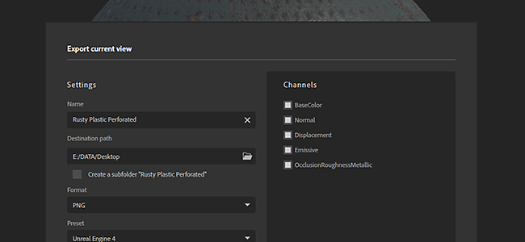

# Versão 2020.1 (2.1)

O **Substance Alchemist 2020.1 “Tiramisu”** permite exportar os materiais diretamente embalados para renderizadores e mecanismos de jogo. Por padrão, 15 predefinições de exportação estão disponíveis, como Unity HDRP, Unreal Engine 4, Blender, Vray-Next e muito mais.

Ele apresenta um novo arquivo de configuração e controles para o verificador de atualizações.

Data de lançamento: *12 de março de 2020*

## Principais recursos

### Janela Novo exportador

A janela de exportação foi reformulada para introduzir uma nova interface que tem vários novos recursos:

* **Use predefinições de exportação para empacotar texturas para um renderizador ou mecanismo de jogo específico** Agora é possível escolher, durante o processo de exportação, uma configuração entre uma lista de predefinições de exportação que convertem, empacotam e nomeiam as texturas para um aplicativo de terceiros específico. O resultado dessa conversão é exibido na lista de canais à direita da interface.\
  O novo exportador inclui as seguintes predefinições por padrão:

  * Unreal Engine 4
  * Unity Standard
  * Unity HDRP
  * Ciclos de Mesclagem/Véspera
  * Arnold 5
  * Renderização Corona
  * Enscape
  * Keyshot 9
  * Redshift
  * Variar Próximo
  * Lens Studio
  * Spark AR Studio
  * Specular PBR/Textura reluzente da aspereza metálica PBR

  
* **Criar uma subpasta com o nome do material**\
  Ao exportar vários materiais para um local comum, agora é possível criar uma subpasta
* **As configurações de exportação são salvas e restauradas com a próxima exportação**\
  Para facilitar as coisas, reabrir a janela de exportação também reutilizará as configurações de exportação usadas anteriormente. Tornando mais fácil e mais rápido reexportar um material.
* **Criar, importar e gerenciar predefinições de exportação personalizadas**\
  Também é possível criar predefinições de exportação personalizadas. Para saber como criá-las e gerenciá-las, dê uma olhada nas seguintes páginas de documentação:

  * [Gerenciamento de predefinições personalizadas](https://helpx.adobe.com/br/substance-3d/unlisted/documentation/sadoc/creating-and-importing-custom-presets-188976295.html)
  * [Gerenciando predefinições](../../getting-started/export/managing-presets.md)

### Configuração de Aplicativo

(Foto de [Fabian Grohs](https://unsplash.com/@grohsfabian?utm_source=unsplash&utm_medium=referral&utm_content=creditCopyText) em [Unsplash](https://unsplash.com/?utm_source=unsplash&utm_medium=referral&utm_content=creditCopyText))

Agora é possível configurar o Substance Alchemist com um arquivo de configuração. Isso facilita a configuração do aplicativo em computadores, como em um estúdio, por exemplo. Os arquivos de configuração definem os recursos padrão e a lista de pastas vinculadas.

Para saber mais sobre como criar e usar um arquivo de configuração, consulte a [página de documentação](https://helpx.adobe.com/br/substance-3d/unlisted/documentation/sadoc/resources-configuration-file-188976187.html) dedicada.

### Melhorias diversas

Algumas novas melhorias no fluxo de trabalho estão disponíveis nesta versão:

* **Foco da exibição 2D**\
  Agora é possível usar o atalho “F” para redefinir e centralizar a visualização 2D, o mesmo que com a visualização 3D.
* **Reabrir último projeto**\
  Para tornar a criação de conteúdo mais fácil e rápida, o aplicativo agora reabre o último projeto usado. Agora, o modo padrão ao abrir o aplicativo é Criar laboratório.
* **Atualizar configuração do Verificador**\
  Defina se deseja ser notificado se uma nova versão estiver disponível. Para obter mais informações, consulte a [página de documentação](../../technical-support/configuration/update-checker.md) dedicada.

### Novo conteúdo

Melhoramos alguns filtros e também atualizamos o conteúdo inicial:

* **Novos Materiais Iniciais**\
  Substituímos alguns materiais existentes por novos, aqui está a lista de novos materiais:
  * Microfibra de Alcântara
  * Piso de tapete
  * Cliff Rock
  * Cobre
  * Dirt rachado
  * Roughcast
  * Terracota
  * Tecido de lã
  * Tecido
* **Controle metálico com filtro de material Bitmap 2**\
  O filtro de Material Bitmap 2 foi atualizado para oferecer mais controle sobre o canal metálico. Agora é possível usar uma entrada de bitmap personalizada para ele ou definir uma cor uniforme.
* **Filtro de ajuste aprimorado**\
  O filtro Ajuste agora pode trabalhar com o projeto definido para usar o fluxo de trabalho PBR Specular/Textura reluzente.
* **Novos parâmetros de Atlas scatter**\
  Adicionamos alguns novos parâmetros para oferecer melhor controle sobre como os elementos se misturam com o mapa de height do material abaixo.

## Tutorials

Esta versão vem com um novo conjunto de entradas em nosso tutorial para começar com Substance Alchemist:

## Notas de versão

### 2.1.0 Tiramisu

*(Lançado Em 12 De março De 2020)*

**Adicionado:**

* [Exportar] Seleção de predefinição de exportação para empacotar suas texturas para renderizadores e mecanismos de jogo
* [Exportar] Exportar predefinição para o Unreal Engine 4
* [Exportar] Predefinição de exportação para o padrão de unidade
* [Exportar] Predefinição de exportação para Unity HDRP
* [Exportar] Predefinição de exportação para ciclos do Blender/Eevee
* [Exportar] Exportar predefinição para Arnold 5
* [Exportar] Predefinição de exportação para o renderizador Corona
* [Exportar] Exportar predefinição para o Enscape
* [Exportar] Exportar predefinição para Keyshot 9
* [Exportar] Predefinição de exportação para Redshift
* [Exportar] Exportar predefinição para Vray Next
* [Exportar] Exportar predefinição para o Lens Studio
* [Exportar] Predefinição de exportação para o Spark AR Studio
* [Exportar] Exportar predefinição para brilho de Specular PBR da aspereza metálica PBR
* [Export] Nova interface de exportação
* [Exportar] Lembrar configurações de exportação
* [Exportar] Importe e gerencie suas predefinições de exportação personalizadas
* [Exportar] Excluir e substituir suas predefinições de exportação personalizadas
* [Exportar] Renomear suas predefinições de exportação personalizadas
* [Exportar] Define a resolução de exportação padrão para a resolução atual
* [Exportar] Adicione a opção de criar uma subpasta para o local de exportação
* [Exportar] Mensagem de aviso antes de substituir arquivos existentes
* [Aplicativo] Novo esquema de numeração de versão
* [Aplicativo] Abrir Criar na inicialização e alterar ordem dos laboratórios
* [Tela de boas-vindas] Novo banner de boas-vindas
* [Project] Abrir último projeto na inicialização
* [UI] Novo estilo de caixa de combinação
* [Exibição 2D] Atalho F para focalizar na exibição 2D
* [Filters] Adicionado suporte para a tag alchemist::parameterVisibility em gráficos de Substance
* [Filtros] Têm um ajuste global para gerenciar a visibilidade de parâmetros com base no fluxo de trabalho
* [Resources] Nova opção de linha de comando para configurar recursos e pastas vinculadas com um arquivo de configuração
* [Verificador de versão] Configuração da verificação de versão
* [Content] Novos materiais iniciais
* [Conteúdo] Bitmap para Material - Adiciona a possibilidade de definir o canal metálico (importação de imagem uniforme e personalizada, escolha de cores)
* [Conteúdo] Ajuste - Adicionar o suporte do fluxo de trabalho de specular/brilho do PBR
* atlas scatter [Content] - Novos parâmetros

**Corrigido:**

* [Project] Falha ao importar o mesmo projeto duas vezes
* [Project] Correção de uma falha que ocorria ao importar e abrir projetos várias vezes
* [Aplicativo] Falha ao carregar um material não nomeado
* [Aplicativo] Reconhecer arquivos ausentes ao importá-los novamente
* [Aplicativo] Corrigir falha aleatória ao desligar
* [Application] Corrigida uma falha rara ao descarregar um material em Criar
* [Aplicativo] Correção de falha aleatória ao usar controles de interface do usuário
* [UI] O tamanho do painel Exportar está incorreto ao abri-lo em Criar
* [IU] Abrir projeto com um único clique
* [UI] Defina corretamente os valores mínimos e máximos do controle deslizante
* [UI] Mostrar rótulo dos usos do canal em vez de ids
* [IU] Clicar em um material sempre abre/fecha o painel de ajuste
* [IU] Corrigir cores de camadas ocultas
* [UI] Melhorias nos botões da Tela de Boas-vindas
* [Camadas] Recalculações menos desnecessárias
* [Camadas] Falha ao usar o Patch de clone
* [Camadas] Selecionar uma camada de importação de imagem não aciona mais um computador
* [Configurações do canal] Ativar ou desativar usos agora aciona uma renderização
* [Recursos] Impedir o congelamento ao clicar em massa em uma pilha da biblioteca
* [Resources] Falha de desempenho ao readicionar uma pasta vinculada adicionada anteriormente
* [Recursos] Correção de uma falha ao tentar abrir um arquivo .sbsar excluído
* [Desempenho] Evite carregar materiais para acessar seus parâmetros
* [Desempenho] Fazer backup de ativos somente quando usados em um projeto ou em um material criado
* [Exportar] Materiais fixos na fila de exportação às vezes ignorados ou exportados com parâmetros incorretos
* [Exibição 2D] Panorâmica e zoom restaurados
* [Conteúdo] O padrão de assoalho leva em consideração o canal da Oclusão ambiente
* [Conteúdo] Pintar - Exibir entrada de máscara ao ativar a máscara personalizada
* [Content] Stonewall Pattern - Remover possíveis efeitos de faixa no mapa normal
* [Content] Modulação de Height - Corrija as entradas de cores de base dupla na exibição 2d

**Problemas Conhecidos:**

* Os filtros de Preenchimento sensível a conteúdo são lentos em alta resolução
* O uso de múltiplos delighters em um material não é recomendado
* O Delighter trava com drivers NVIDIA mais antigos (menos de 400.x)
* Coma ou ponto pode ser ignorado ao digitar um valor específico em um controle deslizante
