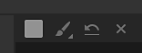
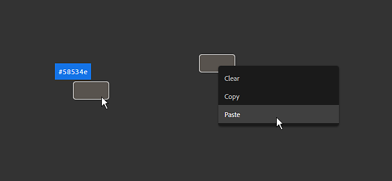

# Versão 2020.2 (2.2)

O **Substance Alchemist 2020.2 “Udon”** introduz um novo processo de Imagem para Material viabilizado por IA para transformar uma única entrada de imagem em um Material PBR completo, um Modelo de Criação de Material aprimorado, muitos fluxos de trabalho e melhorias de usabilidade, além de novo conteúdo, como novos filtros.

Data de lançamento: *15 de junho de 2020*

## Principais recursos

### Imagem para material (viabilizado por IA)

O modelo de **Imagem para material** tem uma nova configuração chamada **Powered** com IA. Essa nova configuração fornece melhores resultados para gerar um material PBR de alta qualidade a partir de uma única imagem de entrada.

A configuração Com IA usa o aprendizado de máquina para reconhecer formas e objetos e gerar com precisão informações normais e de height. Essa configuração também inclui o filtro Delighter para remover sombras e realces. Este novo ambiente funciona melhor com materiais ao ar livre, já que o algoritmo foi treinado com chão, seixos, casca, pedras e outras superfícies externas iluminadas com iluminação natural. Mais atualizações trarão mais flexibilidade e versatilidade dos materiais suportados. Para obter mais detalhes, consulte a [página de documentação dedicada](../../filters/tools/image-to-material.md).

Esta é uma comparação das informações de height geradas pelos dois algoritmos com seus valores padrão:

{width="800px"}

>[!NOTE]
>
> A configuração Com IA exige um hardware específico. Ela só está disponível no Windows e no Linux com uma GPU NVIDIA. Consulte os [requisitos técnicos](../../getting-started/system-requirements.md) para obter mais informações.

### Novo modelo de importação de textura

A janela pop-up de importação de imagem foi aprimorada em vários aspectos. Há também um novo tipo de processo disponível chamado **Importação de textura**.

* **Interface aprimorada**\
  A interface foi atualizada para facilitar o uso e o aprendizado, com explicações detalhadas para cada opção disponível.
* **Nova opção de importação de textura**\
  Uma nova opção chamada **Importação de textura** agora está disponível e permite importar e conectar como conjunto de imagens diretamente nos canais de saída corretos com base em seus nomes. Ele fornece uma maneira fácil de configurar um material de um grupo de imagens existente. Para obter mais informações, consulte a [página de documentação dedicada](../../features-and-workflows/texture-import.md).

### Nova pintura 2D para entradas de máscara de filtros

Nesta versão, agora é possível pintar e editar máscaras de filtros diretamente na visualização 2D sem precisar importar uma imagem externa. A pintura automaticamente azuleia-se para possibilitar a criação de material perfeito.

{width="450px"}

* **Entrando no Modo de Pintura 2D**\
  Para iniciar o modo de Pintura 2D, basta clicar no ícone de pincel ao lado do nome da máscara nas propriedades do filtro.

  
* **Barra de Ferramentas de Pintura 2D**\
  Quando estiver no modo de pintura, a visualização 2D exibirá uma nova barra de ferramentas na parte superior com as seguintes funcionalidades:

  * **Cor do pincel**: ajuste o valor do pincel em tons de cinza para pintar a máscara.
  * **Tamanho da caneta-pincel**: ajuste o tamanho do pincel para pintar a máscara.
  * **Redefinir máscara**: limpe a máscara atual para preto; qualquer informação da pintura será perdida.
  * **Parar desenho**: saia do modo de Pintura 2D.

  
* **Atalhos de teclado**\
  O modo de pintura oferece suporte aos seguintes atalhos para acelerar o processo de pintura:

  * **X**: inverta o valor atual em tons de cinza do pincel.
  * **Ctrl+Roda do Mouse**: altere o tamanho do pincel.
  * **[ ou ]**: altera o tamanho do pincel.

### Novos atalhos do modo de criação de atlas e decalques

Dois novos modos de criação foram adicionados para aproveitar os novos tipos de materiais de Substance e facilitar a configuração na pilha de camadas:

* **Modo de decalque**\
  **Alt + arrastar e soltar**: ao arrastar e soltar um material de uma coleção, pressione e mantenha a tecla **Alt** pressionada para criar o material no modo de projeção de decalque automaticamente.
* **Modo Atlas**\
  **Shift+Arrastar e soltar**: ao arrastar e soltar um material de uma coleção, pressione e mantenha a tecla Shift pressionada para criar o material no modo de atlas scatter automaticamente.

### Nova ferramenta de correção de perspectiva

Uma nova ferramenta chamada **Correção de perspectiva** foi adicionada à lista de filtros e permite ajustar ou compensar a perspectiva de uma imagem.

* **Correção de perspectiva**\
  Com esse filtro, é possível corrigir padrões de digitalizações e imagens de fotografia para torná-las mais adequadas para a criação de materiais. O filtro oferece quatro pontos de controle, que representam os cantos iniciais da imagem. Mova os pontos para ajustar/compensar a perspectiva.

  

### Widget de cores aprimorado

O widget de cores visível no painel de parâmetros agora oferece mais controles:

* **Dica de Ferramenta do Valor de Cor**\
  Quando o mouse passa sobre um widget de cor, uma dica de ferramenta aparece descrevendo o valor da cor atual (formato hexadecimal).
* **Ações de Clique com o Botão Direito**\
  Ao clicar com o botão direito do mouse em um widget de cor, um novo menu contextual aparecerá com as seguintes ações:
  * **Limpar**: defina a cor como preto e o valor alfa como zero.
  * **Copiar**: copie na memória o valor da cor atual do widget.
  * **Colar**: cole no widget o valor da cor atual na memória.

### Novo conteúdo

Esta versão traz muito conteúdo novo e variado:

* **Novas Malhas Padrão**\
  Há três novas malhas disponíveis para exibir materiais no visor:
  * Forma de sapato
  * Camiseta Masculina
  * Camiseta Feminina
* **Novos Filtros**\
  Há 5 novos filtros disponíveis nesta versão:
  * Rachaduras
  * Musgo
  * Pontos de colagem
  * Ladrilhos do assoalho
  * Validação do PBR
* **Novo Modo de Mesclagem**
* Os filtros e outras ferramentas agora suportam um novo modo de mesclagem chamado **Modo de Mesclagem por Canal**. Quando esse modo está ativado, é possível ajustar a operação de mesclagem de cada canal no painel de propriedades.
* **Exportar predefinições**\
  Esta versão inclui predefinições de exportação novas e atualizadas:
  * VStitcher
  * CLO
  * Suporte a DetailMap em modelos HDRP do Unity
