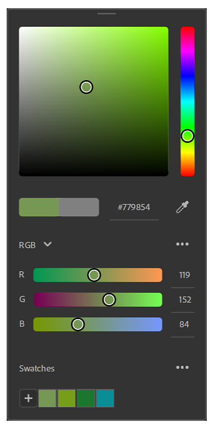

# Versão 3.1

O Adobe Substance 3D Sampler 3.1 apresenta um novo seletor de cores, suporte para arquivos SVG e interoperabilidade aprimorada com o Stager, Photoshop e Illustrator.

Data de lançamento: *28 de setembro de 2021*

## Principais recursos

### Seletor de cores

Esta versão adiciona um novo [Seletor de Cores](../../interface/tools-and-widgets/color-picker.md) que inclui um conta-gotas e suporte para amostras.

O Seletor de cores aparece sempre que você precisa selecionar uma cor. Ele pode ser movido para qualquer lugar na(s) tela(s).

{width="250px"}

### suporte para SVG

O Sampler agora é compatível com arquivos SVG. Você pode importá-los em seus ativos, diretamente na pilha de camadas ou em uma entrada de imagem de camada.

{width="500px"}

### Editar no Illustrator

Um novo recurso de “edição em” traz grande flexibilidade para atualizar imagens importadas. Se você deseja ajustar seu arquivo SVG, basta editar o arquivo diretamente no Illustrator. O Sampler atualizará instantaneamente seu visual com o novo SVG.

### Novo corte de UX/UI

O Sampler agora obtém um widget de corte adequado e renovado para definir facilmente a área cortada. Você também não obterá resultados esticados ao cortar imagens não quadradas em texturas quadradas.

{width="500px"}

### Formato normal

Edite suas Preferências para definir o [formato normal](../../interface/preferences/normal-format.md) necessário para seu fluxo de trabalho. Suas informações normais serão importadas, exibidas e exportadas no formato selecionado nas preferências.

{width="250px"}

### Exportação de propriedades do material em SBSAR

Todos os parâmetros de material das configurações do Sombreador (escala normal, escala de height, nível de height,...) serão exportados no arquivo SBSAR para serem lidos no Substance 3D Stager para uma correspondência perfeita do material.

{width="500px"}

## Notas de versão

### 3.1.0 Xocoalte

*(Lançado Em 28 De setembro De 2021)*

**Adicionado:**

* [Seletor de cores] Nova interface do seletor de cores
* [Seletor de cores] Visualizar as cores atuais e anteriores lado a lado
* [Seletor de cores] Insira sua cor em hexadecimal
* [Seletor de cores] Novo conta-gotas com visualização de cores
* [Seletor de cores] O conta-gotas pode selecionar uma cor fora do Sampler
* [Seletor de cores] Ajuste sua cor em espaços de cores RGB ou HSV
* [Seletor de cores] Salvar e gerenciar amostras
* [Interoperabilidade] Edite imagens no Illustrator a partir da camada de importação de imagem ou dos parâmetros de imagem
* [Interoperabilidade] Edite imagens no Photoshop a partir da camada de importação de imagem ou dos parâmetros de imagem
* [Widget] Novo widget de corte
* [Widget] Pressione Enter para validar seu corte
* [Widget] O widget Cortar lê o tamanho da imagem para se ajustar ao widget e manter a proporção ao redimensionar
* [IU] Nova interface do controle deslizante de escala de cinza
* [Aplicativo] Adicionar seleção de formato normal em preferências
* [Aplicativo] O formato normal nas camadas de importação de imagem segue o formato normal padrão definido nas preferências
* [Aplicativo] Na exibição 2D, o normal é exibido seguindo o formato normal definido nas preferências
* [Aplicativo] O normal é exportado no formato normal definido nas preferências
* [Exportar] Adicionar o parâmetro de formato normal às exportações de arquivos SBS e SBSAR
* [Exportar] Adicionar configurações de sombreador às exportações de arquivos SBS e SBSAR
* [Exportar] Definir a resolução padrão de gráficos SBS exportados
* [Filtros compostos] Filtros SSA do pacote com 7z
* [Filtros compostos] Adicionar metadados de categoria em filtros compostos
* [Filtros compostos] Os filtros compostos podem ter uma miniatura incorporada
* [Filtros compostos] Extensão de Filtros compostos adicionada (.ssafilter) à caixa de diálogo Obter arquivo de conteúdo
* [Filtros compostos] Importar filtros compostos (.safilter) no painel Ativos
* [Engine] Atualizar o mecanismo do substance para v8.2.0

**Corrigido:**

* [Aplicativo] Pastas locais conectadas podem travar
* [Application] Falha ao sair
* [Aplicativo] Falha ao iniciar duas instâncias do Sampler
* [Conteúdo] O filtro de corte tem um ajuste de propagação aleatório
* [Conteúdo] Alguns materiais de Substance às vezes não são atualizados
* [Exportar] Falha ao exportar com uma predefinição personalizada recém-adicionada
* [Export] O tamanho estimado do pacote está ausente no pop-up de exportação
* [Exportar] Corrigir vazamento de memória ao exportar arquivos SBS e SBSAR
* [Filtros compostos] Os filtros compostos podem ter entradas duplicadas
* [Filtros compostos] Falha se um filtro tiver referências não atendidas
* [Filtros compostos] Falha ao reordenar uma pilha de camadas com um filtro composto
* [Filtros compostos] A renderização às vezes trava
* [Importação de imagem] Importar uma imagem aciona várias renderizações
* [Camadas] Falha ao desfazer/refazer
* [Camadas] Falha ao adicionar um Material de base
* [Layers] Falha ao usar uma imagem inválida como luz do ambiente
* [Camadas] Corrigir importação duplicada ao inserir um filtro com vários gráficos
* [Camadas] A reordenação de camadas nem sempre funciona
* [Project] Falha ao carregar um arquivo de projeto incompleto
* [Project] Falha ao abrir um projeto corrompido
* [Projeto] Alguns ativos podem desaparecer de um projeto
* [Propriedades] Corrigir predefinições de filtro ausentes
* [UI] Parâmetros de ângulo não podem ser definidos
* [UI] Filtros e exibição de metadados no painel Ativos
* [IU] Agrupar por categoria oculta filtros
* [IU] Problema de rolagem no painel Ativos
* [IU] O painel de exportação agora tem uma barra de rolagem
* [IU] A miniatura não é exibida para alguns formatos de imagem no seletor de imagens

**Problemas Conhecidos:**

* [Realtime Engine 2021] Computação pesada pode travar o aplicativo
* [Mecanismo em tempo real 2021] O Mecanismo em tempo real 2021 falhará em uma máquina Windows com a CPU AMD e a GPU Nvidia instaladas
* [Seletor de cores] Escolher uma cor em um segundo monitor com uma resolução diferente pode não funcionar
