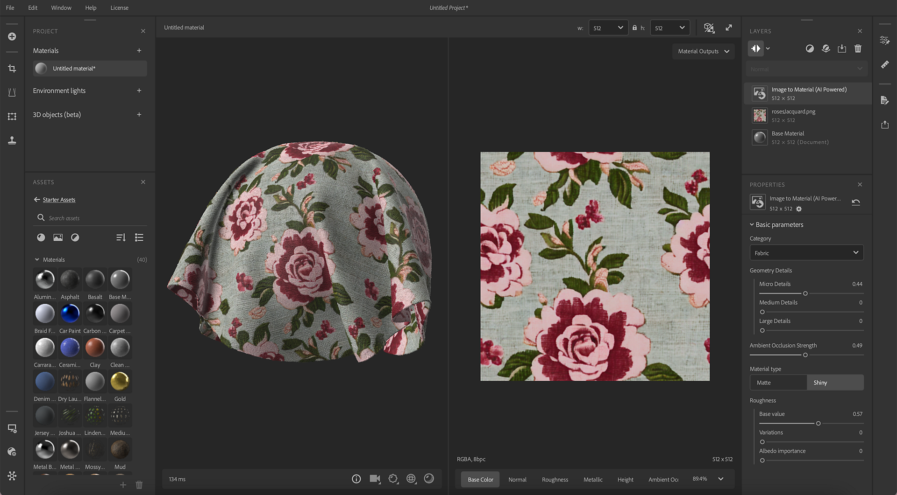

# Versão 4.2

O <b>Substance 3D Sampler 4.2</b> apresenta uma nova versão viabilizada por IA do <b>Image to Material</b> e um novo recurso de <b>Aumento de IA</b>. Esta versão inclui controle total da resolução por camada.

*Data de lançamento: 05 de setembro de 2023*

## Imagem para material - nova versão

A opção Imagem para material gera canais de material (cor de base, rugosidade, normal, deslocamento e metálico) para você a partir de uma única imagem.

A versão atualizada da Imagem para material melhora a geração de material e a gama de materiais suportados.

Agora, o Image to Material foi treinado em todos os tipos de materiais, gerando melhores resultados para Tecido, Plástico, Madeira etc.

A versão atualizada tem um novo parâmetro para selecionar o tipo de material para gerar com precisão todos os canais e ajustar automaticamente o intervalo.

## Aumento de IA

Graças à nova camada Upscale (Aumentar), o Sampler aprimora os recursos do seu material ou imagem multiplicando por 2 ou 4 a resolução do seu ativo (material ou imagem).

Isso permite aumentar a qualidade e o nível de detalhes das texturas de baixa resolução para manter a coerência de recursos entre os mapas durante a ampliação do textura.

O filtro Escala superior melhora os canais de cor de base, normal, height, aspereza e metálico do material.

Para maximizar a qualidade dos resultados, o filtro Upscale deve ser usado em dados (material e imagem) na resolução original sem alteração anterior da resolução.

## Resolução de camada

O novo sistema de Resolução de camadas permite que você tenha controle total sobre a resolução de cada camada. Uma camada usa a resolução do tamanho do seu documento ou as resoluções da camada abaixo.

A resolução é exibida em cada camada para visualizar facilmente o impacto do seu trabalho na resolução do seu material.

Isso permite que você aumente a qualidade dos materiais, mas também o desempenho ao trabalhar nos ativos.

## Tutorials

## Nota de versão

<b>4.2 DORAYAKI</b>

*(Lançado Em: 05 De setembro De 2023)*

<b>Adicionado</b>:

* [Conteúdo] Filtros de imagem para material (IA) e Delighter totalmente aprimorados
* [Conteúdo] Novo filtro de Ampliação
* [Conteúdo] O filtro Cortar agora tem resolução de saída dinâmica.
* [Modelo de criação de material] Adicionar configuração de tamanho do documento.
* [Modelo de criação de material] Novo botão de alternância “Adicionar um corte”.
* [Modelo de criação de material] Nova alternância “Aumentar material”
* [Modelo de criação de material] Exibir tamanho da imagem importada
* [Modelo de criação de material] Fornecer feedback quando algumas imagens importadas não puderem ser usadas
* [Modelo de criação de material] Avisar quando os tamanhos da imagem forem inconsistentes
* [Modelo de criação de material] Novos avisos e dicas de ferramentas
* [Camadas] Exibe a resolução das camadas na pilha de camadas
* [Camadas] A resolução de computação da camada agora pode ser definida para o tamanho do documento ou o tamanho de entrada
* [Camadas] Mostrar resolução de camadas na pilha de camadas
* [Camadas] Alterne uma política de resolução de camada para Documento ou Entrada de camada quando aplicável
* [Camadas] Avisar o usuário quando um filtro de Ampliação for adicionado manualmente e fornecer alguma documentação
* [Camadas] Avisar o usuário ao fazer um upscale linear e se oferecer para usar o filtro Upscale
* [Camadas] Computar uma camada Image to Material (AI) agora pode ser cancelada mais rapidamente, para melhorar os tempos de renderização ao ajustar a pilha de camadas
* [Camadas] Computar uma camada em alta escala agora pode ser cancelada mais rapidamente, para melhorar os tempos de renderização ao ajustar a pilha de camadas
* [Exportar] Permitir a substituição da resolução de texturas exportadas
* [Exportar] Os canais para exportar a lista agora estão classificados
* [Exportar] Exibe a resolução do canal na lista de canais a serem exportados
* [Aplicativo] Nova preferência para habilitar ou desabilitar redes neurais aceleradas por GPU
* [UI] Suspensões de resolução aprimoradas
* [UI] Novos ícones para os filtros Transformo de malha, Pós-processo de malha e tecelagem
* [UI] Renomear o painel “Compartilhar” para “Exportar”
* [Script] Adicionar suporte à resolução de saída de camada à API de exportação
* [Scripting] Adição de corte, aumento e tamanho do documento à API de importação de imagem
* [Integração] Novos tutoriais
* [Integração] Atualizar conteúdo de telas de Boas-vindas e Novidades
* [Engine] Atualização do Substance Engine para a versão 9.0.1

<b>Corrigido:</b>

* [captura 3D] Melhorar a nomenclatura das opções de Precisão nos parâmetros das configurações de Alinhamento
* [Aplicativo] Importar imagens com um não múltiplo de 16 dimensões pode levar a uma falha
* [Aplicativo] Falha ao duplicar um ativo no painel Projeto
* [Aplicativo] Falha ao alternar ativos no painel Projeto
* [Conteúdo] Pintar uma máscara personalizada para o filtro Snow não funciona corretamente
* [Parâmetros expostos] As alterações dos parâmetros expostos podem ser perdidas ao trocar de materiais
* [Interoperabilidade] Enviar um material do painel Exportar pode levar a uma falha
* [Camadas] O Preenchimento com reconhecimento de conteúdo para o processamento ao alternar de uma única entrada de imagem para uma entrada de material
* [Camadas] Falha após duplicar uma Iluminação do ambiente que contém um material
* [Camadas] A camada de importação de imagem exibe o nome de imagem incorreto no painel Propriedades se o arquivo de imagem tiver sido renomeado
* [Camadas] Às vezes, um ícone giratório é exibido em uma camada inativa
* [Camadas] Às vezes, alterar o uso de saída de uma imagem em uma camada de importação de imagem não funciona
* [Camadas] Erros de digitação na janela Modelo de criação
* [UI] A dica de ferramenta de integração do visor 3D tem problemas de foco
* [UI] O nome da imagem poderá estourar se o nome do arquivo for muito longo
* [UI] Pequenos problemas de layout da barra de ferramentas do pincel ao usar a borracha
* [UI] As sequências estão truncadas em alguns idiomas no painel Configurações do visualizador
* [UI] Enquanto o pop-up da dica de ferramenta do visor é exibido, pressionar “space” cria um novo projeto
