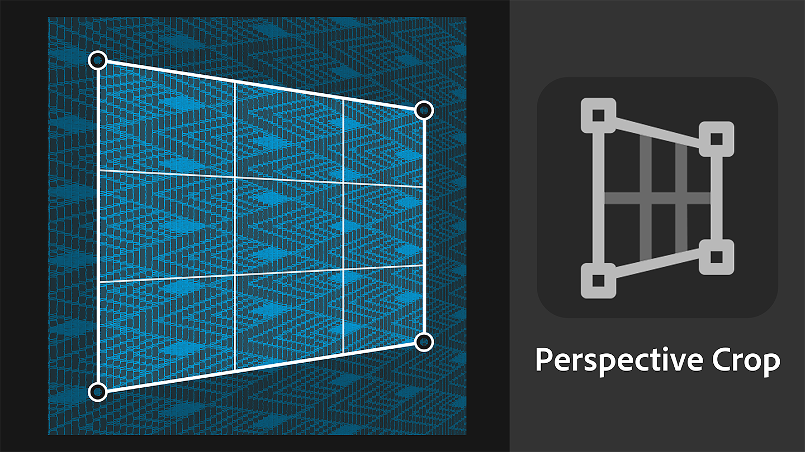

# Versão 4.3

O <b>Substance 3D Sampler 4.3</b> apresenta um novo Conteúdo Inicial, incluindo os <b>Geradores de Textura</b>, uma nova versão do filtro <b>Bordado</b> e uma ferramenta de <b>Corte de Perspectiva</b>.

*Data de lançamento: 25 de janeiro de 2024*

## Um novo conteúdo de ativos iniciais

O material incluído no Sampler foi atualizado para atender melhor às necessidades de fluxos de trabalho de <b>design industrial</b>, fluxos de trabalho de <b>moda </b> e artistas técnicos que trabalham em mídia e entretenimento terão agora mais controle sobre os aspectos técnicos da criação de texturas.

## Gerador de textura

Novos geradores de textura fornecem controle aprimorado sobre a criação de materiais usando <b>ruídos paramétricos, padrões e opções de </b>desgaste<b>.</b>  As imagens geradas podem ser usadas em mapas de máscaras ou canais, tornando mais fácil do que nunca a colaboração de equipes técnicas e criativas em design de material.

Use o novo ícone de filtragem para analisar somente geradores de textura.

## Bordado

O filtro Bordado atualizado melhorou a precisão da costura e suporta até 8 cores. As entradas do material estão de volta na pilha de camadas que permite a inserção de outros metariais no patch.

## Corte da perspectiva

A nova ferramenta de corte de perspectiva permite cortar materiais distorcidos e digitalizações com quatro pontos de controle para remover artefatos de perspectiva e obter um ativo ladrilhável.

## Estilização

O filtro de Estilização permite estilizar qualquer material para obter uma aparência de pintura à mão.

## Modo de mistura no filtro Preenchimento

A atualização do filtro Preenchimento introduz modos de mesclagem, permitindo multiplicar o valor, os mapas de entrada ou os geradores de textura do Preenchimento com os resultados de canal das camadas abaixo.

## Melhorias na camada de importação de imagem

É possível adicionar várias imagens em uma camada de importação de imagem e gerar um mapa de opacidade a partir do canal de Alpha de uma imagem.

## Nota de versão

*(Lançado Em 25 De Janeiro De 2024)*

<b>Adicionado</b>:

* [Assets] Novo tipo de ativo: Geradores de textura
* [Ativos] Novos materiais incluídos nos Ativos de Iniciante
* [Ativos] Novo seletor de ativos para parâmetros de imagem no painel Propriedades
* [Ativos] Arraste e solte Geradores de textura do painel Ativos para os seletores de imagem no painel Propriedades
* [Assets] Arraste e solte Geradores de textura do explorador de arquivos do sistema operacional
* [Ativos] Os filtros podem sugerir o ajuste de geradores por meio de uma tag de usuário na entrada da imagem
* [Assets] Os geradores de textura podem definir qual filtro deve sugerir por meio de uma tag de usuário
* [Conteúdo] Novo filtro Corte de perspectiva
* [Conteúdo] Novo filtro de estilização
* [Conteúdo] Modo de mesclagem no Filtro de preenchimento
* [Content] Filtro de bordado atualizado
* [Content] Filtro de quebra de tinta atualizado
* [Content] Todos os filtros atualizados para oferecer suporte a Geradores de textura
* [Camadas] Capacidade de escolher um canal de saída do Gerador de textura ao adicioná-lo à pilha de camadas
* [Camadas] Capacidade de listar e aplicar facilmente predefinições em geradores de textura
* [Camadas] Exibir uma visualização do Gerador de textura nos seletores de imagem
* [Camadas] Os parâmetros do gerador de textura podem ser expostos e exportados
* [Camadas] Atribua o uso de Cor base ao importar uma única imagem com o Modelo de criação de importação de textura
* [Camadas] Feedback ao tentar arrastar e soltar arquivos incompatíveis em seletores de imagem no painel Propriedades
* [Camadas] Gerar um canal de opacidade a partir do canal alfa de uma imagem importada
* [Camadas] A imagem para material (AI) é mais rápida de calcular ao alterar sua categoria
* [Camadas] Selecione a camada mais relevante depois que um Modelo de criação é usado
* [Camadas] Os widgets de posição agora podem ser ajustados com um controle deslizante no grupo Parâmetros avançados
* [Exportar] Exibir uma porcentagem na fila em vez de números brutos
* [Interoperabilidade] O canal de opacidade agora é reconhecido como canal alfa ao enviar para o Painter
* [Aplicativo] Nova caixa de diálogo para exibir e salvar informações de hardware
* [Aplicativo] Nova preferência para alterar a escala de height padrão para cada projeto
* [Aplicativo] Aprimorar a exibição de ativos desatualizados
* [Scripting] Novas funções asset.documentResolution() e asset.setDocumentResolution()
* [Scripting] Nova função select\_asset()
* [Scripting] API Python para geradores de textura
* [Scripting] get\_project\_assets() agora retorna objetos 3D
* [IU] O tamanho da miniatura do ativo pode ser alterado no painel Ativos
* [UI] Ícones de exibição atualizados do visor

<b>Corrigido:</b>

* [Exibição 2D] O zoom com a roda do mouse está bloqueado em 244%
* [Aplicativo] Falha no início ao inicializar a API de gráficos
* [Aplicativo] Falha se o nome do projeto contiver o caractere #
* [Aplicativo] Possível falha ao abrir um projeto antigo
* [Aplicativo] A reabertura do projeto atual pode levar a uma falha
* [Aplicativo] Algumas alterações de projeto não são registradas e são perdidas sem aviso ao fechar o projeto, se não forem salvas
* [Export] Problemas de exportação .sbs/.sbsar ao usar vários arquivos com o mesmo nome
* [Exportar] Espaço de cor incorreto para imagens em tons de cinza exportadas no arquivo .sbs/.sbsar
* [Filtros] Problemas de comportamento de mesclagem de opacidade
* [Camadas] Arquivos .svg às vezes não são renderizados na resolução correta
* [Desempenho] Alguns salvamentos de projeto em disco são desnecessários
* [Projeto] Importar um projeto antigo não carrega predefinições associadas
* [Script] Não é possível obter parâmetros da primeira camada inserida
* [IU] O pop-up de visualização ao passar o mouse sobre um ativo pode aparecer no local ou na tela errada
* [IU] Os painéis desencaixados ficam visíveis e podem ser usados na parte superior da tela de boas-vindas
