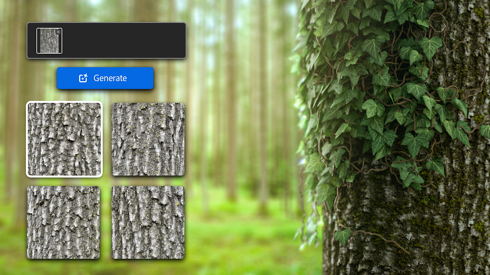

# Versão 4.4

O <b>Substance 3D Sampler 4.4</b> apresenta três novos fluxos de trabalho generativos como beta: Texto para textura, Texto para padrão e Imagem para textura.

<b>Os recursos de IA generativa estão disponíveis somente na versão de Adobe</b>, pois isso requer uma conta de Adobe. Portanto, estes recursos <b>não estão disponíveis na Steam</b>.

*Data de lançamento: 23 de maio de 2024*

## Texto para textura

O recurso Texto para textura permite explorar uma nova maneira de criar materiais com um <b>prompt de texto</b>. É possível gerar uma textura lado a lado a partir de uma descrição de texto detalhada e continuar aproveitando o resultado por meio da conversão de imagem em material ou de qualquer filtro do Sampler para torná-lo exclusivamente seu.

## Image-to-textura

Com o recurso Imagem para textura, você pode criar texturas quadradas lado a lado a partir de <b>sua própria imagem de referência</b>, independentemente de ela ser quadrada ou não. Isso aproxima você dos resultados desejados sem precisar escrever o prompt perfeito.\
A conversão de imagem em textura também pode ajudar você a economizar tempo criando variações a partir de conteúdo já criado.

## Texto para padrão

O recurso Texto para padrão usará seu <b> prompt de texto</b> para gerar um padrão de divisão em blocos gráficos quadrados. Você pode usá-la como cor de base com um filtro de tecelagem para criar um material de tecido original, usá-la como entrada de um filtro de padrão e muito mais!

## Nota de versão

*(Lançado Em 23 De maio De 2024)*

<b>Adicionado</b>:

* O cache do captura 3D do [Aplicativo] agora está armazenado em uma subpasta separada
* [Generative AI] Imagem para Textura (beta)
* [Generative AI] Texto para padrão (Beta)
* [Generative AI] Texto para Textura (Beta)
* [Scripting] Os ativos agora têm uma propriedade &#39;resource&#39;
* [Script] As camadas agora têm uma propriedade &#39;output\_usages&#39;

<b>Corrigido:</b>

* [Aplicativo] Falha ao abrir arquivo de projeto corrompido
* [Aplicativo] Falha quando o projeto contém ativos corrompidos
* [Aplicativo] Falha ao desconectar um monitor no Windows
* [Aplicativo] Ícone de aplicativo incorreto na barra de tarefas do Windows
* [Aplicativo] A corrupção do arquivo de configuração principal pode levar à exclusão de arquivos
* Os painéis [Aplicativo] aparecem na frente dos pop-ups
* [Conteúdo] Os geradores de Textura têm miniaturas desfocadas
* [Exportar] Canal de opacidade gerado a partir de quebras de uma imagem importada ao exportar um arquivo .sbs/.sbsar
* [Filtros] A ampliação pode falhar dependendo das camadas de entrada
* [Generative AI] Possíveis falhas ao receber resultados inesperados do serviço
* [Script] Falha ao carregar automaticamente um plug-in a partir de uma variável de ambiente
* [Scripting] Possível falha ao atribuir Uso de saída com a API
