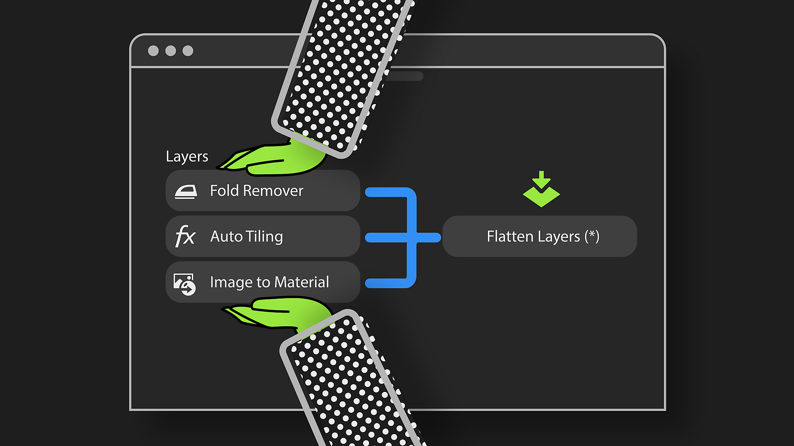

# Versão 5.1

Passe menos tempo entre a captura de seus materiais e a exportação de gêmeos digitais com ferramentas novas e aprimoradas no <b>Substance 3D Sampler 5.1</b>!

Os principais novos recursos incluem:

## Organize materiais estruturados automaticamente lado a lado

Economize tempo no processamento de materiais estruturados ou padronizados, como malhas, gerando automaticamente ladrilhos perfeitos.

Mais informações *[aqui](../filters/tools/auto-tiling.md)*.

## Fluxos de trabalho de camada eficientes

Aumente o desempenho e reduza o tempo de computação com a camada Achatar transformando resultados de camadas empilhadas em um único conjunto de mapas em uma camada unificada. Renomeie-os e duplique-os para mais eficiência!

Mais informações *[aqui](../features-and-workflows/flatten-layers.md)*.

## Ferramentas poderosas para processamento de digitalização

Com os filtros aprimorados Equalizar e Carimbo de Clonar, além de um novo recurso de remoção automática de dobras para tecidos, você pode obter digitalizações perfeitas com apenas alguns cliques, não importa a complexidade do material.

## Suporte aprimorado ao HP Z Captis

Agora, com a geração de mapas de aspereza e a detecção automática de tamanhos físicos no modo Studio, você obtém um gêmeo digital de material mais detalhado e preciso do que nunca!

## Notas de versão V5.1

*(Lançado em: 7 de agosto de 2025)*

## Adicionado:

* [Visualização 2D] O tamanho do pincel agora se adapta à resolução de textura atual
* [Visualização 3D] Alternar a escala de exibição nativa para renderização 3D nas preferências
* Atualização do mecanismo de renderização do [Aplicativo]
* [Legendas] Adicionar a possibilidade de “criar quadrado” durante a visualização
* [Captis] Detecção automática de tamanho físico
* [Captis] A captura de um novo material criará um novo ativo
* [Captis] Altere a seleção da resolução no menu suspenso para pixels por polegada ou centímetro em vez da resolução de pixel da área máxima
* [Captis] Ajuda contextual na calibração de alinhamento
* [Captis] Gerar mapa de aspereza
* [Captis] Avisar o usuário se os arquivos de calibração padrão estiverem ausentes
* [Filters] Filtro de divisão em blocos gráficos para materiais estruturados e digitalizações
* [Filters] Novo filtro Removedor de dobra
* [Filters] Novos recursos no filtro Clonar Stamp
* [Filters] Novos recursos no filtro Equalizar
* [Camadas] Capacidade de nivelar camadas
* [Camadas] Menu de contexto ao clicar com o botão direito do mouse em uma camada para renomear, duplicar, excluir ou nivelar a camada
* [Integração] Atualizar conteúdo de telas de Boas-vindas e Novidades
* [Desempenho] Melhor desempenho ao usar o filtro Corte demarcado
* [Desempenho] Melhorar o uso de memória para o Visualização 3D
* [Desempenho] Atualizar a exibição 3D é mais rápido
* [Tamanho físico] Habilitar “tela com proporção física” ao trabalhar em filtros de Substance quando o Tamanho físico estiver habilitado
* [Tamanho físico] Ao importar imagens em uma pilha vazia, proponha uma resolução mais coerente com a proporção da imagem
* [Ações rápidas] 3 novas ações rápidas para processamento de digitalização
* [Script] API para nivelar camadas
* [Script] Obtenha o nome de arquivo de cada imagem de uma camada de importação de imagem
* [Script] Nova função para ativar/desativar determinado canal de um ativo
* [IU] Ícones e botões de retrabalho no painel Camadas para acomodar novos recursos
* [UI] Avisar sobre a obsolescência da criação de iluminação do ambiente

## Corrigido:

* [Visualização 2D] Selecionar ‘exibir com proporção física’ pode não funcionar ao usar filtros de Substance
* [captura 3D] Os arquivos Svg estão listados no seletor de arquivos, mas não são compatíveis
* [Visualização 3D] O parâmetro de intensidade de emissão nas Configurações de Sombreador não funciona
* [Visualização 3D] Às vezes, a posição da malha está incorreta ao criar um novo ativo
* [Visualização 3D] A alternância para a renderização de rastreamento de caminho trava em hardware não compatível
* [Aplicativo] O aplicativo trava ao fechar o pop-up de medida manual sem definir um tamanho
* Falha do [Aplicativo]
* [Aplicativo] Congela no Windows ao exibir a área de trabalho (tecla Windows + D atalho de teclado)
* [Aplicativo] Possível falha ao alternar o idioma
* [Captis] Falha quando os dados de visualização não são válidos
* [Captis] Impossível reduzir totalmente após aumentar o zoom
* [Captis] Localização ausente em algumas etapas do assistente
* [Captis] Possível falha ao sair ao usar Captis
* [Captis] A digitalização não funciona se faltarem arquivos de calibração no dispositivo
* [Filtros] A visualização do pincel ao usar o filtro Clonar Stamp pode estar incorreta, dependendo da textura e dos tamanhos do pincel
* [Filtros] Tamanho de saída incorreto após usar o filtro Ampliação
* [Filtros] Ícones ausentes para os filtros Rotação e Estilização do ambiente
* [Filtros] Atualizar alguns filtros pode levar à renderização incorreta
* [Camadas] Primeira renderização incorreta ao mesclar dois materiais
* [Camadas] O botão para atualizar as camadas mostra “Atualizar tudo” mesmo quando há apenas uma atualização
* [Camadas] Cálculos desnecessários ao importar imagens na pilha de camadas
* [Desempenho] Melhorar a manipulação de formatos de mapa normais para reduzir os tempos de renderização
* [Tamanho físico] A mensagem de medida manual só funciona depois de fazer uma medida automática
* [Tamanho físico] Resolução de exportação incorreta no pop-up Exportar quando o Tamanho físico está habilitado
* [Ações rápidas] Localização ausente nos nomes de ativos gerados
* [IU] A visualização do ativo ao passar o mouse pode não aparecer
* [UI] Clicar no botão Redefinir para o valor padrão pode quebrar alguns dos controles
* [UI] As mensagens de erro não são apagadas ao alternar projetos
* [UI] Certifique-se de que o nome do material no visor e no painel de propriedades esteja vazio quando não houver ativos
* [UI] O botão Redefinir para valor padrão do parâmetro Ponto de Vista não funciona
* [IU] Sobreposição do botão Redefinir para valor padrão
* [IU] Alguns botões não são clicáveis quando um painel é desencaixado
* [UI] Textura o parâmetro V da divisão em blocos gráficos parcialmente oculto nas Configurações do visualizador e no Visualização 3D

## Removido:

* [captura 3D] Remover suporte ao captura 3D
* [Aplicativo] Remover o suporte ao macOS x86
