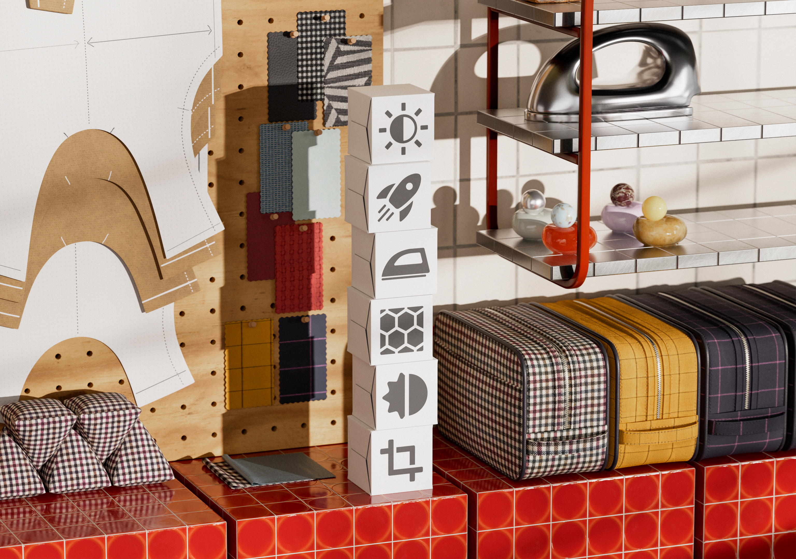
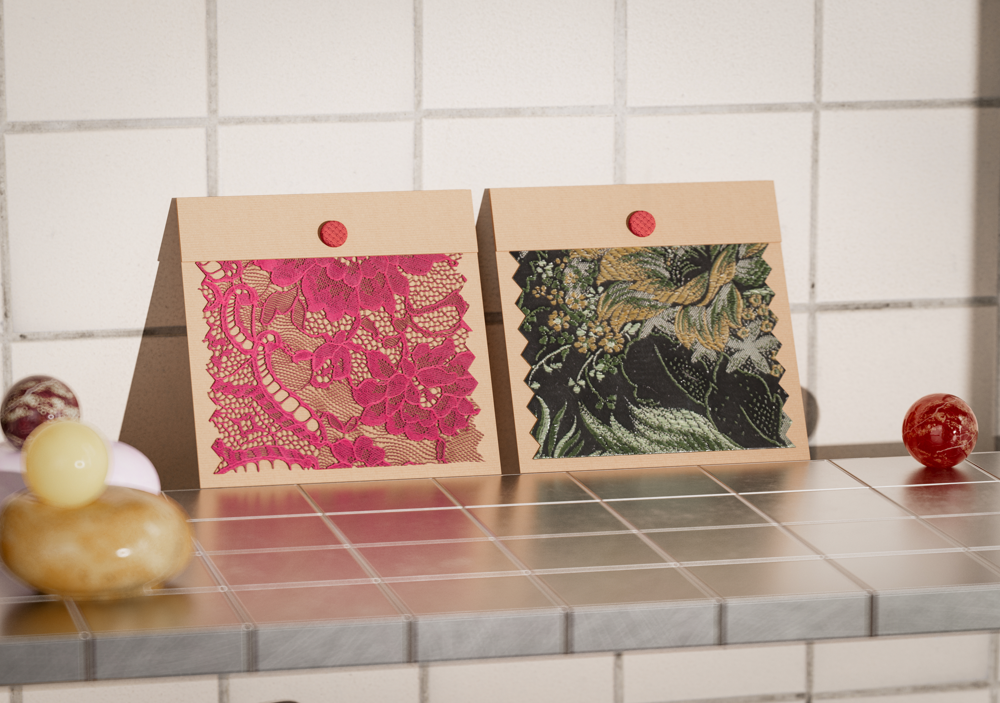

# Versão 6.0

Jalapeño

Esta atualização apresenta suporte de OpenPBR padrão do setor, predefinições de material para criação mais rápida de materiais avançados e um painel Propriedades reprojetado para criação mais flexível.

Os principais novos recursos incluem:

## OpenPBR no centro do ecossistema Substance

O Sampler 6.0 adota o [OpenPBR](../features-and-workflows/openpbr.md), o modelo de material unificado do setor. Crie materiais que sejam entendidos de forma nativa em todo o ecossistema 3D: um padrão e compatibilidade infinita.Crie uma vez, elimine suposições e acelere seu fluxo de trabalho com um modelo criado para interoperabilidade perfeita entre ferramentas.

## Materiais complexos em um clique

Crie materiais mais ricos e complexos instantaneamente. Novos modelos, como fuzz, translucidez e revestimento transparente, permitem adicionar efeitos físicos avançados sem a complexidade. Basta escolher um modelo, e vá!

Mais informações *[aqui](../interface/tools-and-widgets/material-creation-presets.md)*

## Feito para criar materiais

O Sampler 6.0 aprimora toda a experiência em torno do que mais importa: criar materiais gêmeos digitais de alta qualidade. Todas as atualizações e novos recursos são projetados para remover atritos, poupar seu tempo e permitir que você se concentre nas partes do seu fluxo de trabalho que realmente agregam valor.

## Uma nova pilha de camadas criada para controle

Assuma o controle dos seus materiais. Com o painel de propriedades reformulado, você pode definir filtros por canal, fornecendo edições precisas sem etapas adicionais.

Mais informações *[aqui](../interface/panels/properties-panel.md)*

## Capture materiais mais rápido do que nunca

O Sampler agora permite iniciar uma captura do HP Z Captis em um único clique, com a região de interesse detectada automaticamente, girável sob demanda e automação inteligente para foco e intensidade de luz, para que você obtenha mapas nítidos e consistentes com menos configuração.

Mais informações *[aqui](../pipeline-and-integrations/hp-z-captis-support/your-first-capture-step-by-step.md)*

## V6.0 - Notas de versão

### **6.0.4**

*(Lançado em: 24 de setembro de 2026)*

**Alterado**
Atualização do Substance Engine para 9.6.1 do [Engine]

**Corrigido**
[Camadas] falham ao adicionar imagem à máscara de relevo
Correções gerais de [segurança]

### **6.0.3**

*(Lançado em: 24 de agosto de 2026)*

**Corrigido:**

[Renderização] Reverta a solução temporária para drivers NVIDIA com falha

### **6.0.2**

*(Lançado em: 25 de junho de 2026)*

**Adicionado:**

* &amp;lbrack;Assets&amp;rbrack; Verifique a versão do sbsar e avise os usuários se o mecanismo é muito antigo para lê-lo
* &amp;lbrack;Captis&amp;rbrack; Adicionar opção de volta para salvar a fotometria das legendas nas preferências

**Corrigido:**

* &amp;lbrack;Exibição 2D&amp;rbrack; Não “exibir com proporção física” se o tamanho físico estiver desabilitado
* &amp;lbrack;Analytics&amp;rbrack; Eventos de análise ausentes
* &amp;lbrack;Analytics&amp;rbrack; Impedir que o bloco de anotações reporte uma falha no vk devicelost
* &amp;lbrack;Aplicativo&amp;rbrack; Não destrua dispositivos vkna saída para evitar uma falha no driver nvidia
* &amp;lbrack;Aplicativo&amp;rbrack; Corrigir saída do inspetor de coleções vinculadas + gerenciador de canais
* &amp;lbrack;Aplicativo&amp;rbrack; Evitar falhas ao sair
* O filtro &amp;lbrack;Content&amp;brack; “metal finish” não afeta a metalidade
* &amp;lbrack;Content&amp;brack; Adicionar tamanho físico a filtros dinâmicos nos quais está faltando
* &amp;lbrack;Filtros&amp;rbrack; Remover preenchimento sensível a conteúdo da lista de ativos ocultos
* &amp;lbrack;Camadas&amp;rbrack; Clicar em &#39;redefinir todas as configurações&#39; não redefine o menu suspenso &#39;aplica a&#39;
* &amp;lbrack;Camadas&amp;rbrack; Corrigir ajuste mínimo &amp; máximo para o widget de posição
* &amp;lbrack;Camadas&amp;rbrack; Atualizar filtro corretamente
* &amp;lbrack;Tamanho físico&amp;rbrack; Certificar-se de que a escala física está funcionando em todos os lugares + deixar o tamanho físico ok com filtros dinâmicos
* &amp;lbrack;Projeto&amp;rbrack; Certifique-se de que a resolução do ativo é a padrão (2k x 2k) ao criar um novo ativo
* &amp;lbrack;Projeto&amp;rbrack; Reabrindo o projeto atual usado para abrir a versão anterior
* &amp;lbrack;Projeto&amp;rbrack; O Sampler não oferece mais a opção de restaurar um backup de projetos corrompidos
* &amp;lbrack;Renderização&amp;rbrack; Renderizar a miniatura do material em no máximo 2k de resolução
* &amp;lbrack;UI&amp;rbrack; Código defensivo para evitar falhas se o usuário for mais rápido que a interface

### **6.0.1**

*(Lançado em: 16 de abril de 2026)*

**Adicionado:**

* [Visualização 3D] Fornece malhas padrão no formato USD
* [Aplicativo] Detecta usos em um material que não está disponível no modelo de material atual
* Marca de modelo de material de leitura do [Aplicativo] de arquivos SBSAR
* [Legendas] Permitem a rotação da região de interesse e da nova resolução 4K
* [Captis] verifique a versão do SO da Captis e avise o usuário para atualizar, se relevante
* [Legendas] mantêm os parâmetros de verificação entre digitalizações sucessivas
* [Legendas] - novo sistema de foco automático
* [Legendas] Verificação Com Um Clique
* [Legendas] mostram uma notificação quando a captura termina
* [Legendas] várias melhorias de UI/UX
* [Configurações de canal] Painel de configurações de canal reformulado para OpenPBR
* [Configurações de Canal] Suporte para alternar entre modelos de material de OpenPBR e ASM
* [Exportar] permite exportar materiais como USD, USDA ou USDZ
* [Exportar] Suporte a canais de OpenPBR na seleção do canal de exportação
* [Exportar] Use o caminho do projeto como caminho de exportação padrão
* [Filtros] Permitem a atualização de filtros compostos estáticos para dinâmicos
* [Filtros] Permitem a atualização de filtros estáticos para dinâmicos
* [Filtros] Versões dinâmicas de Divisão em Blocos Gráficos Automáticos, Preenchimento Sensível ao Conteúdo, Combinar de Height, Combinar Normal
* [Filtros] ocultam a versão estática de um filtro quando a versão dinâmica está presente
* [Filtros] - Nova experiência de preenchimento
* [Filtros] Novo Material de base compatível com OpenPBR e ASM
* [Importação de imagem] Importar imagens agora propõe adicionar usos ao fluxo de trabalho
* [Importação de imagem] Seletor de uso aprimorado
* [Camadas] O tamanho padrão do ativo agora é de 2K
* [Camadas] Habilitam uma seleção de uso de saída por camada
* [Preferências] Adicione uma preferência de modelo de material padrão
* A predefinição padrão [Predefinição] agora usa modelo de material de OpenPBR
* [Renderização] Habilita renderização 8K
* [Renderizando] Trata do sombreador do OpenPBR na cena do USD
* [Renderizando] imagens no tamanho do documento quando não estiver exportando
* modelo de material de manuseio de [Scripts] para a criação de ativos na API Python
* [Gerando script] da nova propriedade MaterialModel no ativo
* [IU] Adicionar uma categoria a Ações Rápidas e ocultar filtros de ambiente/malha
* [IU] Exibe a janela de modelo quando a pilha contém apenas um material de base
* [IU] Implementar pesquisa difusa no acessador rápido
* [IU] Integrou a seleção de modelo na caixa de diálogo de criação de material
* Criação de material de [IU] desde o início rápido
* [IU] Fluxo de trabalho de criação de material com modelos
* [IU] Novo estilo para barras de ação flutuantes
* [IU] Notificar o usuário quando um material precisar de usos adicionais
* [IU] Propor novo nome de material com número incrementado
* [IU] Renomeie “Criar projeto vazio” para “Início Rápido”
* [IU] remodelada para o painel “Obter conteúdo”
* Implementação da pesquisa de [UI] na edição de lista de canais
* [IU] Mostrar uma notificação ao salvar um instantâneo em arquivo

**Corrigido:**

* [Visualização 2D] Ordene a Visualização 2D de acordo com o índice de uso do resultado na especificação
* [Aplicativo] Corrigir uma falha no início
* [Aplicativo] Corrigir lógica incorreta para filtragem de uso de fluxo de trabalho com OpenPBR
* A lista de versões conhecidas do [Aplicativo] agora é lida ao procurar uma atualização
* [Aplicativo] impede uma falha de acesso simultâneo
* [Aplicativo] impede a dupla computação ao importar imagens com material de base
* [Aplicativo] impede uma possível falha ao sair
* [Aplicativo] impede falha ao limpar uma máscara duas vezes
* [Aplicativo] Impedir a conversão de uso que perde o caso original
* [Aplicativo] Impede a computação inútil de saídas invisíveis
* [Aplicativo] Substitua espaços por sublinhados ao criar a ID de uso a partir do nome
* Várias correções de atualização do [Aplicativo]
* Dispositivo [Captis] não detectado após a atualização das políticas de segurança
* [Legendas] - Corrigir erros do protocolo FTP
* [Legendas] Corrigir corte
* [Legendas] Concentre-se em uma área técnica antes de fazer a calibração de cores
* [Legendas] mantêm a proporção de corte quando a resolução está bloqueada
* [Legendas] impedem o congelamento ao pressionar &#39;enviar resultados para amostrador&#39; várias vezes
* [Captis] aciona a janela Captis ao clicar no menu Captis para minimizá-la
* [Legendas] Trocam duas seções na interface de visualização
* [Legendas] Os metadados do ativo final não estão definidos
* [Legendas] Várias correções de erros
* [Legendas] tamanho de corte incorreto
* [Configurações de canal] Mascarar canais no painel se eles estiverem invisíveis
* [Exportar] Abrir uma pasta com caracteres especiais funciona corretamente
* [Exportar] evita falha na exportação quando a árvore tiver sido descarregada
* [Exportar] as saídas selecionadas não são persistentes na caixa de diálogo de exportação
* [Filtros] Exportar uma árvore com imagens interrompe a resolução dinâmica da imagem
* [Filtros] Corrigir disponibilidade de filtro C++
* [Filtros] Corrigir detecção de filtro dinâmico de carimbo de Clonar
* [Filtros] corrige a inicialização do contador de UID ao preencher usos dinâmicos
* [Filtros] Corrigir espaço de cores no assistente de AutoEnquadramento
* [Filtros] Corrigir tamanhos de saída de corte
* [Filtros] Faça o filtro de atualização com o parâmetro fixado funcionar
* [Filtros] evitam uma falha no macOS no assistente de divisão em blocos automáticos
* [Filtros] evitam falha no upscale quando uma entrada está ausente
* [Filtros] evitam falhas ao carregar um filtro composto sem nome de arquivo
* [Filtros] O ajuste da máscara de destino foi duplicado em PatchMatch
* [Importação de imagem] corrija a medida do manual automático para o tamanho físico
* [Importação de imagem] Tamanho de rasterização de SVG adequado quando usado como ajuste
* [Camadas] A atribuição de um uso a uma imagem digitando-a não funciona
* [Camadas] evite falhas ao adicionar camadas à pilha
* [Camadas] Os parâmetros expostos que não precisavam ser atualizados foram removidos
* [Camadas] Corrigir adição de gerador de textura como mapa
* [Camadas] - Corrigir nivelamento
* [Camadas] nivelam a subpilha no tamanho de entrada, não no tamanho do documento
* [Camadas] evitam falhas ao nivelar uma pilha que contém camadas niveladas
* [Camadas] Impedem que a mensagem de otimização de renderização seja exibida com Material de base
* [Camadas] Atualizar um filtro para um filtro de saída exclusivo não atualizou a interface do usuário corretamente
* [Preferências] Corrigir a alteração das Preferências
* [Projeto] Corrigir importação de projetos .alch
* O salvamento do [Projeto] não falha mais silenciosamente
* [Renderização] evite falhas no macOS mantendo o modo de agendamento automático
* [Renderização] A alteração do componente V da divisão em blocos gráficos de textura não teve efeito
* [Renderização] Corrigir renderização e miniaturas ausentes
* [Renderização] Impede acessos simultâneos aos valores de saída
* [Renderização] Trata corretamente os valores de saída de uma árvore no renderizador
* [Renderizando] Interrompe a recriação da estrutura de árvore em cada renderização
* [Script] Corrige uma falha em get_project_assets
* [Scripts] evitam falha no achatamento da API Python
* [IU] Todos os divisores no painel de propriedades agora têm a largura do painel
* [IU] Evite exibir usos internos de divisão automática como personalizados
* [IU] Corrigir menu contextual corrompido
* [IU] Corrigir menu de contexto para ajustes do gerador
* Correção do carregamento de fontes da [IU]
* [IU] Botão Corrigir predefinição de material com nomes longos
* [IU] Corrigir associações de ajuste de vários controles deslizantes
* [IU] Corrigir botões de tamanho pequeno raro na caixa de diálogo
* [IU] Corrigir alteração do valor de ajuste na criação do componente
* [IU] Corrigir a exibição de entrada de variável e remover o comando fantasma incorreto
* [IU] Corrigir a atualização do painel de configurações de exibição quando o contexto do ativo é alterado
* [IU] Corrigir modo de quebra automática de palavras do seletor unificado
* [IU] - Proibir a adição de caracteres especiais no campo de nome dos metadados
* A exibição da ferramenta de medida de Tamanho físico da [IU] está danificada
* [IU] Evitar falha ao abrir o painel de configurações do canal
* [IU] Evitar falha ao usar &#39;Redefinir para layout padrão&#39;
* [IU] Impedir que a notificação de atualização no painel de árvore desapareça
* [IU] Priorizar filtro dinâmico ao pesquisar por nome
* [IU] Role o painel de propriedades para usar ajustes
* [IU] Atualiza as configurações do canal ao ajustar o uso de uma imagem
* [IU] Atualiza o texto no pop-up de conversão de Modelo de material

## Removido

* Item de menu Remover Captura 3D da [IU]
* [Interface do usuário] - Remover o painel de IA generativa
* [IU] Remover configurações de sombreador
